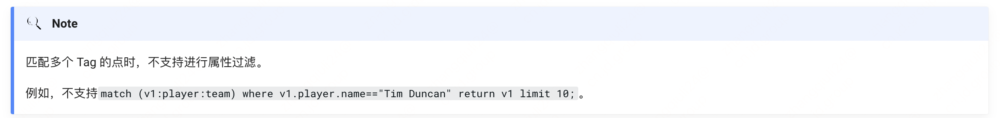
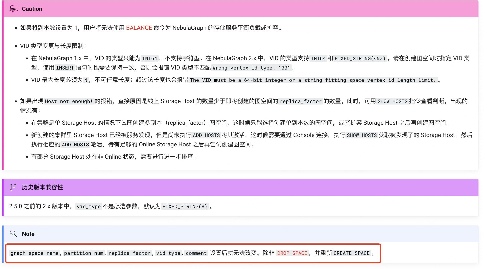

# 一、特性 介绍

- 易拓展
- 易开发
- 高可靠访问控制 


# 图模式

模式（pattern）和图模式匹配，是图查询语言的核心功能，本文介绍 NebulaGraph 设计的各种模式，部分还未实现

## 1、单点模式

点用一对括号来描述，通常包含一个名称。例如：

```
(a)
```

示例为一个简单的模式，描述了单个点，并使用变量`a`命名该点。


## 2、多点关联模式

多个点通过边相连是常见的结构，模式用箭头来描述两个点之间的边。例如：

```
(a)-[]->(b)
```

示例为一个简单的数据结构：两个点和一条连接两个点的边，两个点分别为`a`和`b`，边是有方向的，从`a`到`b`。


这种描述点和边的方式可以扩展到任意数量的点和边，例如：

```
(a)-[]->(b)<-[]-(c)
```

这样的一系列点和边称为`路径`（path）。

==只有在涉及某个点时，才需要命名这个点。如果不涉及这个点==，则可以省略名称，例如：

```
(a)-[]->()<-[]-(c)
```


## 3、tag模式

模式除了简单地描述图中的点之外，还可以描述点的 Tag。例如：

```
(a:user:admin)-[]->(b)
```


## 4、属性模式

点和边是图的基本结构。nGQL 在这两种结构上都可以增加属性，方便实现更丰富的模型。

在模式中，属性的表示方式为：用花括号括起一些键值对，用英文逗号分隔，并且需要指定属性所属的 Tag 或者 Edge type。

例如一个点有两个属性：

```
(a:player{name: "Tim Duncan", age: 42})
```

在这个点上可以有一条边是：

```
(a)-[e:follow{degree: 95}]->(b)
```

## 5、边模式

描述一条边最简单的方法是使用箭头连接两个点。

可以用以下方式描述边以及它的方向性。如果不关心边的方向，可以省略箭头，例如：

```
(a)-[]-(b)
```

和点一样，边也可以命名。一对方括号用于分隔箭头，变量放在两者之间。例如：

```
(a)-[r]->(b)
```

和点上的 Tag 一样，边也可以有类型。描述边的类型，例如：

```
(a)-[r:Rel_type]->(b)
```


==和点上的 Tag 不同，一条边只能有一种 Edge type。但是如果我们想描述多个可选 Edge type，可以用管道符号（|）将可选值分开，例如：==

```
(a)-[r:TYPE1|TYPE2]->(b)
```


和点一样，边的名称可以省略，例如：

```
(a)-[:TYPE]->(b)
```


## 6、变长模式

在图中指定边的长度来描述多条边（以及中间的点）组成的一条长路径，不需要使用多个点和边来描述。例如：

```
(a)-[*2]->(b)
```

该模式描述了 3 点 2 边组成的图，它们都在一条路径上（长度为 2），等价于：

```
(a)-[]-()-[]->(b)
```


**也可以指定范围**,这样的边模式称为`variable-length edges`，例如：

```
(a)-[*3..5]->(b)
```

`*3..5`表示最小长度为 3，最大长度为 5。

该模式描述了 4 点 3 边、5 点 4 边或 6 点 5 边组成的图。

也可以忽略最小长度，只指定最大长度，例如：


也可以忽略最小长度，只指定最大长度，例如：

```
(a)-[*..5]->(b)
```


## ## 7、路径变量

[¶](https://docs.nebula-graph.com.cn/master/3.ngql-guide/1.nGQL-overview/3.graph-patterns/#_7)

一系列连接的点和边称为`路径`。nGQL 允许使用变量来命名路径，例如：

```
p = (a)-[*3..5]->(b)
```

可以在 MATCH 语句中使用路径变量。


# 自定义变量

当引用一个变量的点、边或路径，需要先给它命名。例如：

```
nebula> MATCH (v:player{name:"Tim Duncan"}) RETURN v;
+----------------------------------------------------+
| v                                                  |
+----------------------------------------------------+
| ("player100" :player{name: "Tim Duncan", age: 42}) |
+----------------------------------------------------+
```

==示例中的`v`就是自定义变量。==

Caution

在同一个 MATCH 语句的模式中，不能重复使用边变量。例如`e`不能重复被写在模式`p=(v1)-[e*2..2]->(v2)-[e*2..2]->(v3)`中。


# 引用符列表


- $^	引用起始点。更多信息请参见引用属性。
- $$	引用目的点。更多信息请参见引用属性。
- $-	引用复合查询中管道符之前的语句输出结果。更多信息请参见管道符。


# 通用查询语句

**数据**

```
drop space basketballplayer;
create space basketballplayer(partition_num=10,replica_factor=1,vid_type=fixed_string(32));
:sleep 20
use basketballplayer;
create tag player(name string,age int);
create tag team(name string);
create edge serve(start_year int,end_year int);
create edge follow(degree int);
:sleep 20
create tag index player_index_0 on player();
create tag index player_index_1 on player(name(20));
:sleep 20
insert vertex player(name,age) values "player100":("Tim Duncan", 42);
insert vertex player(name,age) values "player101":("Tony Parker", 36);
insert vertex player(name,age) values "player102":("LaMarcus Aldridge", 33);
insert vertex player(name,age) values "player103":("Rudy Gay", 32);
insert vertex player(name,age) values "player104":("Marco Belinelli", 32);
insert vertex player(name,age) values "player105":("Danny Green", 31);
insert vertex player(name,age) values "player106":("Kyle Anderson", 25);
insert vertex player(name,age) values "player107":("Aron Baynes", 32);
insert vertex player(name,age) values "player108":("Boris Diaw", 36);
insert vertex player(name,age) values "player109":("Tiago Splitter", 34);
insert vertex player(name,age) values "player110":("Cory Joseph", 27);
insert vertex player(name,age) values "player111":("David West", 38);
insert vertex player(name,age) values "player112":("Jonathon Simmons", 29);
insert vertex player(name,age) values "player113":("Dejounte Murray", 29);
insert vertex player(name,age) values "player114":("Tracy McGrady", 39);
insert vertex player(name,age) values "player115":("Kobe Bryant", 40);
insert vertex player(name,age) values "player116":("LeBron James", 34);
insert vertex player(name,age) values "player117":("Stephen Curry", 31);
insert vertex player(name,age) values "player118":("Russell Westbrook", 30);
insert vertex player(name,age) values "player119":("Kevin Durant", 30);
insert vertex player(name,age) values "player120":("James Harden", 29);
insert vertex player(name,age) values "player121":("Chris Paul", 33);
insert vertex player(name,age) values "player122":("DeAndre Jordan", 30);
insert vertex player(name,age) values "player123":("Ricky Rubio", 28);
insert vertex player(name,age) values "player124":("Rajon Rondo", 33);
insert vertex player(name,age) values "player125":("Manu Ginobili", 41);
insert vertex player(name,age) values "player126":("Kyrie Irving", 26);
insert vertex player(name,age) values "player127":("Vince Carter", 42);
insert vertex player(name,age) values "player128":("Carmelo Anthony", 34);
insert vertex player(name,age) values "player129":("Dwyane Wade", 37);
insert vertex player(name,age) values "player130":("Joel Embiid", 25);
insert vertex player(name,age) values "player131":("Paul George", 28);
insert vertex player(name,age) values "player132":("Giannis Antetokounmpo", 24);
insert vertex player(name,age) values "player133":("Yao Ming", 38);
insert vertex player(name,age) values "player134":("Blake Griffin", 30);
insert vertex player(name,age) values "player135":("Damian Lillard", 28);
insert vertex player(name,age) values "player136":("Steve Nash", 45);
insert vertex player(name,age) values "player137":("Dirk Nowitzki", 40);
insert vertex player(name,age) values "player138":("Paul Gasol", 38);
insert vertex player(name,age) values "player139":("Marc Gasol", 34);
insert vertex player(name,age) values "player140":("Grant Hill", 46);
insert vertex player(name,age) values "player141":("Ray Allen", 43);
insert vertex player(name,age) values "player142":("Klay Thompson", 29);
insert vertex player(name,age) values "player143":("Kristaps Porzingis", 23);
insert vertex player(name,age) values "player144":("Shaquille O'Neal", 47);
insert vertex player(name,age) values "player145":("JaVale McGee", 31);
insert vertex player(name,age) values "player146":("Dwight Howard", 33);
insert vertex player(name,age) values "player147":("Amar'e Stoudemire", 36);
insert vertex player(name,age) values "player148":("Jason Kidd", 45);
insert vertex player(name,age) values "player149":("Ben Simmons", 22);
insert vertex player(name,age) values "player150":("Luka Doncic", 20);
insert vertex team(name) values "team200":("Warriors");
insert vertex team(name) values "team201":("Nuggets");
insert vertex team(name) values "team202":("Rockets");
insert vertex team(name) values "team203":("Trail Blazers");
insert vertex team(name) values "team204":("Spurs");
insert vertex team(name) values "team205":("Thunders");
insert vertex team(name) values "team206":("Jazz");
insert vertex team(name) values "team207":("Clippers");
insert vertex team(name) values "team208":("Kings");
insert vertex team(name) values "team209":("Timberwolves");
insert vertex team(name) values "team210":("Lakers");
insert vertex team(name) values "team211":("Pelicans");
insert vertex team(name) values "team212":("Grizzlies");
insert vertex team(name) values "team213":("Mavericks");
insert vertex team(name) values "team214":("Suns");
insert vertex team(name) values "team215":("Hornets");
insert vertex team(name) values "team216":("Cavaliers");
insert vertex team(name) values "team217":("Celtics");
insert vertex team(name) values "team218":("Raptors");
insert vertex team(name) values "team219":("76ers");
insert vertex team(name) values "team220":("Pacers");
insert vertex team(name) values "team221":("Bulls");
insert vertex team(name) values "team222":("Hawks");
insert vertex team(name) values "team223":("Knicks");
insert vertex team(name) values "team224":("Pistons");
insert vertex team(name) values "team225":("Bucks");
insert vertex team(name) values "team226":("Magic");
insert vertex team(name) values "team227":("Nets");
insert vertex team(name) values "team228":("Wizards");
insert vertex team(name) values "team229":("Heat");
insert edge follow(degree) values "player100"->"player101":(95);
insert edge follow(degree) values "player100"->"player125":(95);
insert edge follow(degree) values "player101"->"player100":(95);
insert edge follow(degree) values "player101"->"player125":(95);
insert edge follow(degree) values "player101"->"player102":(90);
insert edge follow(degree) values "player125"->"player100":(90);
insert edge follow(degree) values "player102"->"player101":(75);
insert edge follow(degree) values "player102"->"player100":(75);
insert edge follow(degree) values "player103"->"player102":(70);
insert edge follow(degree) values "player104"->"player101":(50);
insert edge follow(degree) values "player104"->"player100":(55);
insert edge follow(degree) values "player104"->"player105":(60);
insert edge follow(degree) values "player105"->"player104":(83);
insert edge follow(degree) values "player105"->"player100":(70);
insert edge follow(degree) values "player105"->"player116":(80);
insert edge follow(degree) values "player107"->"player100":(80);
insert edge follow(degree) values "player108"->"player101":(80);
insert edge follow(degree) values "player108"->"player100":(80);
insert edge follow(degree) values "player109"->"player100":(80);
insert edge follow(degree) values "player109"->"player125":(90);
insert edge follow(degree) values "player113"->"player100":(99);
insert edge follow(degree) values "player113"->"player101":(99);
insert edge follow(degree) values "player113"->"player125":(99);
insert edge follow(degree) values "player113"->"player104":(99);
insert edge follow(degree) values "player113"->"player105":(99);
insert edge follow(degree) values "player113"->"player116":(99);
insert edge follow(degree) values "player113"->"player118":(99);
insert edge follow(degree) values "player113"->"player121":(99);
insert edge follow(degree) values "player113"->"player106":(99);
insert edge follow(degree) values "player113"->"player119":(99);
insert edge follow(degree) values "player113"->"player120":(99);
insert edge follow(degree) values "player114"->"player115":(90);
insert edge follow(degree) values "player114"->"player140":(90);
insert edge follow(degree) values "player114"->"player103":(90);
insert edge follow(degree) values "player116"->"player141":(100);
insert edge follow(degree) values "player118"->"player131":(90);
insert edge follow(degree) values "player118"->"player120":(90);
insert edge follow(degree) values "player120"->"player118":(80);
insert edge follow(degree) values "player121"->"player116":(90);
insert edge follow(degree) values "player121"->"player128":(90);
insert edge follow(degree) values "player121"->"player129":(90);
insert edge follow(degree) values "player124"->"player141":(-1);
insert edge follow(degree) values "player126"->"player116":(13);
insert edge follow(degree) values "player127"->"player114":(90);
insert edge follow(degree) values "player127"->"player148":(70);
insert edge follow(degree) values "player128"->"player116":(90);
insert edge follow(degree) values "player128"->"player121":(90);
insert edge follow(degree) values "player128"->"player129":(90);
insert edge follow(degree) values "player129"->"player116":(90);
insert edge follow(degree) values "player129"->"player121":(90);
insert edge follow(degree) values "player129"->"player128":(90);
insert edge follow(degree) values "player130"->"player149":(80);
insert edge follow(degree) values "player131"->"player118":(95);
insert edge follow(degree) values "player133"->"player114":(90);
insert edge follow(degree) values "player133"->"player144":(90);
insert edge follow(degree) values "player134"->"player121":(-1);
insert edge follow(degree) values "player135"->"player102":(80);
insert edge follow(degree) values "player136"->"player147":(90);
insert edge follow(degree) values "player136"->"player137":(88);
insert edge follow(degree) values "player136"->"player117":(90);
insert edge follow(degree) values "player136"->"player148":(85);
insert edge follow(degree) values "player137"->"player136":(80);
insert edge follow(degree) values "player137"->"player148":(80);
insert edge follow(degree) values "player137"->"player129":(10);
insert edge follow(degree) values "player138"->"player115":(90);
insert edge follow(degree) values "player138"->"player139":(99);
insert edge follow(degree) values "player139"->"player138":(99);
insert edge follow(degree) values "player140"->"player114":(90);
insert edge follow(degree) values "player141"->"player124":(9);
insert edge follow(degree) values "player142"->"player117":(90);
insert edge follow(degree) values "player143"->"player150":(90);
insert edge follow(degree) values "player144"->"player145":(100);
insert edge follow(degree) values "player144"->"player100":(80);
insert edge follow(degree) values "player147"->"player136":(90);
insert edge follow(degree) values "player148"->"player127":(80);
insert edge follow(degree) values "player148"->"player136":(90);
insert edge follow(degree) values "player148"->"player137":(85);
insert edge follow(degree) values "player149"->"player130":(80);
insert edge follow(degree) values "player150"->"player137":(90);
insert edge follow(degree) values "player150"->"player143":(90);
insert edge follow(degree) values "player150"->"player120":(80);
insert edge serve(start_year,end_year) values "player100"->"team204":(1997, 2016);
insert edge serve(start_year,end_year) values "player101"->"team204":(1999, 2018);
insert edge serve(start_year,end_year) values "player101"->"team215":(2018, 2019);
insert edge serve(start_year,end_year) values "player102"->"team203":(2006, 2015);
insert edge serve(start_year,end_year) values "player102"->"team204":(2015, 2019);
insert edge serve(start_year,end_year) values "player103"->"team212":(2006, 2013);
insert edge serve(start_year,end_year) values "player103"->"team218":(2013, 2013);
insert edge serve(start_year,end_year) values "player103"->"team208":(2013, 2017);
insert edge serve(start_year,end_year) values "player103"->"team204":(2017, 2019);
insert edge serve(start_year,end_year) values "player104"->"team200":(2007, 2009);
insert edge serve(start_year,end_year) values "player104"->"team218":(2009, 2010);
insert edge serve(start_year,end_year) values "player104"->"team215"@20102012:(2010, 2012);
insert edge serve(start_year,end_year) values "player104"->"team221":(2012, 2013);
insert edge serve(start_year,end_year) values "player104"->"team204"@20132015:(2013, 2015);
insert edge serve(start_year,end_year) values "player104"->"team208":(2015, 2016);
insert edge serve(start_year,end_year) values "player104"->"team215"@20162017:(2016, 2017);
insert edge serve(start_year,end_year) values "player104"->"team222":(2017, 2018);
insert edge serve(start_year,end_year) values "player104"->"team219":(2018, 2018);
insert edge serve(start_year,end_year) values "player104"->"team204"@20182019:(2018, 2019);
insert edge serve(start_year,end_year) values "player105"->"team216":(2009, 2010);
insert edge serve(start_year,end_year) values "player105"->"team204":(2010, 2018);
insert edge serve(start_year,end_year) values "player105"->"team218":(2018, 2019);
insert edge serve(start_year,end_year) values "player106"->"team204":(2014, 2018);
insert edge serve(start_year,end_year) values "player106"->"team212":(2018, 2019);
insert edge serve(start_year,end_year) values "player107"->"team204":(2013, 2015);
insert edge serve(start_year,end_year) values "player107"->"team224":(2015, 2017);
insert edge serve(start_year,end_year) values "player107"->"team217":(2017, 2019);
insert edge serve(start_year,end_year) values "player108"->"team222":(2003, 2005);
insert edge serve(start_year,end_year) values "player108"->"team214":(2005, 2008);
insert edge serve(start_year,end_year) values "player108"->"team215":(2008, 2012);
insert edge serve(start_year,end_year) values "player108"->"team204":(2012, 2016);
insert edge serve(start_year,end_year) values "player108"->"team206":(2016, 2017);
insert edge serve(start_year,end_year) values "player109"->"team204":(2010, 2015);
insert edge serve(start_year,end_year) values "player109"->"team222":(2015, 2017);
insert edge serve(start_year,end_year) values "player109"->"team219":(2017, 2017);
insert edge serve(start_year,end_year) values "player110"->"team204":(2011, 2015);
insert edge serve(start_year,end_year) values "player110"->"team218":(2015, 2017);
insert edge serve(start_year,end_year) values "player110"->"team220":(2017, 2019);
insert edge serve(start_year,end_year) values "player111"->"team215":(2003, 2011);
insert edge serve(start_year,end_year) values "player111"->"team220":(2011, 2015);
insert edge serve(start_year,end_year) values "player111"->"team204":(2015, 2016);
insert edge serve(start_year,end_year) values "player111"->"team200":(2016, 2018);
insert edge serve(start_year,end_year) values "player112"->"team204":(2015, 2017);
insert edge serve(start_year,end_year) values "player112"->"team226":(2017, 2019);
insert edge serve(start_year,end_year) values "player112"->"team219":(2019, 2019);
insert edge serve(start_year,end_year) values "player113"->"team204":(2016, 2019);
insert edge serve(start_year,end_year) values "player114"->"team218":(1997, 2000);
insert edge serve(start_year,end_year) values "player114"->"team226":(2000, 2004);
insert edge serve(start_year,end_year) values "player114"->"team202":(2004, 2010);
insert edge serve(start_year,end_year) values "player114"->"team204":(2013, 2013);
insert edge serve(start_year,end_year) values "player115"->"team210":(1996, 2016);
insert edge serve(start_year,end_year) values "player116"->"team216"@20032010:(2003, 2010);
insert edge serve(start_year,end_year) values "player116"->"team229":(2010, 2014);
insert edge serve(start_year,end_year) values "player116"->"team216"@20142018:(2014, 2018);
insert edge serve(start_year,end_year) values "player116"->"team210":(2018, 2019);
insert edge serve(start_year,end_year) values "player117"->"team200":(2009, 2019);;
insert edge serve(start_year,end_year) values "player118"->"team205":(2008, 2019);
insert edge serve(start_year,end_year) values "player119"->"team205":(2007, 2016);
insert edge serve(start_year,end_year) values "player119"->"team200":(2016, 2019);
insert edge serve(start_year,end_year) values "player120"->"team205":(2009, 2012);
insert edge serve(start_year,end_year) values "player120"->"team202":(2012, 2019);
insert edge serve(start_year,end_year) values "player121"->"team215":(2005, 2011);
insert edge serve(start_year,end_year) values "player121"->"team207":(2011, 2017);
insert edge serve(start_year,end_year) values "player121"->"team202":(2017, 2021);
insert edge serve(start_year,end_year) values "player122"->"team207":(2008, 2018);
insert edge serve(start_year,end_year) values "player122"->"team213":(2018, 2019);
insert edge serve(start_year,end_year) values "player122"->"team223":(2019, 2019);
insert edge serve(start_year,end_year) values "player123"->"team209":(2011, 2017);
insert edge serve(start_year,end_year) values "player123"->"team206":(2017, 2019);
insert edge serve(start_year,end_year) values "player124"->"team217":(2006, 2014);
insert edge serve(start_year,end_year) values "player124"->"team213":(2014, 2015);
insert edge serve(start_year,end_year) values "player124"->"team208":(2015, 2016);
insert edge serve(start_year,end_year) values "player124"->"team221":(2016, 2017);
insert edge serve(start_year,end_year) values "player124"->"team211":(2017, 2018);
insert edge serve(start_year,end_year) values "player124"->"team210":(2018, 2019);
insert edge serve(start_year,end_year) values "player125"->"team204":(2002, 2018);
insert edge serve(start_year,end_year) values "player126"->"team216":(2011, 2017);
insert edge serve(start_year,end_year) values "player126"->"team217":(2017, 2019);
insert edge serve(start_year,end_year) values "player127"->"team218":(1998, 2004);
insert edge serve(start_year,end_year) values "player127"->"team227":(2004, 2009);
insert edge serve(start_year,end_year) values "player127"->"team226":(2009, 2010);
insert edge serve(start_year,end_year) values "player127"->"team214":(2010, 2011);
insert edge serve(start_year,end_year) values "player127"->"team213":(2011, 2014);
insert edge serve(start_year,end_year) values "player127"->"team212":(2014, 2017);
insert edge serve(start_year,end_year) values "player127"->"team208":(2017, 2018);
insert edge serve(start_year,end_year) values "player127"->"team222":(2018, 2019);
insert edge serve(start_year,end_year) values "player128"->"team201":(2003, 2011);
insert edge serve(start_year,end_year) values "player128"->"team223":(2011, 2017);
insert edge serve(start_year,end_year) values "player128"->"team205":(2017, 2018);
insert edge serve(start_year,end_year) values "player128"->"team202":(2018, 2019);
insert edge serve(start_year,end_year) values "player129"->"team229"@20032016:(2003, 2016);
insert edge serve(start_year,end_year) values "player129"->"team221":(2016, 2017);
insert edge serve(start_year,end_year) values "player129"->"team216":(2017, 2018);
insert edge serve(start_year,end_year) values "player129"->"team229"@20182019:(2018, 2019);
insert edge serve(start_year,end_year) values "player130"->"team219":(2014, 2019);
insert edge serve(start_year,end_year) values "player131"->"team220":(2010, 2017);
insert edge serve(start_year,end_year) values "player131"->"team205":(2017, 2019);
insert edge serve(start_year,end_year) values "player132"->"team225":(2013, 2019);
insert edge serve(start_year,end_year) values "player133"->"team202":(2002, 2011);
insert edge serve(start_year,end_year) values "player134"->"team207":(2009, 2018);
insert edge serve(start_year,end_year) values "player134"->"team224":(2018, 2019);
insert edge serve(start_year,end_year) values "player135"->"team203":(2012, 2019);
insert edge serve(start_year,end_year) values "player136"->"team214"@19961998:(1996, 1998);
insert edge serve(start_year,end_year) values "player136"->"team213":(1998, 2004);
insert edge serve(start_year,end_year) values "player136"->"team214"@20042012:(2004, 2012);
insert edge serve(start_year,end_year) values "player136"->"team210":(2012, 2015);
insert edge serve(start_year,end_year) values "player137"->"team213":(1998, 2019);
insert edge serve(start_year,end_year) values "player138"->"team212":(2001, 2008);
insert edge serve(start_year,end_year) values "player138"->"team210":(2008, 2014);
insert edge serve(start_year,end_year) values "player138"->"team221":(2014, 2016);
insert edge serve(start_year,end_year) values "player138"->"team204":(2016, 2019);
insert edge serve(start_year,end_year) values "player138"->"team225":(2019, 2020);
insert edge serve(start_year,end_year) values "player139"->"team212":(2008, 2019);
insert edge serve(start_year,end_year) values "player139"->"team218":(2019, 2019);
insert edge serve(start_year,end_year) values "player140"->"team224":(1994, 2000);
insert edge serve(start_year,end_year) values "player140"->"team226":(2000, 2007);
insert edge serve(start_year,end_year) values "player140"->"team214":(2007, 2012);
insert edge serve(start_year,end_year) values "player140"->"team207":(2012, 2013);
insert edge serve(start_year,end_year) values "player141"->"team225":(1996, 2003);
insert edge serve(start_year,end_year) values "player141"->"team205":(2003, 2007);
insert edge serve(start_year,end_year) values "player141"->"team217":(2007, 2012);
insert edge serve(start_year,end_year) values "player141"->"team229":(2012, 2014);
insert edge serve(start_year,end_year) values "player142"->"team200":(2011, 2019);
insert edge serve(start_year,end_year) values "player143"->"team223":(2015, 2019);
insert edge serve(start_year,end_year) values "player143"->"team213":(2019, 2020);
insert edge serve(start_year,end_year) values "player144"->"team226":(1992, 1996);
insert edge serve(start_year,end_year) values "player144"->"team210":(1996, 2004);
insert edge serve(start_year,end_year) values "player144"->"team229":(2004, 2008);
insert edge serve(start_year,end_year) values "player144"->"team214":(2008, 2009);
insert edge serve(start_year,end_year) values "player144"->"team216":(2009, 2010);
insert edge serve(start_year,end_year) values "player144"->"team217":(2010, 2011);
insert edge serve(start_year,end_year) values "player145"->"team228":(2008, 2012);
insert edge serve(start_year,end_year) values "player145"->"team201":(2012, 2015);
insert edge serve(start_year,end_year) values "player145"->"team213":(2015, 2016);
insert edge serve(start_year,end_year) values "player145"->"team200":(2016, 2018);
insert edge serve(start_year,end_year) values "player145"->"team210":(2018, 2019);
insert edge serve(start_year,end_year) values "player146"->"team226":(2004, 2012);
insert edge serve(start_year,end_year) values "player146"->"team210":(2012, 2013);
insert edge serve(start_year,end_year) values "player146"->"team202":(2013, 2016);
insert edge serve(start_year,end_year) values "player146"->"team222":(2016, 2017);
insert edge serve(start_year,end_year) values "player146"->"team215":(2017, 2018);
insert edge serve(start_year,end_year) values "player146"->"team228":(2018, 2019);
insert edge serve(start_year,end_year) values "player147"->"team214":(2002, 2010);
insert edge serve(start_year,end_year) values "player147"->"team223":(2010, 2015);
insert edge serve(start_year,end_year) values "player147"->"team229":(2015, 2016);
insert edge serve(start_year,end_year) values "player148"->"team213"@19941996:(1994, 1996);
insert edge serve(start_year,end_year) values "player148"->"team214":(1996, 2001);
insert edge serve(start_year,end_year) values "player148"->"team227":(2001, 2008);
insert edge serve(start_year,end_year) values "player148"->"team213"@20082012:(2008, 2012);
insert edge serve(start_year,end_year) values "player148"->"team223":(2012, 2013);
insert edge serve(start_year,end_year) values "player149"->"team219":(2016, 2019);
insert edge serve(start_year,end_year) values "player150"->"team213":(2018, 2019);
```


## 1、match


`MATCH`语句提供基于模式（pattern）匹配的搜索功能。

一个`MATCH`语句定义了一个搜索模式，用该模式匹配存储在 NebulaGraph 中的数据，然后用`RETURN`子句检索数据。

与`GO`或`LOOKUP`等其他查询语句相比，`MATCH`的语法更灵活。`MATCH`语句采用的路径类型是[`trail`](https://docs.nebula-graph.com.cn/master/1.introduction/2.1.path/)，即遍历时==只有点可以重复，边不可以重复。==

`MATCH` 语法如下：

```
MATCH <pattern> [<clause_1>]  RETURN <output>  [<clause_2>];
```


- `pattern`：pattern 的详细说明请参见[模式](https://docs.nebula-graph.com.cn/master/3.ngql-guide/1.nGQL-overview/3.graph-patterns/)。`MATCH`语句支持匹配一个或多个模式，多个模式之间用英文逗号（,）分隔。例如`(a)-[]->(b),(c)-[]->(d)`。

- `clause_1`：支持`WHERE`、`WITH`、`UNWIND`、`OPTIONAL MATCH`子句，也可以使用`MATCH`作为子句。

- `output`：定义需要返回的输出。可以使用`AS`设置输出的别名。

- `clause_2`：支持`ORDER BY`、`LIMIT`子句。


**示例**

创建索引及重建索引

```
# 在 Tag player 的 name 属性和 Edge type follow 上创建索引。
nebula> CREATE TAG INDEX IF NOT EXISTS player_index_1 ON player(name(20));
nebula> CREATE EDGE INDEX IF NOT EXISTS follow_index on follow();

# 重建索引使其生效。
nebula> REBUILD TAG INDEX player_index_1;
+------------+
| New Job Id |
+------------+
| 121        |
+------------+

nebula> REBUILD EDGE INDEX follow_index;
+------------+
| New Job Id |
+------------+
| 122        |
+------------+

# 确认重建索引成功。
nebula> SHOW JOB 121;
+----------------+---------------------+------------+----------------------------+----------------------------+-------------+
| Job Id(TaskId) | Command(Dest)       | Status     | Start Time                 | Stop Time                  | Error Code  |
+----------------+---------------------+------------+----------------------------+----------------------------+-------------+
| 121            | "REBUILD_TAG_INDEX" | "FINISHED" | 2021-05-27T02:18:02.000000 | 2021-05-27T02:18:02.000000 | "SUCCEEDED" |
| 0              | "storaged1"         | "FINISHED" | 2021-05-27T02:18:02.000000 | 2021-05-27T02:18:02.000000 | "SUCCEEDED" |
| 1              | "storaged0"         | "FINISHED" | 2021-05-27T02:18:02.000000 | 2021-05-27T02:18:02.000000 | "SUCCEEDED" |
| 2              | "storaged2"         | "FINISHED" | 2021-05-27T02:18:02.000000 | 2021-05-27T02:18:02.000000 | "SUCCEEDED" |
| "Total:3"      | "Succeeded:3"       | "Failed:0" | "In Progress:0"            | ""                         | ""          |
+----------------+---------------------+------------+----------------------------+----------------------------+-------------+

nebula> SHOW JOB 122;
+----------------+----------------------+------------+----------------------------+----------------------------+-------------+
| Job Id(TaskId) | Command(Dest)        | Status     | Start Time                 | Stop Time                  | Error Code  |
+----------------+----------------------+------------+----------------------------+----------------------------+-------------+
| 122            | "REBUILD_EDGE_INDEX" | "FINISHED" | 2021-05-27T02:18:11.000000 | 2021-05-27T02:18:11.000000 | "SUCCEEDED" |
| 0              | "storaged1"          | "FINISHED" | 2021-05-27T02:18:11.000000 | 2021-05-27T02:18:21.000000 | "SUCCEEDED" |
| 1              | "storaged0"          | "FINISHED" | 2021-05-27T02:18:11.000000 | 2021-05-27T02:18:21.000000 | "SUCCEEDED" |
| 2              | "storaged2"          | "FINISHED" | 2021-05-27T02:18:11.000000 | 2021-05-27T02:18:21.000000 | "SUCCEEDED" |
| "Total:3"      | "Succeeded:3"       | "Failed:0" | "In Progress:0"             | ""                         | ""          |
+----------------+----------------------+------------+----------------------------+----------------------------+-------------+
```


### 1.1、匹配点


用户可以在一对括号中使用自定义变量来表示模式中的点。例如`(v)`。

```
V3 的语句
MATCH (v) \
RETURN v \
LIMIT 3;

V2的时候必须指定tag

nebula> MATCH (v) \
        RETURN v \
        LIMIT 3;
+-----------------------------------------------------------+
| v                                                         |
+-----------------------------------------------------------+
| ("player102" :player{age: 33, name: "LaMarcus Aldridge"}) |
| ("player106" :player{age: 25, name: "Kyle Anderson"})     |
| ("player115" :player{age: 40, name: "Kobe Bryant"})       |
+-----------------------------------------------------------+


V2 必须有tag
match (v:player) return v limit 2;
+--------------------------------------------------------+
| v                                                      |
+--------------------------------------------------------+
| ("player105" :player{age: 31, name: "Danny Green"})    |
+--------------------------------------------------------+
| ("player109" :player{age: 34, name: "Tiago Splitter"}) |
+--------------------------------------------------------+
Got 2 rows (time spent 7408/8313 us)

Wed, 22 Feb 2023 10:20:26 UTC
```


### 1.2、匹配tag


```
nebula> MATCH (v:player) \
        RETURN v \
        LIMIT 3;
+-----------------------------------------------------------+
| v                                                         |
+-----------------------------------------------------------+
| ("player102" :player{age: 33, name: "LaMarcus Aldridge"}) |
| ("player106" :player{age: 25, name: "Kyle Anderson"})     |
| ("player115" :player{age: 40, name: "Kobe Bryant"})       |
+-----------------------------------------------------------+
...
```


<font size=6x color=red>3.0以下的版本不支持</font>

==需要匹配拥有多个 Tag 的点，可以用英文冒号（:）。==




```
nebula> CREATE TAG actor (name string, age int);
nebula> INSERT VERTEX actor(name, age) VALUES "player100":("Tim Duncan", 42);
nebula> MATCH (v:player:actor) \
        RETURN v \
        LIMIT 10;
+----------------------------------------------------------------------------------------+
| v                                                                                      |
+----------------------------------------------------------------------------------------+
| ("player100" :actor{age: 42, name: "Tim Duncan"} :player{age: 42, name: "Tim Duncan"}) |
+----------------------------------------------------------------------------------------+
```


### 1.3、匹配点的属性

用户可以在 Tag 的右侧用`{<prop_name>: <prop_value>}`表示模式中点的属性。

```
(root@nebula) [basketballplayer]> match (v:player{name:"Tim Duncan"}) return v
+----------------------------------------------------------------------------------------+
| v                                                                                      |
+----------------------------------------------------------------------------------------+
| ("player100" :actor{age: 42, name: "Tim Duncan"} :player{age: 42, name: "Tim Duncan"}) |
+----------------------------------------------------------------------------------------+
Got 1 rows (time spent 7335/8164 us)

Wed, 22 Feb 2023 10:43:17 UTC
```

使用`WHERE`子句也可以实现相同的操作：

```
nebula> MATCH (v:player) \
        WHERE v.player.name == "Tim Duncan" \
        RETURN v;
+----------------------------------------------------+
| v                                                  |
+----------------------------------------------------+
| ("player100" :player{age: 42, name: "Tim Duncan"}) |
+----------------------------------------------------+
```


<font size=6x color=red>V2版本的不需要指定tag，因为不支持多个tag</font>

```
使用WHERE子句也可以实现相同的操作：


nebula> MATCH (v:player) WHERE v.name == "Tim Duncan" RETURN v;
+----------------------------------------------------+
| v                                                  |
+----------------------------------------------------+
| ("player100" :player{name: "Tim Duncan", age: 42}) |
+----------------------------------------------------+
```


### 1.4、`WHERE`子句直接匹配点的属性(3.0以下不支持)

```
nebula> MATCH (v) \
        WITH v, properties(v) as props, keys(properties(v)) as kk \
        LIMIT 10000 WHERE [i in kk where props[i] == "Tim Duncan"] \
        RETURN v;
+----------------------------------------------------+
| v                                                  |
+----------------------------------------------------+
| ("player100" :player{age: 42, name: "Tim Duncan"}) |
+----------------------------------------------------+
```

properties()

properties() 返回点或边的所有属性。

语法：`properties(<vertex_or_edge>)`

- 返回类型：map。

示例：

```
nebula> MATCH (v:player)-[e:follow]-() RETURN properties(v),properties(e);
+---------------------------------------+---------------+
| properties(v)                         | properties(e) |
+---------------------------------------+---------------+
| {age: 31, name: "Stephen Curry"}      | {degree: 90}  |
| {age: 47, name: "Shaquille O'Neal"}   | {degree: 100} |
| {age: 34, name: "LeBron James"}       | {degree: 13}  |
...
```


**keys()**

keys() 返回一个列表，包含字符串形式的点、边的所有属性。

语法：`keys({vertex | edge})`

- 返回类型：list。

示例：

```
nebula> LOOKUP ON player \
        WHERE player.age  > 45 \
        YIELD keys(vertex);
+-----------------+
| keys(VERTEX)    |
+-----------------+
| ["age", "name"] |
| ["age", "name"] |
+-----------------+
```


WITH

`WITH`子句可以获取并处理查询前半部分的结果，并将处理结果作为输入传递给查询的后半部分。

Note

在原生 nGQL 中，有与`WITH`类似的[管道符](https://docs.nebula-graph.com.cn/master/3.ngql-guide/5.operators/4.pipe/)，但它们的工作方式不同。不要在 openCypher 方式中使用管道符，也不要在原生 nGQL 中使用`WITH`子句。


### 1.5、匹配点id

直接用id() 中间放变量

```
(root@nebula) [basketballplayer]> match(v) where id(v) == 'player101' return v;
+-----------------------------------------------------+
| v                                                   |
+-----------------------------------------------------+
| ("player101" :player{age: 36, name: "Tony Parker"}) |
+-----------------------------------------------------+
Got 1 rows (time spent 4286/5242 us)

```


要匹配多个点的ID，可以用`WHERE id(v) IN [vid_list]`。

```
nebula> MATCH (v:player { name: 'Tim Duncan' })--(v2) \
        WHERE id(v2) IN ["player101", "player102"] RETURN v2;
+-----------------------------------------------------------+
| v2                                                        |
+-----------------------------------------------------------+
| ("player101" :player{name: "Tony Parker", age: 36})       |
+-----------------------------------------------------------+
| ("player102" :player{name: "LaMarcus Aldridge", age: 33}) |
+-----------------------------------------------------------+
| ("player101" :player{name: "Tony Parker", age: 36})       |
+-----------------------------------------------------------+
```

### 1.6 匹配连接的点边方向

用户可以使用`--`符号表示两个方向的边，并匹配这些边连接的点。

```
nebula> MATCH (v:player{name:"Tim Duncan"})--(v2) \
        RETURN v2.name AS Name;
+---------------------+
| Name                |
+---------------------+
| "Tony Parker"       |
+---------------------+
| "LaMarcus Aldridge" |
+---------------------+
| "Marco Belinelli"   |
+---------------------+
| "Danny Green"       |
+---------------------+
| "Aron Baynes"       |
+---------------------+
...
```


用户可以在`--`符号上增加`<`或`>`符号指定边的方向。

```
# -->表示边从v开始，指向v2。对于点v来说是出边，对于点v2来说是入边。
nebula> MATCH (v:player{name:"Tim Duncan"})-->(v2) \
        RETURN v2.name AS Name;
+-----------------+
| Name            |
+-----------------+
| "Spurs"         |
+-----------------+
| "Tony Parker"   |
+-----------------+
| "Manu Ginobili" |
+-----------------+
```

如果需要扩展模式，可以增加更多点和边。

```
nebula> MATCH (v:player{name:"Tim Duncan"})-->(v2)<--(v3) \
        RETURN v3.name AS Name;
+---------------------+
| Name                |
+---------------------+
| "Tony Parker"       |
+---------------------+
| "Tiago Splitter"    |
+---------------------+
| "Dejounte Murray"   |
+---------------------+
| "Tony Parker"       |
+---------------------+
| "LaMarcus Aldridge" |
+---------------------+
...
```


如果不需要引用点，可以省略括号中表示点的变量。

```
nebula> MATCH (v:player{name:"Tim Duncan"})-->()<--(v3) \
        RETURN v3.name AS Name;
+---------------------+
| Name                |
+---------------------+
| "Tony Parker"       |
+---------------------+
| "LaMarcus Aldridge" |
+---------------------+
| "Rudy Gay"          |
+---------------------+
| "Danny Green"       |
+---------------------+
| "Kyle Anderson"     |
+---------------------+
...
```

### 匹配路径

```
nebula> MATCH p=(v:player{name:"Tim Duncan"})-->(v2) \
        RETURN p;
+-------------------------------------------+
| p                                         |
+-------------------------------------------+
| <("player100" :player{age: 42, name: "Tim Duncan"})-[:follow@0 {degree: 95}]->("player101" :player{age: 36, name: "Tony Parker"})>   |
+-------------------------------------------+
| <("player100" :player{age: 42, name: "Tim Duncan"})-[:follow@0 {degree: 95}]->("player125" :player{age: 41, name: "Manu Ginobili"})> |
+-------------------------------------------+
| <("player100" :player{age: 42, name: "Tim Duncan"})-[:serve@0 {end_year: 2016, start_year: 1997}]->("team204" :team{name: "Spurs"})> |
+-------------------------------------------+
```

在这里 p 值得是 `p=(v:player{name:"Tim Duncan"})-->(v2)`

### ==1.7匹配边==

除了用`--`、`-->`、`<--`表示未命名的边之外，用户还可以在方括号中使用自定义变量命名边。例如`-[e]-`。

```
nebula> MATCH (v:player{name:"Tim Duncan"})-[e]-(v2) \
        RETURN e;
+---------------------------------------------------------------------------+
| e                                                                         |
+---------------------------------------------------------------------------+
| [:follow "player101"->"player100" @0 {degree: 95}]                        |
+---------------------------------------------------------------------------+
| [:follow "player102"->"player100" @0 {degree: 75}]                        |
+---------------------------------------------------------------------------+
| [:serve "player100"->"team204" @0 {end_year: 2016, start_year: 1997}]     |
+---------------------------------------------------------------------------+
...
```


### 1.8、匹配Edge type

和点一样，用户可以用:<edge_type>表示模式中的Edge type，例如-[e:follow]-。

```
nebula> MATCH ()-[e:follow]-() \
        RETURN e;
+-----------------------------------------------------+
| e                                                   |
+-----------------------------------------------------+
| [:follow "player113"->"player119" @0 {degree: 99}]  |
+-----------------------------------------------------+
| [:follow "player130"->"player149" @0 {degree: 80}]  |
+-----------------------------------------------------+
| [:follow "player149"->"player130" @0 {degree: 80}]  |
+-----------------------------------------------------+
| [:follow "player136"->"player117" @0 {degree: 90}]  |
+-----------------------------------------------------+
| [:follow "player142"->"player117" @0 {degree: 90}]  |
+-----------------------------------------------------+
...
```

### 1.9、匹配边的属性

Note

==匹配边的属性的前提是 Edge type 本身有对应属性的索引，否则，用户无法执行 `MATCH` 语句匹配该属性。==

用户可以用`{<prop_name>: <prop_value>}`表示模式中Edge type的属性，例如`[e:follow{likeness:95}]`。

```
(root@nebula) [basketballplayer]> match(v:player{name:"Tim Duncan"})-[e:follow{degree:95}]->(v2) return e
+----------------------------------------------------+
| e                                                  |
+----------------------------------------------------+
| [:follow "player100"->"player101" @0 {degree: 95}] |
+----------------------------------------------------+
| [:follow "player100"->"player125" @0 {degree: 95}] |
+----------------------------------------------------+
Got 2 rows (time spent 5404/6014 us)

Thu, 23 Feb 2023 09:10:07 UTC
```


### 1.10、匹配多个Edgetype

使用`|`可以匹配多个Edge type，例如`[e:follow|:serve]`。第一个Edge type前的英文冒号（:）不可省略，后续Edge type前的英文冒号可以省略，例如`[e:follow|serve]`。

```
nebula> MATCH (v:player{name:"Tim Duncan"})-[e:follow|:serve]->(v2) \
        RETURN e;
+---------------------------------------------------------------------------+
| e                                                                         |
+---------------------------------------------------------------------------+
| [:follow "player100"->"player101" @0 {degree: 95}]                        |
+---------------------------------------------------------------------------+
| [:follow "player100"->"player125" @0 {degree: 95}]                        |
+---------------------------------------------------------------------------+
| [:serve "player100"->"team204" @0 {end_year: 2016, start_year: 1997}]     |
+---------------------------------------------------------------------------+
```


### 1.11、匹配多条边

用户可以扩展模式，匹配路径中的多条边。

```
nebula> MATCH (v:player{name:"Tim Duncan"})-[]->(v2)<-[e:serve]-(v3) \
        RETURN v2, v3;
+------------------------------------+-----------------------------------------------------------+
| v2                                 | v3                                                        |
+------------------------------------+-----------------------------------------------------------+
| ("player204" :team{name: "Spurs"}) | ("player101" :player{name: "Tony Parker", age: 36})       |
+------------------------------------+-----------------------------------------------------------+
| ("player204" :team{name: "Spurs"}) | ("player102" :player{name: "LaMarcus Aldridge", age: 33}) |
+------------------------------------+-----------------------------------------------------------+
| ("player204" :team{name: "Spurs"}) | ("player103" :player{age: 32, name: "Rudy Gay"})          |
+------------------------------------+-----------------------------------------------------------+
...
```


### 1.12、匹配定长路径

用户可以在模式中使用`:<edge_type>*<hop>`匹配定长路径。`hop`必须是一个非负整数。

```

```


distinct

```
注意 distinct 必须跟在return 使用

(root@nebula) [basketballplayer]> match(v:player)-[e:follow*2]->(v2) return v,DISTINCT v2 as vv,e limit 3
[ERROR (-1004)]: SyntaxError: syntax error near `DISTINCT'

Thu, 23 Feb 2023 09:36:18 UTC


不能使用多个
match(v:player)-[e:follow*2]->(v2) return DISTINCT v2 as vv ,distinct v ,e limit 3
[ERROR (-1004)]: SyntaxError: syntax error near `distinct'

Thu, 23 Feb 2023 09:39:46 UTC

正确的
match(v:player)-[e:follow*2]->(v2) return DISTINCT v2 as vv , v   ,e limit 3

```


==如果`hop`为0，模式会匹配路径上的起始点。==

和返回v 是一样的

```
nebula> MATCH (v:player{name:"Tim Duncan"}) -[*0]-> (v2) \
        RETURN v2;
+----------------------------------------------------+
| v2                                                 |
+----------------------------------------------------+
| ("player100" :player{age: 42, name: "Tim Duncan"}) |
+----------------------------------------------------+
```

### 1.13、匹配变长路径

用户可以在模式中使用`:<edge_type>*[minHop]..<maxHop>`匹配变长路径。

- `minHop`  可选项。表示路径的最小长度。`minHop`必须是一个非负整数，默认值为1。 
- `maxHop`  必选项。表示路径的最大长度。`maxHop`必须是一个非负整数，没有默认值。 

```
nebula> MATCH p=(v:player{name:"Tim Duncan"})-[e:follow*1..3]->(v2) \
        RETURN v2 AS Friends;
+-----------------------------------------------------------+
| Friends                                                   |
+-----------------------------------------------------------+
| ("player100" :player{age: 42, name: "Tim Duncan"})        |
+-----------------------------------------------------------+
| ("player101" :player{age: 36, name: "Tony Parker"})       |
+-----------------------------------------------------------+
| ("player125" :player{age: 41, name: "Manu Ginobili"})     |
+-----------------------------------------------------------+
| ("player102" :player{age: 33, name: "LaMarcus Aldridge"}) |
+-----------------------------------------------------------+
```


==用户可以使用`DISTINCT`关键字聚合重复结果。==

count统计数量

```
nebula> MATCH p=(v:player{name:"Tim Duncan"})-[e:follow*1..3]->(v2:player) \
        RETURN DISTINCT v2 AS Friends, count(v2);
+-----------------------------------------------------------+-----------+
| Friends                                                   | count(v2) |
+-----------------------------------------------------------+-----------+
| ("player125" :player{age: 41, name: "Manu Ginobili"})     | 3         |
+-----------------------------------------------------------+-----------+
| ("player102" :player{age: 33, name: "LaMarcus Aldridge"}) | 1         |
+-----------------------------------------------------------+-----------+
| ("player100" :player{age: 42, name: "Tim Duncan"})        | 4         |
+-----------------------------------------------------------+-----------+
| ("player101" :player{age: 36, name: "Tony Parker"})       | 3         |
+-----------------------------------------------------------+-----------+
```

如果`minHop`为`0`，模式会匹配路径上的起始点。与上个示例相比，下面的示例设置`minHop`为`0`，因为它是起始点，所以结果集中`"Tim Duncan"`比上个示例多计算一次。

```
nebula> MATCH p=(v:player{name:"Tim Duncan"})-[e:follow*0..3]->(v2:player) \
        RETURN DISTINCT v2 AS Friends, count(v2);
+-----------------------------------------------------------+-----------+
| Friends                                                   | count(v2) |
+-----------------------------------------------------------+-----------+
| ("player125" :player{age: 41, name: "Manu Ginobili"})     | 3         |
+-----------------------------------------------------------+-----------+
| ("player101" :player{age: 36, name: "Tony Parker"})       | 3         |
+-----------------------------------------------------------+-----------+
| ("player102" :player{age: 33, name: "LaMarcus Aldridge"}) | 1         |
+-----------------------------------------------------------+-----------+
| ("player100" :player{age: 42, name: "Tim Duncan"})        | 5         |
+-----------------------------------------------------------+-----------+
```


### 1.14、匹配多个Edge type的变长路径

用户可以在变长或定长模式中指定多个Edge type。`hop`、`minHop`和`maxHop`对所有Edge type都生效。

```
nebula> MATCH p=(v:player{name:"Tim Duncan"})-[e:follow|serve*2]->(v2) \
        RETURN DISTINCT v2;
+-----------------------------------------------------------+
| v2                                                        |
+-----------------------------------------------------------+
| ("player100" :player{name: "Tim Duncan", age: 42})        |
+-----------------------------------------------------------+
| ("player102" :player{name: "LaMarcus Aldridge", age: 33}) |
+-----------------------------------------------------------+
| ("player125" :player{name: "Manu Ginobili", age: 41})     |
+-----------------------------------------------------------+
| ("player204" :team{name: "Spurs"})                        |
+-----------------------------------------------------------+
| ("player215" :team{name: "Hornets"})                      |
+-----------------------------------------------------------+
```


### 1.15、检索点或边的信息

使用`RETURN {<vertex_name> | <edge_name>}`检索点或边的所有信息。

```
nebula> MATCH (v:player{name:"Tim Duncan"}) \
        RETURN v;
+----------------------------------------------------+
| v                                                  |
+----------------------------------------------------+
| ("player100" :player{name: "Tim Duncan", age: 42}) |
+----------------------------------------------------+

nebula> MATCH (v:player{name:"Tim Duncan"})-[e]->(v2) \
        RETURN e;
+---------------------------------------------------------------------------+
| e                                                                         |
+---------------------------------------------------------------------------+
| [:follow "player100"->"player101" @0 {degree: 95}]                        |
+---------------------------------------------------------------------------+
| [:follow "player100"->"player125" @0 {degree: 95}]                        |
+---------------------------------------------------------------------------+
| [:serve "player100"->"team204" @0 {end_year: 2016, start_year: 1997}]     |
+---------------------------------------------------------------------------+
```


### 1.16、检索点Id

```
(root@nebula) [basketballplayer]> match(v:player) return id(v) limit 2
+-------------+
| id(v)       |
+-------------+
| "player104" |
+-------------+
| "player107" |
+-------------+
Got 2 rows (time spent 4708/5246 us)

Thu, 23 Feb 2023 12:08:00 UTC
```


### 1.17、检索tag

使用`labels()`函数检索点上的Tag列表。

```
(root@nebula) [basketballplayer]> match(v:player{name:'Tim Duncan'}) return labels(v)
+---------------------+
| labels(v)           |
+---------------------+
| ["actor", "player"] |
+---------------------+
Got 1 rows (time spent 6622/7270 us)

Fri, 24 Feb 2023 01:38:02 UTC
```

检索列表`labels(v)`中的第N个元素，可以使用`labels(v)[n-1]`。例如下面示例使用`labels(v)[0]`检索第一个元素。

```
(root@nebula) [basketballplayer]> match(v:player{name:'Tim Duncan'}) return labels(v)[0]
+--------------+
| labels(v)[0] |
+--------------+
| "actor"      |
+--------------+
Got 1 rows (time spent 4949/5590 us)

Fri, 24 Feb 2023 01:38:47 UTC
```

超过范围 会报越界


### 1.18、检索点或者边的单个属性

```
(root@nebula) [basketballplayer]> match(v:player{name:'Tim Duncan'}) return v.age
+-------+
| v.age |
+-------+
| 42    |
+-------+
Got 1 rows (time spent 4312/4987 us)

Fri, 24 Feb 2023 01:40:37 UTC
```


as设置别名

```
(root@nebula) [basketballplayer]> match(v:player{name:'Tim Duncan'}) return v.age as AGE
+-----+
| AGE |
+-----+
| 42  |
+-----+
Got 1 rows (time spent 6924/7624 us)

Fri, 24 Feb 2023 01:41:21 UTC

```


### 1.19、检索点活边的所有属性

Properties() 获取点或者边的属性

```
(root@nebula) [basketballplayer]> match(v:player{name:'Tim Duncan'}) -[e]->(v2) return properties(v2)
+----------------------------------+
| properties(v2)                   |
+----------------------------------+
| {age: 36, name: "Tony Parker"}   |
+----------------------------------+
| {age: 41, name: "Manu Ginobili"} |
+----------------------------------+
Got 2 rows (time spent 13996/14586 us)
```


### 1.20 检索edge type

type检索

```
(root@nebula) [basketballplayer]> match(v:player{name:'Tim Duncan'}) -[e] ->(v2) return type(e)
+----------+
| type(e)  |
+----------+
| "follow" |
+----------+
| "follow" |
+----------+
Got 2 rows (time spent 6859/7760 us)

Fri, 24 Feb 2023 01:51:16 UTC

(root@nebula) [basketballplayer]> match(v:player{name:'Tim Duncan'}) -[e] ->(v2) return distinct type(e)
+----------+
| type(e)  |
+----------+
| "follow" |
+----------+
Got 1 rows (time spent 8362/8952 us)

Fri, 24 Feb 2023 01:51:37 UTC
```


### 1.21、检索路径

使用`RETURN <path_name>`检索匹配路径的所有信息。

包含起始点和边

```
(root@nebula) [basketballplayer]> match p = (v:player{name:"Tim Duncan"})-[e*3]->() return p limit 2
+-----------------------------------------------------------------------------------------------------------------------------------------------------------------------------------------------------------------------------------------------------------------------------------------------------------------------------------------------------------------------------+
| p                                                                                                                                                                                                                                                                                                                                                                           |
+-----------------------------------------------------------------------------------------------------------------------------------------------------------------------------------------------------------------------------------------------------------------------------------------------------------------------------------------------------------------------------+
| <("player100" :actor{age: 42, name: "Tim Duncan"} :player{age: 42, name: "Tim Duncan"})-[:follow@0 {degree: 95}]->("player101" :player{age: 36, name: "Tony Parker"})-[:follow@0 {degree: 90}]->("player102" :player{age: 33, name: "LaMarcus Aldridge"})-[:follow@0 {degree: 75}]->("player101" :player{age: 36, name: "Tony Parker"})>                                    |
+-----------------------------------------------------------------------------------------------------------------------------------------------------------------------------------------------------------------------------------------------------------------------------------------------------------------------------------------------------------------------------+
| <("player100" :actor{age: 42, name: "Tim Duncan"} :player{age: 42, name: "Tim Duncan"})-[:follow@0 {degree: 95}]->("player101" :player{age: 36, name: "Tony Parker"})-[:follow@0 {degree: 90}]->("player102" :player{age: 33, name: "LaMarcus Aldridge"})-[:follow@0 {degree: 75}]->("player100" :actor{age: 42, name: "Tim Duncan"} :player{age: 42, name: "Tim Duncan"})> |
+-----------------------------------------------------------------------------------------------------------------------------------------------------------------------------------------------------------------------------------------------------------------------------------------------------------------------------------------------------------------------------+
Got 2 rows (time spent 9448/10765 us)

Fri, 24 Feb 2023 01:56:39 UTC
```

==只检索边的信息==


### 1.22、检索路径中的点nodes

```
(root@nebula) [basketballplayer]> match p = (v:player{name:'Tim Duncan'}) -[e*3] -> (v2) return nodes(p) limit 2
+--------------------------------------------------------------------------------------------------------------------------------------------------------------------------------------------------------------------------------------------------------------------------------------------------+
| nodes(p)                                                                                                                                                                                                                                                                                         |
+--------------------------------------------------------------------------------------------------------------------------------------------------------------------------------------------------------------------------------------------------------------------------------------------------+
| [("player100" :actor{age: 42, name: "Tim Duncan"} :player{age: 42, name: "Tim Duncan"}), ("player101" :player{age: 36, name: "Tony Parker"}), ("player102" :player{age: 33, name: "LaMarcus Aldridge"}), ("player101" :player{age: 36, name: "Tony Parker"})]                                    |
+--------------------------------------------------------------------------------------------------------------------------------------------------------------------------------------------------------------------------------------------------------------------------------------------------+
| [("player100" :actor{age: 42, name: "Tim Duncan"} :player{age: 42, name: "Tim Duncan"}), ("player101" :player{age: 36, name: "Tony Parker"}), ("player102" :player{age: 33, name: "LaMarcus Aldridge"}), ("player100" :actor{age: 42, name: "Tim Duncan"} :player{age: 42, name: "Tim Duncan"})] |
+--------------------------------------------------------------------------------------------------------------------------------------------------------------------------------------------------------------------------------------------------------------------------------------------------+
Got 2 rows (time spent 10962/11776 us)

Fri, 24 Feb 2023 01:59:53 UTC
```


### 1.23、检索路径中的边

Relationships()

```
(root@nebula) [basketballplayer]> match p = (v:player{name:'Tim Duncan'})-[]->(v2) return relationships(p)
+------------------------------------------------------+
| relationships(p)                                     |
+------------------------------------------------------+
| [[:follow "player100"->"player101" @0 {degree: 95}]] |
+------------------------------------------------------+
| [[:follow "player100"->"player125" @0 {degree: 95}]] |
+------------------------------------------------------+
Got 2 rows (time spent 7370/8552 us)

Fri, 24 Feb 2023 02:10:16 UTC

(root@nebula) [basketballplayer]> match p = (v:player{name:'Tim Duncan'})-[e]->(v2) return e
+----------------------------------------------------+
| e                                                  |
+----------------------------------------------------+
| [:follow "player100"->"player101" @0 {degree: 95}] |
+----------------------------------------------------+
| [:follow "player100"->"player125" @0 {degree: 95}] |
+----------------------------------------------------+
Got 2 rows (time spent 7573/8669 us)

Fri, 24 Feb 2023 02:10:55 UTC
```


### 1.24、检索路径的长度

length ==指的是路径上边的数量==

```
(root@nebula) [basketballplayer]> match p = (v:player{name:'Tim Duncan'})-[e*..2]->(v2) return p as path,length(p)  as leg limit 2
+--------------------------------------------------------------------------------------------------------------------------------------------------------------------------+-----+
| path                                                                                                                                                                     | leg |
+--------------------------------------------------------------------------------------------------------------------------------------------------------------------------+-----+
| <("player100" :actor{age: 42, name: "Tim Duncan"} :player{age: 42, name: "Tim Duncan"})-[:follow@0 {degree: 95}]->("player101" :player{age: 36, name: "Tony Parker"})>   | 1   |
+--------------------------------------------------------------------------------------------------------------------------------------------------------------------------+-----+
| <("player100" :actor{age: 42, name: "Tim Duncan"} :player{age: 42, name: "Tim Duncan"})-[:follow@0 {degree: 95}]->("player125" :player{age: 41, name: "Manu Ginobili"})> | 1   |
+--------------------------------------------------------------------------------------------------------------------------------------------------------------------------+-----+
Got 2 rows (time spent 11031/11788 us)

Fri, 24 Feb 2023 02:16:32 UTC

(root@nebula) [basketballplayer]> 

```


### 1.25、match优化替代

Nebula Graph 2.5.0 中 `MATCH` 语句对性能和资源占用进行了初步优化。

较简单的逻辑可以使用 `GO`, `LOOKUP`, `|` 和 `FETCH` 等来替代。


## 2、loopUp 获取点或者边

`LOOKUP`根据==索引==遍历数据。用户可以使用`LOOKUP`实现如下功能：

- 根据`WHERE`子句搜索特定数据。

- 通过Tag列出点：检索指定Tag的所有点ID。

- 通过Edge type列出边：检索指定Edge type的所有边的起始点、目的点和rank。

- 统计包含指定Tag的点或属于指定Edge type的边的数量。


### 2.1、语法


```
LOOKUP ON {<vertex_tag> | <edge_type>} 
[WHERE <expression> [AND <expression> ...]] 
[YIELD <return_list>];

<return_list>
    <prop_name> [AS <col_alias>] [, <prop_name> [AS <prop_alias>] ...];
```

- `WHERE <expression>`：指定遍历的过滤条件，还可以结合布尔运算符AND和OR一起使用。详情请参见[WHERE](https://docs.nebula-graph.com.cn/2.5.0/3.ngql-guide/8.clauses-and-options/where/)。

- `YIELD <return_list>`：指定要返回的结果和格式。
- ==`YIELD`子句用于原生 nGQL 语句中，例如`GO`、`FETCH`或`LOOKUP`，必须通过`YIELD`子句定义返回结果。==

- 如果只有WHERE子句，没有 YIELD 子句：
  - `LOOKUP`Tag时，返回点ID。
  - `LOOKUP`Edge type时，返回起始点ID、目的点ID和rank。

### 2.2、loop Up 的WHERE语句限制

在`LOOKUP`语句中使用`WHERE`子句，不支持如下操作：

- `$-`和`$^`。
- 在关系表达式中，不支持运算符两边都有字段名，例如`tagName.prop1 > tagName.prop2`。
- 不支持运算表达式和函数表达式中嵌套AliasProp表达式。
- 字符串类型索引不支持范围扫描。
- 不支持XOR和NOT运算符。


### 2.3、检索点


<font color=red size=5x>lookUP tag的时候，没有yield 只返回tag的点id</font>

```
nebula> CREATE TAG INDEX index_player ON player(name(30), age);

nebula> REBUILD TAG INDEX index_player;
+------------+
| New Job Id |
+------------+
| 15         |
+------------+

//lookup tag的时候没有yield 返回点的id
(root@nebula) [basketballplayer]> lookup on player where player.name == "Tony Parker"
+-------------+
| VertexID    |
+-------------+
| "player101" |
+-------------+
Got 1 rows (time spent 4780/5326 us)

Fri, 24 Feb 2023 02:32:40 UTC


//lookup tag的时候有yield 返回点的id、及指定的属性
(root@nebula) [basketballplayer]> lookup on player where player.name == 'Tony Parker' yield player.name,player.age
+-------------+---------------+------------+
| VertexID    | player.name   | player.age |
+-------------+---------------+------------+
| "player101" | "Tony Parker" | 36         |
+-------------+---------------+------------+
Got 1 rows (time spent 2513/3569 us)

Fri, 24 Feb 2023 02:36:58 UTC


nebula> LOOKUP ON player \
        WHERE player.name == "Kobe Bryant" \
        YIELD player.name AS name |\
        GO FROM $-.VertexID OVER serve \
        YIELD $-.name, serve.start_year, serve.end_year, $$.team.name;
==================================================================
| $-.name     | serve.start_year | serve.end_year | $$.team.name |
==================================================================
| Kobe Bryant | 1996             | 2016           | Lakers       |
------------------------------------------------------------------


```


### 2.4、检索边

<font color=red size=5x>lookUP 的时候，没有yield 只返回tag的点id</font>

<font color=red size=5x>lookUP 不支持直接limit，可用| limit</font>

```
nebula> CREATE EDGE INDEX index_follow ON follow(degree);

nebula> REBUILD EDGE INDEX index_follow;
+------------+
| New Job Id |
+------------+
| 62         |
+------------+

//直接limit 不支持 
(root@nebula) [basketballplayer]> lookup on follow where follow.degree == 90  limit 2
[ERROR (-1004)]: SyntaxError: syntax error near `limit'


//可以这样limit ｜
(root@nebula) [basketballplayer]> lookup on follow where follow.degree == 90 | limit 2
+-------------+-------------+---------+
| SrcVID      | DstVID      | Ranking |
+-------------+-------------+---------+
| "player121" | "player116" | 0       |
+-------------+-------------+---------+
| "player121" | "player128" | 0       |
+-------------+-------------+---------+
Got 2 rows (time spent 6201/7041 us)

Fri, 24 Feb 2023 03:13:32 UTC


Fri, 24 Feb 2023 02:58:13 UTC

(root@nebula) [basketballplayer]> lookup on follow where follow.degree == 90
+-------------+-------------+---------+
| SrcVID      | DstVID      | Ranking |
+-------------+-------------+---------+
| "player101" | "player102" | 0       |
+-------------+-------------+---------+
| "player109" | "player125" | 0       |
+-------------+-------------+---------+

//指定增加返回边的属性
(root@nebula) [basketballplayer]> lookup on follow where follow.degree == 90 yield follow.degree | limit 2
+-------------+-------------+---------+---------------+
| SrcVID      | DstVID      | Ranking | follow.degree |
+-------------+-------------+---------+---------------+
| "player101" | "player102" | 0       | 90            |
+-------------+-------------+---------+---------------+
| "player109" | "player125" | 0       | 90            |
+-------------+-------------+---------+---------------+
Got 2 rows (time spent 2556/3097 us)


nebula> LOOKUP ON follow \
        WHERE follow.degree == 60 \
        YIELD follow.degree AS Degree |\
        GO FROM $-.DstVID OVER serve \
        YIELD $-.DstVID, serve.start_year, serve.end_year, $$.team.name;
+-------------+------------------+----------------+--------------+
| $-.DstVID   | serve.start_year | serve.end_year | $$.team.name |
+-------------+------------------+----------------+--------------+
| "player105" | 2010             | 2018           | "Spurs"      |
+-------------+------------------+----------------+--------------+
| "player105" | 2009             | 2010           | "Cavaliers"  |
+-------------+------------------+----------------+--------------+
| "player105" | 2018             | 2019           | "Raptors"    |
+-------------+------------------+----------------+--------------+
```


### 2.5、通过tag 里处所有的点 or 边的信息

如果需要通过Tag列出==所有的点==，或通过Edge type列出边，则Tag、Edge type或属性上必须有==至少一个索引。==

例如一个Tag `player`有属性`name`和`age`，为了遍历所有包含Tag `player`的点ID，Tag `player`、属性`name`或属性`age`中必须有一个已经创建索引。


### 2.6、查找所有Tag为`player`的点 VID。


```
(root@nebula) [basketballplayer]> lookup on player
+-------------+
| VertexID    |
+-------------+
| "player102" |
+-------------+
| "player104" |
+-------------+
| "player106" |
+-------------+
| "player107" |
+-------------+
...

(root@nebula) [basketballplayer]> explain lookup on player 
Execution succeeded (time spent 483/936 us)

Execution Plan (optimize time 68 us)

-----+------------------+--------------+----------------+-------------------------------------
| id | name             | dependencies | profiling data | operator info                      |
-----+------------------+--------------+----------------+-------------------------------------
|  2 | Project          | 3            |                | outputVar: [                       |
|    |                  |              |                |   {                                |
|    |                  |              |                |     "colNames": [                  |
|    |                  |              |                |       "VertexID"                   |
|    |                  |              |                |     ],                             |
|    |                  |              |                |     "type": "DATASET",             |
|    |                  |              |                |     "name": "__Project_2"          |
|    |                  |              |                |   }                                |
|    |                  |              |                | ]                                  |
|    |                  |              |                | inputVar: __TagIndexFullScan_1     |
|    |                  |              |                | columns: [                         |
|    |                  |              |                |   "$-.VertexID AS VertexID"        |
|    |                  |              |                | ]                                  |
-----+------------------+--------------+----------------+-------------------------------------
|  3 | TagIndexFullScan | 0            |                | outputVar: [                       |
|    |                  |              |                |   {                                |
|    |                  |              |                |     "colNames": [                  |
|    |                  |              |                |       "VertexID"                   |
|    |                  |              |                |     ],                             |
|    |                  |              |                |     "type": "DATASET",             |
|    |                  |              |                |     "name": "__TagIndexFullScan_1" |
|    |                  |              |                |   }                                |
|    |                  |              |                | ]                                  |
|    |                  |              |                | inputVar:                          |
|    |                  |              |                | space: 244                         |
|    |                  |              |                | dedup: false                       |
|    |                  |              |                | limit: 9223372036854775807         |
|    |                  |              |                | filter:                            |
|    |                  |              |                | orderBy: []                        |
|    |                  |              |                | schemaId: 245                      |
|    |                  |              |                | isEdge: false                      |
|    |                  |              |                | returnCols: [                      |
|    |                  |              |                |   "_vid"                           |
|    |                  |              |                | ]                                  |
|    |                  |              |                | indexCtx: [                        |
|    |                  |              |                |   {                                |
|    |                  |              |                |     "columnHints": [],             |
|    |                  |              |                |     "filter": "",                  |
|    |                  |              |                |     "index_id": 249                |
|    |                  |              |                |   }                                |
|    |                  |              |                | ]                                  |
-----+------------------+--------------+----------------+-------------------------------------
|  0 | Start            |              |                | outputVar: [                       |
|    |                  |              |                |   {                                |
|    |                  |              |                |     "colNames": [],                |
|    |                  |              |                |     "type": "DATASET",             |
|    |                  |              |                |     "name": "__Start_0"            |
|    |                  |              |                |   }                                |
|    |                  |              |                | ]                                  |
-----+------------------+--------------+----------------+-------------------------------------

Fri, 24 Feb 2023 03:23:51 UTC


```


### 2.7、查找Edge type为`like`的所有边的信息。


```
(root@nebula) [basketballplayer]> lookup on follow 
+-------------+-------------+---------+
| SrcVID      | DstVID      | Ranking |
+-------------+-------------+---------+
| "player100" | "player101" | 0       |
+-------------+-------------+---------+
| "player100" | "player125" | 0       |
+-------------+-------------+---------+

(root@nebula) [basketballplayer]> explain lookup on follow 
Execution succeeded (time spent 477/1181 us)

Execution Plan (optimize time 77 us)

-----+-------------------+--------------+----------------+--------------------------------------
| id | name              | dependencies | profiling data | operator info                       |
-----+-------------------+--------------+----------------+--------------------------------------
|  2 | Project           | 3            |                | outputVar: [                        |
|    |                   |              |                |   {                                 |
|    |                   |              |                |     "colNames": [                   |
|    |                   |              |                |       "SrcVID",                     |
|    |                   |              |                |       "DstVID",                     |
|    |                   |              |                |       "Ranking"                     |
|    |                   |              |                |     ],                              |
|    |                   |              |                |     "type": "DATASET",              |
|    |                   |              |                |     "name": "__Project_2"           |
|    |                   |              |                |   }                                 |
|    |                   |              |                | ]                                   |
|    |                   |              |                | inputVar: __EdgeIndexFullScan_1     |
|    |                   |              |                | columns: [                          |
|    |                   |              |                |   "$-.SrcVID AS SrcVID",            |
|    |                   |              |                |   "$-.DstVID AS DstVID",            |
|    |                   |              |                |   "$-.Ranking AS Ranking"           |
|    |                   |              |                | ]                                   |
-----+-------------------+--------------+----------------+--------------------------------------
|  3 | EdgeIndexFullScan | 0            |                | outputVar: [                        |
|    |                   |              |                |   {                                 |
|    |                   |              |                |     "colNames": [                   |
|    |                   |              |                |       "SrcVID",                     |
|    |                   |              |                |       "DstVID",                     |
|    |                   |              |                |       "Ranking"                     |
|    |                   |              |                |     ],                              |
|    |                   |              |                |     "type": "DATASET",              |
|    |                   |              |                |     "name": "__EdgeIndexFullScan_1" |
|    |                   |              |                |   }                                 |
|    |                   |              |                | ]                                   |
|    |                   |              |                | inputVar:                           |
|    |                   |              |                | space: 244                          |
|    |                   |              |                | dedup: false                        |
|    |                   |              |                | limit: 9223372036854775807          |
|    |                   |              |                | filter:                             |
|    |                   |              |                | orderBy: []                         |
|    |                   |              |                | schemaId: 248                       |
|    |                   |              |                | isEdge: true                        |
|    |                   |              |                | returnCols: [                       |
|    |                   |              |                |   "_src",                           |
|    |                   |              |                |   "_dst",                           |
|    |                   |              |                |   "_rank"                           |
|    |                   |              |                | ]                                   |
|    |                   |              |                | indexCtx: [                         |
|    |                   |              |                |   {                                 |
|    |                   |              |                |     "columnHints": [],              |
|    |                   |              |                |     "filter": "",                   |
|    |                   |              |                |     "index_id": 251                 |
|    |                   |              |                |   }                                 |
|    |                   |              |                | ]                                   |
-----+-------------------+--------------+----------------+--------------------------------------
|  0 | Start             |              |                | outputVar: [                        |
|    |                   |              |                |   {                                 |
|    |                   |              |                |     "colNames": [],                 |
|    |                   |              |                |     "type": "DATASET",              |
|    |                   |              |                |     "name": "__Start_0"             |
|    |                   |              |                |   }                                 |
|    |                   |              |                | ]                                   |
-----+-------------------+--------------+----------------+--------------------------------------

Fri, 24 Feb 2023 03:25:27 UTC

```


### 2.8、统计点或者边

统计Tag为`player`的点和Edge type为`like`的边。

==yield 不加 ｜只能返回属性==

```
nebula> LOOKUP ON player |\
        YIELD COUNT(*) AS Player_Number;
+---------------+
| Player_Number |
+---------------+
| 2             |
+---------------+

nebula> LOOKUP ON like | \
        YIELD COUNT(*) AS Like_Number;
+-------------+
| Like_Number |
+-------------+
| 1           |
+-------------+
```


### 2.9 、show-stats 统计点或者边

[`show-stats`命令](https://docs.nebula-graph.com.cn/2.5.0/3.ngql-guide/7.general-query-statements/6.show/14.show-stats/)也可以统计点和边。

<font color=red size=5x>`SHOW STATS`的结果取决于最后一次执行的`SUBMIT JOB STATS`。如果发生过新的写入或者更改，必须再次执行`SUBMIT JOB STATS`，否则统计数据有错误。</font>


```
(root@nebula) [basketballplayer]> SUBMIT JOB STATS
+------------+
| New Job Id |
+------------+
| 260        |
+------------+
Got 1 rows (time spent 119067/119670 us)

Fri, 24 Feb 2023 03:32:26 UTC

(root@nebula) [basketballplayer]> SHOW STATS;
+---------+------------+-------+
| Type    | Name       | Count |
+---------+------------+-------+
| "Tag"   | "actor"    | 1     |
+---------+------------+-------+
| "Tag"   | "player"   | 51    |
+---------+------------+-------+
| "Tag"   | "team"     | 0     |
+---------+------------+-------+
| "Edge"  | "follow"   | 81    |
+---------+------------+-------+
| "Edge"  | "serve"    | 49    |
+---------+------------+-------+
| "Space" | "vertices" | 51    |
+---------+------------+-------+
| "Space" | "edges"    | 130   |
+---------+------------+-------+
Got 7 rows (time spent 5558/6329 us)

Fri, 24 Feb 2023 03:32:30 UTC

```


### 2.9、explain

[explain](https://docs.nebula-graph.com.cn/master/3.ngql-guide/17.query-tuning-statements/1.explain-and-profile/)


## 3、go 基于边获取点

Go 用指定条件便利图，并返回结果

### 3.1、语法

```
GO [[<M> TO] <N> STEPS ] FROM <vertex_list>
OVER <edge_type_list> [{REVERSELY | BIDIRECT}]
[ WHERE <conditions> ]
[YIELD [DISTINCT] <return_list>]
[| ORDER BY <expression> [{ASC | DESC}]]
[| LIMIT [<offset_value>,] <number_rows>]

GO [[<M> TO] <N> STEPS ] FROM <vertex_list>
OVER <edge_type_list> [{REVERSELY | BIDIRECT}]
[ WHERE <conditions> ]
[| GROUP BY {col_name | expr | position} YIELD <col_name>]

<vertex_list> ::=
    <vid> [, <vid> ...]

<edge_type_list> ::=
   edge_type [, edge_type ...]
   | *

<return_list> ::=
    <col_name> [AS <col_alias>] [, <col_name> [AS <col_alias>] ...]
```

- `<N> STEPS`：指定跳数。如果没有指定跳数，默认值`N`为`1`。如果`N`为`0`，Nebula Graph不会检索任何边。

  Note

  `GO`语句采用的路径类型是`walk`，即遍历时点和边可以重复。详情请参见[路径](https://docs.nebula-graph.com.cn/2.5.0/1.introduction/2.1.path/)。

- `M TO N STEPS`：遍历`M~N`跳的边。如果`M`为`0`，输出结果和`M`为`1`相同，即`GO 0 TO 2`和`GO 1 TO 2`是相同的。

- `<vertex_list>`：用逗号分隔的点ID列表，或特殊的引用符`$-.id`。详情请参见[管道符](https://docs.nebula-graph.com.cn/2.5.0/3.ngql-guide/5.operators/4.pipe/)。

- `<edge_type_list>`：遍历的Edge type列表。

- `REVERSELY | BIDIRECT`：默认情况下检索的是`<vertex_list>`的出边（正向），`REVERSELY`表示反向，即检索入边；`BIDIRECT` 为双向，即检索正向和反向，通过返回 `<edge_type>._type` 字段判断方向，其正数为正向，负数为反向。

- `WHERE <conditions>`：指定遍历的过滤条件。用户可以在起始点、目的点和边使用`WHERE`子句，还可以结合`AND`、`OR`、`NOT`、`XOR`一起使用。详情请参见[WHERE](https://docs.nebula-graph.com.cn/2.5.0/3.ngql-guide/8.clauses-and-options/where/)。

  Note

  遍历多个Edge type时，`WHERE`子句有一些限制。例如不支持`WHERE edge1.prop1 > edge2.prop2`。

- `YIELD [DISTINCT] <return_list>`：指定输出结果。详情请参见[YIELD](https://docs.nebula-graph.com.cn/2.5.0/3.ngql-guide/8.clauses-and-options/yield/)。如果没有指定，默认返回目的点ID。

- `ORDER BY`：指定输出结果的排序规则。详情请参见[ORDER BY](https://docs.nebula-graph.com.cn/2.5.0/3.ngql-guide/8.clauses-and-options/order-by/)。

  Note

  没有指定排序规则时，输出结果的顺序不是固定的。

- `LIMIT`：限制输出结果的行数。详情请参见[LIMIT](https://docs.nebula-graph.com.cn/2.5.0/3.ngql-guide/8.clauses-and-options/limit/)。

- `GROUP BY`：根据指定属性的值将输出分组。详情请参见[GROUP BY](https://docs.nebula-graph.com.cn/2.5.0/3.ngql-guide/8.clauses-and-options/group-by/)。


### 3.2 获取基于某条边的点的信息

```
(root@nebula) [basketballplayer]> go from 'player101' over serve
+------------+
| serve._dst |
+------------+
| "team204"  |
+------------+
| "team215"  |
+------------+
Got 2 rows (time spent 2402/3048 us)


//可获取多个 ,分割
(root@nebula) [basketballplayer]> go from 'player101' over serve,follow
+------------+-------------+
| serve._dst | follow._dst |
+------------+-------------+
| "team204"  |             |
+------------+-------------+
| "team215"  |             |
+------------+-------------+
|            | "player100" |
+------------+-------------+
|            | "player102" |
+------------+-------------+
|            | "player125" |
+------------+-------------+
Got 5 rows (time spent 3176/4248 us)

Fri, 24 Feb 2023 06:58:58 UTC

```


### 3.3 获取指定跳数的点id

```
(root@nebula) [basketballplayer]> go 2 steps from 'player101' over follow | limit 2
+-------------+
| follow._dst |
+-------------+
| "player101" |
+-------------+
| "player125" |
+-------------+
Got 2 rows (time spent 4602/5414 us)

Fri, 24 Feb 2023 07:02:48 UTC
```


### 3.4 where过滤条件

```
# 添加过滤条件。
nebula> GO FROM "player100", "player102" OVER serve \
        WHERE serve.start_year > 1995 \
        YIELD DISTINCT $$.team.name AS team_name, serve.start_year AS start_year, $^.player.name AS player_name;
+-----------------+------------+---------------------+
| team_name       | start_year | player_name         |
+-----------------+------------+---------------------+
| "Spurs"         | 1997       | "Tim Duncan"        |
+-----------------+------------+---------------------+
| "Trail Blazers" | 2006       | "LaMarcus Aldridge" |
+-----------------+------------+---------------------+
| "Spurs"         | 2015       | "LaMarcus Aldridge" |
+-----------------+------------+---------------------+
```


### 3.5  基于镀铬edge type 获取

```
# 遍历多个Edge type。属性没有值时，会显示__EMPTY__。
nebula> GO FROM "player100" OVER follow, serve \
        YIELD follow.degree, serve.start_year;
+---------------+------------------+
| follow.degree | serve.start_year |
+---------------+------------------+
| 95            | __EMPTY__        |
+---------------+------------------+
| 95            | __EMPTY__        |
+---------------+------------------+
| __EMPTY__     | 1997             |
+---------------+------------------+
```


### 3.6、 返回入边

```
(root@nebula) [basketballplayer]> go from 'player101' over follow reversely 
+-------------+
| follow._dst |
+-------------+
| "player100" |
+-------------+
| "player102" |
+-------------+
| "player104" |
+-------------+
| "player108" |
+-------------+
| "player113" |
+-------------+
Got 5 rows (time spent 2258/2892 us)

Fri, 24 Feb 2023 07:07:17 UTC

# 返回player100的入边。
nebula> GO FROM "player100" OVER follow REVERSELY \
        YIELD follow._dst AS destination;
+-------------+
| destination |
+-------------+
| "player101" |
+-------------+
| "player102" |
+-------------+
```


match相同


### 3.7、go from 结果作为参数

```
(root@nebula) [basketballplayer]> go from 'player100' over follow reversely yield  follow._dst as id | go from $-.id over serve where $^.player.age > 20 yield $^.player.name as fr ,$$.team.name as tm | limit 2
+-------------------+----+
| fr                | tm |
+-------------------+----+
| "Dejounte Murray" |    |
+-------------------+----+
| "Danny Green"     |    |
+-------------------+----+
Got 2 rows (time spent 11417/12267 us)

Fri, 24 Feb 2023 07:15:01 UTC


# 该MATCH查询与上一个GO查询具有相同的语义。
nebula> MATCH (v)<-[e:follow]- (v2)-[e2:serve]->(v3)  \
        WHERE id(v) == 'player100' \
        RETURN v2.name AS FriendOf, v3.name AS Team;
+---------------------+-----------------+
| FriendOf            | Team            |
+---------------------+-----------------+
| "Tony Parker"       | "Spurs"         |
+---------------------+-----------------+
| "Tony Parker"       | "Hornets"       |
+---------------------+-----------------+
...
```


### 3.8 返回出边和入边

```
# 返回player102的出边和入边。
nebula> GO FROM "player102" OVER follow BIDIRECT \
        YIELD follow._dst AS both;
+-------------+
| both        |
+-------------+
| "player100" |
+-------------+
| "player101" |
+-------------+
...

# 该MATCH查询与上一个GO查询具有相同的语义。
nebula> MATCH (v) -[e:follow]-(v2) \
        WHERE id(v)== "player102" \
        RETURN id(v2) AS both;
+-------------+
| both        |
+-------------+
| "player101" |
+-------------+
| "player103" |
+-------------+
...
```


### 3.9、查询指定跳数的点

```
# 查询player100 1~2跳内的朋友。
nebula> GO 1 TO 2 STEPS FROM "player100" OVER follow \
        YIELD follow._dst AS destination;
+-------------+
| destination |
+-------------+
| "player101" |
+-------------+
| "player125" |
+-------------+
...

# 该MATCH查询与上一个GO查询具有相同的语义。
nebula> MATCH (v) -[e:follow*1..2]->(v2) \
        WHERE id(v) == "player100" \
        RETURN id(v2) AS destination;
+-------------+
| destination |
+-------------+
| "player100" |
+-------------+
| "player102" |
+-------------+
```


### 3.10、group by

```
# 根据年龄分组。
nebula> GO 2 STEPS FROM "player100" OVER follow \
        YIELD follow._src AS src, follow._dst AS dst, $$.player.age AS age \
        | GROUP BY $-.dst \
        YIELD $-.dst AS dst, collect_set($-.src) AS src, collect($-.age) AS age
+-------------+----------------------------+----------+
| dst         | src                        | age      |
+-------------+----------------------------+----------+
| "player125" | ["player101"]              | [41]     |
+-------------+----------------------------+----------+
| "player100" | ["player125", "player101"] | [42, 42] |
+-------------+----------------------------+----------+
| "player102" | ["player101"]              | [33]     |
+-------------+----------------------------+----------+
```


### 3.11 offset、limit

```
# 分组并限制输出结果的行数。
nebula> $a = GO FROM "player100" OVER follow YIELD follow._src AS src, follow._dst AS dst; \
        GO 2 STEPS FROM $a.dst OVER follow \
        YIELD $a.src AS src, $a.dst, follow._src, follow._dst \
        | ORDER BY $-.src | OFFSET 1 LIMIT 2;
+-------------+-------------+-------------+-------------+
| src         | $a.dst      | follow._src | follow._dst |
+-------------+-------------+-------------+-------------+
| "player100" | "player125" | "player100" | "player101" |
+-------------+-------------+-------------+-------------+
| "player100" | "player101" | "player100" | "player125" |
+-------------+-------------+-------------+-------------+
```


### 3.12 is not empty

```
# 在多个边上通过IS NOT EMPTY进行判断。
nebula> GO FROM "player100" OVER * WHERE $$.player.name IS NOT EMPTY YIELD follow._dst;
+-------------+
| follow._dst |
+-------------+
| "player125" |
+-------------+
| "player101" |
+-------------+
```


## 4、fetch 获取点或者边的属性

### 4.1、语法

```
FETCH PROP ON {<tag_name>[, tag_name ...] | *} 
<vid> [, vid ...] 
[YIELD <output>]
```

| 参数       | 说明                                                         |
| ---------- | ------------------------------------------------------------ |
| `tag_name` | Tag名称。                                                    |
| `*`        | 表示当前图空间中的所有Tag。                                  |
| `vid`      | 点ID。                                                       |
| `output`   | 指定要返回的信息。详情请参见[`YIELD`](https://docs.nebula-graph.com.cn/2.5.0/3.ngql-guide/8.clauses-and-options/yield/)。如果没有`YIELD`子句，将返回所有匹配的信息。 |


### 4.1 、基于tag 获取点的属性

在`FETCH`语句中指定Tag获取对应点的属性值。

```
(root@nebula) [basketballplayer]> fetch prop on player "player101"
+-----------------------------------------------------+
| vertices_                                           |
+-----------------------------------------------------+
| ("player101" :player{age: 36, name: "Tony Parker"}) |
+-----------------------------------------------------+
Got 1 rows (time spent 3223/4105 us)

Fri, 24 Feb 2023 07:56:44 UTC
```


### 4.2、获取点的某个属性

 获取点的指定属性值

使用`YIELD`子句指定返回的属性。

```
(root@nebula) [basketballplayer]> fetch prop on player "player101"
+-----------------------------------------------------+
| vertices_                                           |
+-----------------------------------------------------+
| ("player101" :player{age: 36, name: "Tony Parker"}) |
+-----------------------------------------------------+
Got 1 rows (time spent 3223/4105 us)

Fri, 24 Feb 2023 07:56:44 UTC

(root@nebula) [basketballplayer]> fetch prop on player "player101" yield player.name
+-------------+---------------+
| VertexID    | player.name   |
+-------------+---------------+
| "player101" | "Tony Parker" |
+-------------+---------------+
Got 1 rows (time spent 1841/2624 us)

Fri, 24 Feb 2023 07:58:28 UTC

(root@nebula) [basketballplayer]> fetch prop on player "player101" yield player.name,player.age
+-------------+---------------+------------+
| VertexID    | player.name   | player.age |
+-------------+---------------+------------+
| "player101" | "Tony Parker" | 36         |
+-------------+---------------+------------+
Got 1 rows (time spent 1907/2396 us)

Fri, 24 Feb 2023 07:58:38 UTC
```


### 4.3、获取多个点的属性值

指定多个点ID获取多个点的属性值，点之间用英文逗号（,）分隔。

```
(root@nebula) [basketballplayer]> fetch prop on player  "player101",'player102',"player103"
+-----------------------------------------------------------+
| vertices_                                                 |
+-----------------------------------------------------------+
| ("player102" :player{age: 33, name: "LaMarcus Aldridge"}) |
+-----------------------------------------------------------+
| ("player103" :player{age: 32, name: "Rudy Gay"})          |
+-----------------------------------------------------------+
| ("player101" :player{age: 36, name: "Tony Parker"})       |
+-----------------------------------------------------------+
Got 3 rows (time spent 4815/5977 us)

Fri, 24 Feb 2023 08:00:13 UTC
```


### 4.4、基于多个tag获取点的属性值

在`FETCH`语句中指定多个Tag获取属性值。Tag之间用英文逗号（,）分隔。

```
//基于多个tag
(root@nebula) [basketballplayer]> fetch prop on player,team "player101"
+-----------------------------------------------------+
| vertices_                                           |
+-----------------------------------------------------+
| ("player101" :player{age: 36, name: "Tony Parker"}) |
+-----------------------------------------------------+
Got 1 rows (time spent 5260/5981 us)

Fri, 24 Feb 2023 08:01:39 UTC


//基于多个点
(root@nebula) [basketballplayer]> fetch prop on player,team "player101","player102"
+-----------------------------------------------------------+
| vertices_                                                 |
+-----------------------------------------------------------+
| ("player101" :player{age: 36, name: "Tony Parker"})       |
+-----------------------------------------------------------+
| ("player102" :player{age: 33, name: "LaMarcus Aldridge"}) |
+-----------------------------------------------------------+
Got 2 rows (time spent 2629/3489 us)

```


### 4.5、在所有tag中获取点的属性

在`FETCH`语句中使用`*`获取当前图空间所有标签里，点的属性值。

```
nebula> FETCH PROP ON * "player100", "player106", "team200";
+----------------------------------------------------------------------------+
| vertices_                                                                  |
+----------------------------------------------------------------------------+
| ("player106" :player{age: 25, name: "Kyle Anderson"})                      |
+----------------------------------------------------------------------------+
| ("team200" :team{name: "Warriors"})                                        |
+----------------------------------------------------------------------------+
| ("player100" :t1{a: "Hello", b: 100} :player{age: 42, name: "Tim Duncan"}) |
+----------------------------------------------------------------------------+
```


==获取边得属性==

```
FETCH PROP ON <edge_type> <src_vid> -> <dst_vid>[@<rank>] [, <src_vid> -> <dst_vid> ...]
[YIELD <output>]
```

参数	说明

- edge_type	Edge type名称。
- src_vid	起始点ID，表示边的起点。
- dst_vid	目的点ID，表示边的终点。
- rank	边的rank。可选参数，默认值为0。起始点、目的点、Edge type和rank可以唯一确定一条边。
- output	指定要返回的信息。详情请参见YIELD。如果没有YIELD子句，将返回所有匹配的信息。

### 4.6、获取边的所有属性值

```
(root@nebula) [basketballplayer]> fetch prop on serve "player101"->"team204"
+-----------------------------------------------------------------------+
| edges_                                                                |
+-----------------------------------------------------------------------+
| [:serve "player101"->"team204" @0 {end_year: 2018, start_year: 1999}] |
+-----------------------------------------------------------------------+
Got 1 rows (time spent 4306/7076 us)

Fri, 24 Feb 2023 08:09:41 UTC
```


### 4.7、获取边的指定属性值

```
(root@nebula) [basketballplayer]> fetch prop on serve "player101" -> "team204" yield serve.start_year
+-------------+------------+-------------+------------------+
| serve._src  | serve._dst | serve._rank | serve.start_year |
+-------------+------------+-------------+------------------+
| "player101" | "team204"  | 0           | 1999             |
+-------------+------------+-------------+------------------+
Got 1 rows (time spent 2533/3254 us)

Fri, 24 Feb 2023 08:11:01 UTC
```


### 4.8、获取多条边的属性值及指定属性

```
(root@nebula) [basketballplayer]> fetch prop on serve "player101" -> "team204","player102" -> "team204" yield serve.end_year
+-------------+------------+-------------+----------------+
| serve._src  | serve._dst | serve._rank | serve.end_year |
+-------------+------------+-------------+----------------+
| "player102" | "team204"  | 0           | 2019           |
+-------------+------------+-------------+----------------+
| "player101" | "team204"  | 0           | 2018           |
+-------------+------------+-------------+----------------+
Got 2 rows (time spent 2615/3343 us)

Fri, 24 Feb 2023 08:16:53 UTC

```


### 4.9、 基于rank 获取属性

如果有多条边，起始点、目的点和Edge type都相同，可以通过指定rank获取正确的边属性值。

```
# 插入不同属性值、不同rank的边。
nebula> insert edge serve(start_year,end_year) \
        values "player100"->"team204"@1:(1998, 2017);

nebula> insert edge serve(start_year,end_year) \
        values "player100"->"team204"@2:(1990, 2018);

# 默认返回rank为0的边。
nebula> FETCH PROP ON serve "player100" -> "team204";
+-----------------------------------------------------------------------+
| edges_                                                                |
+-----------------------------------------------------------------------+
| [:serve "player100"->"team204" @0 {end_year: 2016, start_year: 1997}] |
+-----------------------------------------------------------------------+

# 要获取rank不为0的边，请在FETCH语句中设置rank。
nebula> FETCH PROP ON serve "player100" -> "team204"@1;
+-----------------------------------------------------------------------+
| edges_                                                                |
+-----------------------------------------------------------------------+
| [:serve "player100"->"team204" @1 {end_year: 2017, start_year: 1998}] |
+-----------------------------------------------------------------------+
```


### 4.10、复合语句使用fetch

```
(root@nebula) [basketballplayer]> go from 'player101' over follow yield follow._src as s,follow._dst as d | fetch prop on follow $-.s -> $-.d yield follow.degree
+-------------+-------------+--------------+---------------+
| follow._src | follow._dst | follow._rank | follow.degree |
+-------------+-------------+--------------+---------------+
| "player101" | "player100" | 0            | 95            |
+-------------+-------------+--------------+---------------+
| "player101" | "player102" | 0            | 90            |
+-------------+-------------+--------------+---------------+
| "player101" | "player125" | 0            | 95            |
+-------------+-------------+--------------+---------------+
Got 3 rows (time spent 3618/4316 us)

Mon, 27 Feb 2023 01:49:24 UTC
```


### 4.11、自定义变量

注意要在一个语句中，\来下一行的开始

```
nebula> $var = GO FROM "player101" OVER follow \
        YIELD follow._src AS s, follow._dst AS d; \
        FETCH PROP ON follow $var.s -> $var.d \
        YIELD follow.degree;
+-------------+-------------+--------------+---------------+
| follow._src | follow._dst | follow._rank | follow.degree |
+-------------+-------------+--------------+---------------+
| "player101" | "player100" | 0            | 95            |
+-------------+-------------+--------------+---------------+
| "player101" | "player102" | 0            | 90            |
+-------------+-------------+--------------+---------------+
| "player101" | "player125" | 0            | 95            |
+-------------+-------------+--------------+---------------+
```


## 5、unwind

`UNWIND`语句可以将列表拆分为单独的行，列表中的每个元素为一行。

`UNWIND`可以作为单独语句或语句中的子句使用。


### 5.1、语法

```
UNWIND <list> AS <alias> <RETURN clause>;
```


### 5.2、拆分列表

拆分列表

```
nebula> UNWIND [1,2,3] AS n RETURN n;
+---+
| n |
+---+
| 1 |
+---+
| 2 |
+---+
| 3 |
+---+
```


### 5.3、返回去重列表

在`UNWIND`语句中使用`WITH DISTINCT`可以将列表中的重复项忽略，返回去重后的结果。

**示例1**

1. 拆分列表`[1,1,2,2,3,3]`。
2. 删除重复行。
3. 排序行。
4. 将行转换为列表。

```
(root@nebula) [basketballplayer]> with [1,1,2,2,3,3] as n unwind n as r with distinct r as r order by r return collect(r)
+------------+
| collect(r) |
+------------+
| [1, 2, 3]  |
+------------+
Got 1 rows (time spent 971/1678 us)

Mon, 27 Feb 2023 01:59:37 UTC
```


**示例2**

1. 将匹配路径上的顶点输出到列表中。
2. 拆分列表。
3. 删除重复行。
4. 将行转换为列表。

```
nebula> MATCH p=(v:player{name:"Tim Duncan"})--(v2) \
        WITH nodes(p) AS n \
        UNWIND n AS r \
        WITH DISTINCT r AS r \
        RETURN collect(r);
+----------------------------------------------------------------------------------------------------------------------+
| collect(r)                                                                                                           |
+----------------------------------------------------------------------------------------------------------------------+
| [("player100" :player{age: 42, name: "Tim Duncan"}), ("player101" :player{age: 36, name: "Tony Parker"}), 
("team204" :team{name: "Spurs"}), ("player102" :player{age: 33, name: "LaMarcus Aldridge"}), 
("player125" :player{age: 41, name: "Manu Ginobili"}), ("player104" :player{age: 32, name: "Marco Belinelli"}), 
("player144" :player{age: 47, name: "Shaquile O'Neal"}), ("player105" :player{age: 31, name: "Danny Green"}), 
("player113" :player{age: 29, name: "Dejounte Murray"}), ("player107" :player{age: 32, name: "Aron Baynes"}), 
("player109" :player{age: 34, name: "Tiago Splitter"}), ("player108" :player{age: 36, name: "Boris Diaw"})] |
+----------------------------------------------------------------------------------------------------------------------+
```


## 6、show

### 6.1、show charest

`SHOW CHARSET`语句显示当前的字符集。

目前可用的字符集为`utf8`和`utf8mb4`。默认字符集为`utf8`。Nebula Graph扩展`uft8`支持四字节字符，因此`utf8`和`utf8mb4`是等价的。

```
(root@nebula) [basketballplayer]> show charset;
+---------+-----------------+-------------------+--------+
| Charset | Description     | Default collation | Maxlen |
+---------+-----------------+-------------------+--------+
| "utf8"  | "UTF-8 Unicode" | "utf8_bin"        | 4      |
+---------+-----------------+-------------------+--------+
Got 1 rows (time spent 902/1527 us)

Mon, 27 Feb 2023 02:07:07 UTC

```


参数	说明

- Charset	字符集名称。
- Description	字符集说明。
- Default collation	默认排序规则。
- Maxlen	存储一个字符所需的最大字节数。


### 6.2、show collation 排序规则

`SHOW COLLATION`语句显示当前的排序规则。

目前可用的排序规则为`utf8_bin`、`utf8_general_ci`、`utf8mb4_bin`和`utf8mb4_general_ci`。

- 当字符集为`utf8`，默认排序规则为`utf8_bin`。

- 当字符集为`utf8mb4`，默认排序规则为`utf8mb4_bin`。

- `utf8_general_ci`和`utf8mb4_general_ci`不区分大小写。

```
(root@nebula) [basketballplayer]> show collation;
+------------+---------+
| Collation  | Charset |
+------------+---------+
| "utf8_bin" | "utf8"  |
+------------+---------+
Got 1 rows (time spent 374/1054 us)

Mon, 27 Feb 2023 02:07:59 UTC
```

- Collation	排序规则名称。
- Charset	与排序规则关联的字符集名称。


### 6.3、 show create space

`SHOW CREATE SPACE`语句显示指定图空间的创建语句。

```
(root@nebula) [basketballplayer]> show create space basketballplayer
+--------------------+-----------------------------------------------------------------------------------------------------------------------------------------------------------------------------+
| Space              | Create Space                                                                                                                                                                |
+--------------------+-----------------------------------------------------------------------------------------------------------------------------------------------------------------------------+
| "basketballplayer" | "CREATE SPACE `basketballplayer` (partition_num = 10, replica_factor = 1, charset = utf8, collate = utf8_bin, vid_type = FIXED_STRING(32), atomic_edge = false) ON default" |
+--------------------+-----------------------------------------------------------------------------------------------------------------------------------------------------------------------------+
Got 1 rows (time spent 2230/3063 us)

Mon, 27 Feb 2023 02:10:14 UTC

```


### 6.4、show create edge/tag

`SHOW CREATE TAG`语句显示指定Tag的基本信息。Tag的更多详细信息，请参见[CREATE TAG](https://docs.nebula-graph.com.cn/2.5.0/3.ngql-guide/10.tag-statements/1.create-tag/)。

`SHOW CREATE EDGE`语句显示指定Edge type的基本信息。Edge type的更多详细信息，请参见[CREATE EDGE](https://docs.nebula-graph.com.cn/2.5.0/3.ngql-guide/11.edge-type-statements/1.create-edge/)。

```
(root@nebula) [basketballplayer]> show tags;
+----------+
| Name     |
+----------+
| "actor"  |
+----------+
| "player" |
+----------+
| "team"   |
+----------+
Got 3 rows (time spent 1820/3714 us)

Mon, 27 Feb 2023 02:12:02 UTC

(root@nebula) [basketballplayer]> show create tag team
+--------+-----------------------------------+
| Tag    | Create Tag                        |
+--------+-----------------------------------+
| "team" | "CREATE TAG `team` (              |
|        |  `name` string NULL               |
|        | ) ttl_duration = 0, ttl_col = """ |
+--------+-----------------------------------+
Got 1 rows (time spent 3187/4145 us)

Mon, 27 Feb 2023 02:12:12 UTC

(root@nebula) [basketballplayer]> show edges
+----------+
| Name     |
+----------+
| "follow" |
+----------+
| "serve"  |
+----------+
Got 2 rows (time spent 1907/2667 us)

Mon, 27 Feb 2023 02:12:20 UTC

(root@nebula) [basketballplayer]> show create edge sollow
[ERROR (-1005)]: Edge not existed!

Mon, 27 Feb 2023 02:12:28 UTC

(root@nebula) [basketballplayer]> show create edge follow
+----------+-----------------------------------+
| Edge     | Create Edge                       |
+----------+-----------------------------------+
| "follow" | "CREATE EDGE `follow` (           |
|          |  `degree` int64 NULL              |
|          | ) ttl_duration = 0, ttl_col = """ |
+----------+-----------------------------------+
Got 1 rows (time spent 2817/3612 us)

Mon, 27 Feb 2023 02:12:34 UTC

(root@nebula) [basketballplayer]
```


### 6.5、show hosts

`SHOW HOSTS`语句可以显示Graph、Storage、Meta服务主机信息、版本信息。

```
SHOW HOSTS [GRAPH | STORAGE | META];
```

不添加服务名，直接使用`SHOW HOSTS`，会显示Storage服务主机信息，以及leader总数、leader分布和分片分布。

```
(root@nebula) [basketballplayer]> show hosts
+-------------+------+----------+--------------+----------------------------------------------+------------------------------------------------+
| Host        | Port | Status   | Leader count | Leader distribution                          | Partition distribution                         |
+-------------+------+----------+--------------+----------------------------------------------+------------------------------------------------+
| "storaged0" | 9779 | "ONLINE" | 40           | "JDNIS:19, TEST_ZQL:18, basketballplayer:3"  | "JDNIS:60, TEST_ZQL:60, basketballplayer:3"    |
+-------------+------+----------+--------------+----------------------------------------------+------------------------------------------------+
| "storaged1" | 9779 | "ONLINE" | 49           | "JDNIS:21, TEST_ZQL:24, basketballplayer:4"  | "JDNIS:60, TEST_ZQL:60, basketballplayer:4"    |
+-------------+------+----------+--------------+----------------------------------------------+------------------------------------------------+
| "storaged2" | 9779 | "ONLINE" | 41           | "JDNIS:20, TEST_ZQL:18, basketballplayer:3"  | "JDNIS:60, TEST_ZQL:60, basketballplayer:3"    |
+-------------+------+----------+--------------+----------------------------------------------+------------------------------------------------+
| "Total"     |      |          | 130          | "JDNIS:60, TEST_ZQL:60, basketballplayer:10" | "JDNIS:180, TEST_ZQL:180, basketballplayer:10" |
+-------------+------+----------+--------------+----------------------------------------------+------------------------------------------------+
Got 4 rows (time spent 6398/7524 us)

Mon, 27 Feb 2023 02:13:45 UTC

(root@nebula) [basketballplayer]> show hosts graph
+-------------+------+----------+---------+--------------+---------------------------------------------+
| Host        | Port | Status   | Role    | Git Info Sha | Version                                     |
+-------------+------+----------+---------+--------------+---------------------------------------------+
| "127.0.0.1" | 9669 | "ONLINE" | "GRAPH" | "422c075"    | "422c075, Build Time: Aug 23 2021 13:32:27" |
+-------------+------+----------+---------+--------------+---------------------------------------------+
Got 1 rows (time spent 2253/3312 us)

Mon, 27 Feb 2023 02:14:19 UTC

(root@nebula) [basketballplayer]> show hosts meta
+----------+------+----------+--------+--------------+---------------------------------------------+
| Host     | Port | Status   | Role   | Git Info Sha | Version                                     |
+----------+------+----------+--------+--------------+---------------------------------------------+
| "metad0" | 9559 | "ONLINE" | "META" | "5b83e5c"    | "5b83e5c, Build Time: Aug 23 2021 13:33:41" |
+----------+------+----------+--------+--------------+---------------------------------------------+
| "metad1" | 9559 | "ONLINE" | "META" | "5b83e5c"    | "5b83e5c, Build Time: Aug 23 2021 13:33:41" |
+----------+------+----------+--------+--------------+---------------------------------------------+
| "metad2" | 9559 | "ONLINE" | "META" | "5b83e5c"    | "5b83e5c, Build Time: Aug 23 2021 13:33:41" |
+----------+------+----------+--------+--------------+---------------------------------------------+
Got 3 rows (time spent 1823/2745 us)

Mon, 27 Feb 2023 02:14:28 UTC

(root@nebula) [basketballplayer]> show hosts storage
+-------------+------+----------+-----------+--------------+---------------------------------------------+
| Host        | Port | Status   | Role      | Git Info Sha | Version                                     |
+-------------+------+----------+-----------+--------------+---------------------------------------------+
| "storaged0" | 9779 | "ONLINE" | "STORAGE" | "5b83e5c"    | "5b83e5c, Build Time: Aug 23 2021 13:34:35" |
+-------------+------+----------+-----------+--------------+---------------------------------------------+
| "storaged1" | 9779 | "ONLINE" | "STORAGE" | "5b83e5c"    | "5b83e5c, Build Time: Aug 23 2021 13:34:35" |
+-------------+------+----------+-----------+--------------+---------------------------------------------+
| "storaged2" | 9779 | "ONLINE" | "STORAGE" | "5b83e5c"    | "5b83e5c, Build Time: Aug 23 2021 13:34:35" |
+-------------+------+----------+-----------+--------------+---------------------------------------------+
Got 3 rows (time spent 2091/3218 us)

Mon, 27 Feb 2023 02:14:39 UTC

(root@nebula) [basketballplayer]> 

```

### 6.6、show index status

`SHOW INDEX STATUS`语句显示重建原生索引的作业状态，以便确定重建索引是否成功。

```
SHOW {TAG | EDGE} INDEX STATUS;
```


```
(root@nebula) [basketballplayer]> show tag index status
+------------------------------------+--------------+
| Name                               | Index Status |
+------------------------------------+--------------+
| "player_index_1"                   | "FINISHED"   |
+------------------------------------+--------------+
| "index_player"                     | "FINISHED"   |
+------------------------------------+--------------+
| "basketballplayer_all_tag_indexes" | "FINISHED"   |
+------------------------------------+--------------+
Got 3 rows (time spent 2119/2901 us)

Mon, 27 Feb 2023 02:16:42 UTC

(root@nebula) [basketballplayer]> show edge index status
+----------------+--------------+
| Name           | Index Status |
+----------------+--------------+
| "follow_index" | "FINISHED"   |
+----------------+--------------+
| "index_follow" | "FINISHED"   |
+----------------+--------------+
Got 2 rows (time spent 6770/7567 us)

Mon, 27 Feb 2023 02:16:49 UTC
```


### 6.7、show indexs

`SHOW INDEXES`语句可以列出当前图空间内的所有Tag和Edge type（包括属性）的索引。

```
SHOW {TAG | EDGE} INDEXES;
```


```
(root@nebula) [basketballplayer]> show tag indexes
+------------------+----------+-----------------+
| Index Name       | By Tag   | Columns         |
+------------------+----------+-----------------+
| "index_player"   | "player" | ["name", "age"] |
+------------------+----------+-----------------+
| "player_index_0" | "player" | []              |
+------------------+----------+-----------------+
| "player_index_1" | "player" | ["name"]        |
+------------------+----------+-----------------+
Got 3 rows (time spent 1947/2848 us)

Mon, 27 Feb 2023 02:18:38 UTC

(root@nebula) [basketballplayer]> show edge indexes
+----------------+----------+------------+
| Index Name     | By Edge  | Columns    |
+----------------+----------+------------+
| "follow_index" | "follow" | []         |
+----------------+----------+------------+
| "index_follow" | "follow" | ["degree"] |
+----------------+----------+------------+
Got 2 rows (time spent 2262/3002 us)

Mon, 27 Feb 2023 02:18:53 UTC

(root@nebula) [basketballplayer]> 
```


### 6.8、show parts

`SHOW PARTS`语句显示图空间中指定分片或所有分片的信息。

```
(root@nebula) [basketballplayer]> show parts
+--------------+------------------+------------------+-------+
| Partition ID | Leader           | Peers            | Losts |
+--------------+------------------+------------------+-------+
| 1            | "storaged1:9779" | "storaged1:9779" | ""    |
+--------------+------------------+------------------+-------+
| 2            | "storaged2:9779" | "storaged2:9779" | ""    |
+--------------+------------------+------------------+-------+
| 3            | "storaged0:9779" | "storaged0:9779" | ""    |
+--------------+------------------+------------------+-------+
| 4            | "storaged1:9779" | "storaged1:9779" | ""    |
+--------------+------------------+------------------+-------+
| 5            | "storaged2:9779" | "storaged2:9779" | ""    |
+--------------+------------------+------------------+-------+
| 6            | "storaged0:9779" | "storaged0:9779" | ""    |
+--------------+------------------+------------------+-------+
| 7            | "storaged1:9779" | "storaged1:9779" | ""    |
+--------------+------------------+------------------+-------+
| 8            | "storaged2:9779" | "storaged2:9779" | ""    |
+--------------+------------------+------------------+-------+
| 9            | "storaged0:9779" | "storaged0:9779" | ""    |
+--------------+------------------+------------------+-------+
| 10           | "storaged1:9779" | "storaged1:9779" | ""    |
+--------------+------------------+------------------+-------+
Got 10 rows (time spent 6712/8172 us)

Mon, 27 Feb 2023 02:19:56 UTC

(root@nebula) [basketballplayer]> show parts 10
+--------------+------------------+------------------+-------+
| Partition ID | Leader           | Peers            | Losts |
+--------------+------------------+------------------+-------+
| 10           | "storaged1:9779" | "storaged1:9779" | ""    |
+--------------+------------------+------------------+-------+
Got 1 rows (time spent 1999/3000 us)

Mon, 27 Feb 2023 02:20:04 UTC

(root@nebula) [basketballplayer]> 
```


参数	说明

- Partition ID	存储分片的ID
- Leader	分片对应的Raft leader副本的信息，包括IP地址与服务端口
- Peers	分片对应的所有副本（leader与follower）的信息，包括IP地址与服务端口
- Losts	分片对应的处于离线状态的副本信息，包括IP地址和服务端口


### 6.9、show relus

SHOW ROLES

`SHOW ROLES`语句显示分配给用户的角色信息。

根据登录的用户角色，返回的结果也有所不同：

- 如果登录的用户角色是`GOD`，或者有权访问该图空间的`ADMIN`，则返回该图空间内除`GOD`之外的所有用户角色信息。

- 如果登录的用户角色是有权访问该图空间`DBA`、`USER`或`GUEST`，则返回自身的角色信息。

- 如果登录的用户角色没有权限访问该图空间，则返回权限错误。

关于角色的详情请参见[内置角色权限](https://docs.nebula-graph.com.cn/2.5.0/7.data-security/1.authentication/3.role-list/)。

语法

```
SHOW ROLES IN <space_name>;
```


```
nebula> SHOW ROLES in basketballplayer;
+---------+-----------+
| Account | Role Type |
+---------+-----------+
| "user1" | "ADMIN"   |
+---------+-----------+
```


### 6.10、 show snapsHosts


`SHOW SNAPSHOTS`语句显示所有快照信息。

```
(root@nebula) [basketballplayer]> SHOW SNAPSHOTS;
+--------------------------------+---------+--------------------------------------------------+
| Name                           | Status  | Hosts                                            |
+--------------------------------+---------+--------------------------------------------------+
| "SNAPSHOT_2022_09_22_10_05_05" | "VALID" | "storaged0:9779, storaged1:9779, storaged2:9779" |
+--------------------------------+---------+--------------------------------------------------+
| "SNAPSHOT_2022_10_31_08_58_12" | "VALID" | "storaged0:9779, storaged1:9779, storaged2:9779" |
+--------------------------------+---------+--------------------------------------------------+
Got 2 rows (time spent 2989/3860 us)

Mon, 27 Feb 2023 02:25:01 UTC
```


### 6.11、show spaces

`SHOW SPACES`语句显示现存的图空间。

```
(root@nebula) [basketballplayer]> show spaces
+--------------------+
| Name               |
+--------------------+
| "JDNIS"            |
+--------------------+
| "TEST_ZQL"         |
+--------------------+
| "basketballplayer" |
+--------------------+
Got 3 rows (time spent 3072/3981 us)

Mon, 27 Feb 2023 02:25:43 UTC
```


### 6.12、show stats

`SHOW STATS`语句显示最近`STATS`作业收集的图空间统计信息。

图空间统计信息包含：

- 点的总数
- 边的总数
- 每个Tag关联的点的总数
- 每个Edge type关联的边的总数

```
(root@nebula) [basketballplayer]> show stats
+---------+------------+-------+
| Type    | Name       | Count |
+---------+------------+-------+
| "Tag"   | "actor"    | 1     |
+---------+------------+-------+
| "Tag"   | "player"   | 51    |
+---------+------------+-------+
| "Tag"   | "team"     | 0     |
+---------+------------+-------+
| "Edge"  | "follow"   | 81    |
+---------+------------+-------+
| "Edge"  | "serve"    | 49    |
+---------+------------+-------+
| "Space" | "vertices" | 51    |
+---------+------------+-------+
| "Space" | "edges"    | 130   |
+---------+------------+-------+
Got 7 rows (time spent 3516/4726 us)

Mon, 27 Feb 2023 02:26:53 UTC
```


```
# 选择图空间。
nebula> USE basketballplayer;

# 执行SUBMIT JOB STATS。
nebula> SUBMIT JOB STATS;
+------------+
| New Job Id |
+------------+
| 98         |
+------------+

# 确认作业执行成功。
nebula> SHOW JOB 98;
+----------------+---------------+------------+------------+------------+
| Job Id(TaskId) | Command(Dest) | Status     | Start Time | Stop Time  |
+----------------+---------------+------------+------------+------------+
| 98             | "STATS"       | "FINISHED" | 1606552675 | 1606552675 |
+----------------+---------------+------------+------------+------------+
| 0              | "storaged2"   | "FINISHED" | 1606552675 | 1606552675 |
+----------------+---------------+------------+------------+------------+
| 1              | "storaged0"   | "FINISHED" | 1606552675 | 1606552675 |
+----------------+---------------+------------+------------+------------+
| 2              | "storaged1"   | "FINISHED" | 1606552675 | 1606552675 |
+----------------+---------------+------------+------------+------------+

# 显示图空间统计信息。
nebula> SHOW STATS;
+---------+------------+-------+
| Type    | Name       | Count |
+---------+------------+-------+
| "Tag"   | "player"   | 51    |
+---------+------------+-------+
| "Tag"   | "team"     | 30    |
+---------+------------+-------+
| "Edge"  | "like"     | 81    |
+---------+------------+-------+
| "Edge"  | "serve"    | 152   |
+---------+------------+-------+
| "Space" | "vertices" | 81    |
+---------+------------+-------+
| "Space" | "edges"    | 233   |
+---------+------------+-------+
```


### 6.13、 show tags/edges

SHOW TAGS/EDGES[¶](https://docs.nebula-graph.com.cn/2.5.0/3.ngql-guide/7.general-query-statements/6.show/15.show-tags-edges/#show_tagsedges)

`SHOW TAGS`语句显示当前图空间内的所有Tag。

`SHOW EDGES`语句显示当前图空间内的所有Edge type。

```
(root@nebula) [basketballplayer]> show tags
+----------+
| Name     |
+----------+
| "actor"  |
+----------+
| "player" |
+----------+
| "team"   |
+----------+
Got 3 rows (time spent 2745/4111 us)

Mon, 27 Feb 2023 02:33:39 UTC

(root@nebula) [basketballplayer]> show edges
+----------+
| Name     |
+----------+
| "follow" |
+----------+
| "serve"  |
+----------+
Got 2 rows (time spent 1955/2837 us)

Mon, 27 Feb 2023 02:33:42 UTC
```


### 6.14、show users

角色要求[¶](https://docs.nebula-graph.com.cn/2.5.0/3.ngql-guide/7.general-query-statements/6.show/16.show-users/#_1)

只有`GOD`角色的用户（即`root`）才能执行`SHOW USERS`语句。

```
(root@nebula) [basketballplayer]> show users
+---------+
| Account |
+---------+
| "root"  |
+---------+
Got 1 rows (time spent 2281/3146 us)

Mon, 27 Feb 2023 02:34:04 UTC
```


### 6.15、show sessions

`SHOW SESSIONS`语句显示所有会话信息，也可以指定会话ID进行查看。

==注意事项==

使用Nebula Console登录数据库时，会创建一个会话，操作结束执行`exit`退出登录时，客户端会调用API `release`，释放会话并清除会话信息。

如果没有正常退出，且没有在配置文件[nebula-graphd.conf](https://docs.nebula-graph.com.cn/2.5.0/5.configurations-and-logs/1.configurations/3.graph-config/)设置空闲会话超时时间（`session_idle_timeout_secs`），会话不会自动释放。

对于未自动释放的会话，需要手动删除指定会话(TODO: coding)。

```
SHOW SESSIONS;
SHOW SESSION <Session_Id>;
```

```
nebula> SHOW SESSIONS;
+------------------+----------+--------------------+----------------------------+----------------------------+---------------+----------+----------------+
| SessionId        | UserName | SpaceName          | CreateTime                 | UpdateTime                 | GraphAddr     | Timezone | ClientIp       |
+------------------+----------+--------------------+----------------------------+----------------------------+---------------+----------+----------------+
| 1623305056644097 | "user1"  | ""                 | 2021-06-10T06:04:16.644097 | 2021-06-10T06:04:16.638039 | "graphd:9669" | 0        | "172.22.xx.xx" |
+------------------+----------+--------------------+----------------------------+----------------------------+---------------+----------+----------------+
| 1623304491050858 | "root"   | "basketballplayer" | 2021-06-10T05:54:51.50858  | 2021-06-10T06:17:31.5417   | "graphd:9669" | 0        | "172.22.xx.xx" |
+------------------+----------+--------------------+----------------------------+----------------------------+---------------+----------+----------------+

nebula> SHOW SESSION 1623304491050858;
+--------------+-----------------------------+
| VariableName | Value                       |
+--------------+-----------------------------+
| "SessionID"  | 1623304491050858            |
+--------------+-----------------------------+
| "UserName"   | "root"                      |
+--------------+-----------------------------+
| "SpaceName"  | "basketballplayer"          |
+--------------+-----------------------------+
| "CreateTime" | 2021-06-10T05:54:51.50858   |
+--------------+-----------------------------+
| "UpdateTime" | 2021-06-10T06:17:34.866137  |
+--------------+-----------------------------+
| "GraphAddr"  | "graphd:9669"               |
+--------------+-----------------------------+
| "Timezone"   | 0                           |
+--------------+-----------------------------+
| "ClientIp"   | "172.22.xx.xx"              |
+--------------+-----------------------------+
```

- SessionId	会话ID，唯一标识一个会话。
- UserName	会话的登录用户名称。
- SpaceName	用户当前所使用的图空间。刚登录时为空（""）。
- CreateTime	会话的创建时间，即用户认证登录的时间。时区为配置文件中timezone_name指定的时区。
- UpdateTime	用户有执行操作时，会更新此时间。时区为配置文件中timezone_name指定的时区。
- GraphAddr	会话的Graph服务地址和端口。
- Timezone	保留参数，暂无意义。
- ClientIp	会话的客户端IP地址。


### 6.16、show quesies

SHOW QUERIES

`SHOW QUERIES`语句可以查看当前Session中正在执行的查询请求信息。

```

```


```
nebula> SHOW QUERIES;
+------------------+-----------------+--------+----------------------+----------------------------+----------------+-----------+-----------------+
| SessionID        | ExecutionPlanID | User   | Host                 | StartTime                  | DurationInUSec | Status    | Query           |
+------------------+-----------------+--------+----------------------+----------------------------+----------------+-----------+-----------------+
| 1625463842921750 | 46              | "root" | ""192.168.x.x":9669" | 2021-07-05T05:44:19.502903 | 0              | "RUNNING" | "SHOW QUERIES;" |
+------------------+-----------------+--------+----------------------+----------------------------+----------------+-----------+-----------------+

nebula> SHOW ALL QUERIES;
+------------------+-----------------+---------+----------------------+----------------------------+----------------+-----------+---------------------------------------------------------+
| SessionID        | ExecutionPlanID | User    | Host                 | StartTime                  | DurationInUSec | Status    | Query                                                   |
+------------------+-----------------+---------+----------------------+----------------------------+----------------+-----------+---------------------------------------------------------+
| 1625456037718757 | 54              | "user1" | ""192.168.x.x":9669" | 2021-07-05T05:51:08.691318 | 1504502        | "RUNNING" | "MATCH p=(v:player)-[*1..4]-(v2) RETURN v2 AS Friends;" |
+------------------+-----------------+---------+----------------------+----------------------------+----------------+-----------+---------------------------------------------------------+

# 返回耗时TOP 10的查询。
nebula> SHOW ALL QUERIES | ORDER BY $-.DurationInUSec DESC | LIMIT 10; 
+------------------+-----------------+---------+----------------------+----------------------------+----------------+-----------+-------------------------------------------------------+
| SessionID        | ExecutionPlanID | User    | Host                 | StartTime                  | DurationInUSec | Status    | Query                                                 |
+------------------+-----------------+---------+----------------------+----------------------------+----------------+-----------+-------------------------------------------------------+
| 1625471375320831 | 98              | "user2" | ""192.168.x.x":9669" | 2021-07-05T07:50:24.461779 | 2608176        | "RUNNING" | "MATCH (v:player)-[*1..4]-(v2) RETURN v2 AS Friends;" |
+------------------+-----------------+---------+----------------------+----------------------------+----------------+-----------+-------------------------------------------------------+
| 1625456037718757 | 99              | "user1" | ""192.168.x.x":9669" | 2021-07-05T07:50:24.910616 | 2159333        | "RUNNING" | "MATCH (v:player)-[*1..4]-(v2) RETURN v2 AS Friends;" |
+------------------+-----------------+---------+----------------------+----------------------------+----------------+-----------+-------------------------------------------------------+
```

- SessionID	会话ID。
- ExecutionPlanID	执行计划ID。
- User	执行查询的用户名。
- Host	用户连接的服务器地址和端口。
- StartTime	执行查询的开始时间。
- DurationInUSec	执行查询的持续时长。单位：微秒。
- Status	查询的当前状态。
- Query	查询语句。


# 子句和选项

## 1、group by

`GROUP BY`子句可以用于聚合数据。

```
(root@nebula) [basketballplayer]> match(v:player)-[:follow]-(:player) return v.name as name,count(*) as cnt order by cnt desc limit 2
+-------------------+-----+
| name              | cnt |
+-------------------+-----+
| "Tim Duncan"      | 12  |
+-------------------+-----+
| "Dejounte Murray" | 11  |
+-------------------+-----+
Got 2 rows (time spent 13650/14261 us)

Mon, 27 Feb 2023 02:50:13 UTC

```


### 1.1、语法

`GROUP BY`子句可以聚合相同值的行，然后进行计数、排序和计算等操作。

`GROUP BY`子句可以在管道符（|）之后和`YIELD`子句之前使用。


```
| GROUP BY <var> YIELD <var>, <aggregation_function(var)>
```

`aggregation_function()`函数支持`avg()`、`sum()`、`max()`、`min()`、`count()`、`collect()`、`std()`。


```
(root@nebula) [basketballplayer]> go from "player101"  over follow bidirect yield $$.player.name as Name | group by $-.Name yield $-.Name as Player ,count(*) as Name_count
+---------------------+------------+
| Player              | Name_count |
+---------------------+------------+
| "LaMarcus Aldridge" | 2          |
+---------------------+------------+
| "Tim Duncan"        | 2          |
+---------------------+------------+
| "Marco Belinelli"   | 1          |
+---------------------+------------+
| "Manu Ginobili"     | 1          |
+---------------------+------------+
| "Boris Diaw"        | 1          |
+---------------------+------------+
| "Dejounte Murray"   | 1          |
+---------------------+------------+
Got 6 rows (time spent 6317/7640 us)

Mon, 27 Feb 2023 02:56:44 UTC
```


### 1.2、计算求和

```
(root@nebula) [basketballplayer]> go from 'player101' over follow yield follow._src as player ,follow.degree as degree |  group by $-.player yield sum($-.degree)
+----------------+
| sum($-.degree) |
+----------------+
| 280            |
+----------------+
Got 1 rows (time spent 2164/2615 us)

Mon, 27 Feb 2023 02:59:34 UTC
```


## 2、limit

LIMIT

`LIMIT`子句限制输出结果的行数。

- 在原生nGQL中，必须使用管道符（|），可以忽略偏移量。


```
# 从排序结果中返回第2行开始的3行数据。
nebula> GO FROM "player100" OVER follow REVERSELY \
        YIELD $$.player.name AS Friend, $$.player.age AS Age \
        | ORDER BY $-.Age, $-.Friend \
        | LIMIT 1, 3;
+-------------------+-----+
| Friend            | Age |
+-------------------+-----+
| "Danny Green"     | 31  |
+-------------------+-----+
| "Aron Baynes"     | 32  |
+-------------------+-----+
| "Marco Belinelli" | 32  |
+-------------------+-----+
```


```
nebula> MATCH (v:player) RETURN v.name AS Name, v.age AS Age \
        ORDER BY Age LIMIT 5;
+-------------------------+-----+
| Name                    | Age |
+-------------------------+-----+
| "Luka Doncic"           | 20  |
+-------------------------+-----+
| "Ben Simmons"           | 22  |
+-------------------------+-----+
| "Kristaps Porzingis"    | 23  |
+-------------------------+-----+
| "Giannis Antetokounmpo" | 24  |
+-------------------------+-----+
| "Kyle Anderson"         | 25  |
+-------------------------+-----+

nebula> MATCH (v:player) RETURN v.name AS Name, v.age AS Age \
        ORDER BY Age LIMIT rand32(5);
+-------------------------+-----+
| Name                    | Age |
+-------------------------+-----+
| "Luka Doncic"           | 20  |
+-------------------------+-----+
| "Ben Simmons"           | 22  |
+-------------------------+-----+
| "Kristaps Porzingis"    | 23  |
+-------------------------+-----+
| "Giannis Antetokounmpo" | 24  |
+-------------------------+-----+
```

## 3、skip

和limit 类似

```
nebula> MATCH (v:player{name:"Tim Duncan"}) --> (v2) \
        RETURN v2.name AS Name, v2.age AS Age \
        ORDER BY Age DESC SKIP 1;
+-----------------+-----+
| Name            | Age |
+-----------------+-----+
| "Manu Ginobili" | 41  |
+-----------------+-----+
| "Tony Parker"   | 36  |
+-----------------+-----+

nebula> MATCH (v:player{name:"Tim Duncan"}) --> (v2) \
        RETURN v2.name AS Name, v2.age AS Age \
        ORDER BY Age DESC SKIP 1+1;
+---------------+-----+
| Name          | Age |
+---------------+-----+
| "Tony Parker" | 36  |
+---------------+-----+
```

用户也可以同时使用`SKIP <offset>`和`LIMIT <number_rows>`，返回中间的部分数据。

```
nebula> MATCH (v:player{name:"Tim Duncan"}) --> (v2) \
        RETURN v2.name AS Name, v2.age AS Age \
        ORDER BY Age DESC SKIP 1 LIMIT 1;
+-----------------+-----+
| Name            | Age |
+-----------------+-----+
| "Manu Ginobili" | 41  |
+-----------------+-----+
```


## 4、order by

`ORDER BY`子句指定输出结果的排序规则。

- 在原生nGQL中，必须在`YIELD`子句之后使用管道符（|）和`ORDER BY`子句。

- 在openCypher方式中，不允许使用管道符。在`RETURN`子句之后使用`ORDER BY`子句。

排序规则分为如下两种：

- `ASC`（默认）: 升序。
- `DESC`: 降序。

```
(root@nebula) [basketballplayer]> fetch prop on player  'player101','player102','player103','player104' yield player.name as name ,player.age as age | order by $-.age asc  ,$-.name desc
+-------------+---------------------+-----+
| VertexID    | name                | age |
+-------------+---------------------+-----+
| "player103" | "Rudy Gay"          | 32  |
+-------------+---------------------+-----+
| "player104" | "Marco Belinelli"   | 32  |
+-------------+---------------------+-----+
| "player102" | "LaMarcus Aldridge" | 33  |
+-------------+---------------------+-----+
| "player101" | "Tony Parker"       | 36  |
+-------------+---------------------+-----+
```


### 4.1、Null的排序

升序排列时，会在输出的最后列出NULL值，降序排列时，会在输出的开头列出NULL值。

```
nebula> MATCH (v:player{name:"Tim Duncan"}) --> (v2) \
        RETURN v2.name AS Name, v2.age AS Age  \
        ORDER BY Age;
+-----------------+----------+
| Name            | Age      |
+-----------------+----------+
| "Tony Parker"   | 36       |
+-----------------+----------+
| "Manu Ginobili" | 41       |
+-----------------+----------+
| "Spurs"         | __NULL__ |
+-----------------+----------+

nebula> MATCH (v:player{name:"Tim Duncan"}) --> (v2) \
        RETURN v2.name AS Name, v2.age AS Age  \
        ORDER BY Age DESC;
+-----------------+----------+
| Name            | Age      |
+-----------------+----------+
| "Spurs"         | __NULL__ |
+-----------------+----------+
| "Manu Ginobili" | 41       |
+-----------------+----------+
| "Tony Parker"   | 36       |
+-----------------+----------+
```


## 5、RETURN

`RETURN`子句定义了nGQL查询的输出结果。如果需要返回多个字段，用英文逗号（,）分隔。

`RETURN`可以引导子句或语句：

- `RETURN`子句可以用于nGQL中的openCypher方式语句中，例如`MATCH`或`UNWIND`。

- `RETURN`可以单独使用，输出表达式的结果。


### 5.1、map顺序说明

`RETURN`返回Map时，Key的顺序是未定义的。

```
nebula> RETURN {age: 32, name: "Marco Belinelli"};
+------------------------------------+
| {age:32,name:"Marco Belinelli"}    |
+------------------------------------+
| {age: 32, name: "Marco Belinelli"} |
+------------------------------------+

nebula> RETURN {zage: 32, name: "Marco Belinelli"};
+-------------------------------------+
| {zage:32,name:"Marco Belinelli"}    |
+-------------------------------------+
| {name: "Marco Belinelli", zage: 32} |
+-------------------------------------+
```


### 5.2、返回点

```
(root@nebula) [basketballplayer]> match(v:player) return v limit 2
+-----------------------------------------------------+
| v                                                   |
+-----------------------------------------------------+
| ("player124" :player{age: 33, name: "Rajon Rondo"}) |
+-----------------------------------------------------+
| ("player103" :player{age: 32, name: "Rudy Gay"})    |
+-----------------------------------------------------+
Got 2 rows (time spent 5771/6732 us)

Mon, 27 Feb 2023 03:24:30 UTC
```


### 5.3、返回边

```
(root@nebula) [basketballplayer]> match(v:player)-[e*3]-(v2) return e limit 2
+-----------------------------------------------------------------------------------------------------------------------------------------------------------------------------------------------------------+
| e                                                                                                                                                                                                         |
+-----------------------------------------------------------------------------------------------------------------------------------------------------------------------------------------------------------+
| [[:serve "player107"->"team204" @0 {end_year: 2015, start_year: 2013}], [:serve "player104"->"team204" @20132015 {end_year: 2015, start_year: 2013}], [:follow "player104"->"player105" @0 {degree: 60}]] |
+-----------------------------------------------------------------------------------------------------------------------------------------------------------------------------------------------------------+
| [[:serve "player107"->"team204" @0 {end_year: 2015, start_year: 2013}], [:serve "player104"->"team204" @20132015 {end_year: 2015, start_year: 2013}], [:follow "player104"->"player101" @0 {degree: 50}]] |
+-----------------------------------------------------------------------------------------------------------------------------------------------------------------------------------------------------------+
Got 2 rows (time spent 384655/385743 us)
```


### 5.4、返回属性

使用语法`{<vertex_name>|<edge_name>}.<property>`返回点或边的属性。

```
nebula> MATCH (v:player) \
        RETURN v.name, v.age \
        LIMIT 3;
+-------------------+-------+
| v.name            | v.age |
+-------------------+-------+
| "Rajon Rondo"     | 33    |
+-------------------+-------+
| "Rudy Gay"        | 32    |
+-------------------+-------+
| "Dejounte Murray" | 29    |
+-------------------+-------+
```


### 5.5、返回所有元素

使用星号（*）返回匹配模式中的所有元素。

```
(root@nebula) [basketballplayer]> match(v:player{name:"Tim Duncan"}) return *
+----------------------------------------------------------------------------------------+
| v                                                                                      |
+----------------------------------------------------------------------------------------+
| ("player100" :actor{age: 42, name: "Tim Duncan"} :player{age: 42, name: "Tim Duncan"}) |
+----------------------------------------------------------------------------------------+
Got 1 rows (time spent 6120/9538 us)

Mon, 27 Feb 2023 03:30:28 UTC

```


### 5.6、使用命名字段

使用语法`AS <alias>`重命名输出结果中的字段。

```
(root@nebula) [basketballplayer]> match (v:player{name:"Tim Duncan"})-[serve*2..4]->(v2) return v2.name as team limit 2
+---------------------+
| team                |
+---------------------+
| "Manu Ginobili"     |
+---------------------+
| "LaMarcus Aldridge" |
+---------------------+
Got 2 rows (time spent 16337/17317 us)

Mon, 27 Feb 2023 03:32:58 UTC
```


### 5.7、返回不存在的属性

如果匹配的结果中，某个属性不存在，会返回`NULL`。

```
nebula> MATCH (v:player{name:"Tim Duncan"})-[e]->(v2) \
        RETURN v2.name, type(e), v2.age;
+-----------------+----------+----------+
| v2.name         | type(e)  | v2.age   |
+-----------------+----------+----------+
| "Tony Parker"   | "follow" | 36       |
+-----------------+----------+----------+
| "Manu Ginobili" | "follow" | 41       |
+-----------------+----------+----------+
| "Spurs"         | "serve"  | __NULL__ |
+-----------------+----------+----------+
```


### 5.8、返回表达式结果

`RETURN`语句可以返回字面量、函数或谓词等表达式的结果。

```
nebula> MATCH (v:player{name:"Tony Parker"})-->(v2:player) \
        RETURN DISTINCT v2.name, "Hello"+" graphs!", v2.age > 35;
+---------------------+------------------+-------------+
| v2.name             | (Hello+ graphs!) | (v2.age>35) |
+---------------------+------------------+-------------+
| "Tim Duncan"        | "Hello graphs!"  | true        |
+---------------------+------------------+-------------+
| "LaMarcus Aldridge" | "Hello graphs!"  | false       |
+---------------------+------------------+-------------+
| "Manu Ginobili"     | "Hello graphs!"  | true        |
+---------------------+------------------+-------------+

nebula> RETURN 1+1;
+-------+
| (1+1) |
+-------+
| 2     |
+-------+

nebula> RETURN 3 > 1;
+-------+
| (3>1) |
+-------+
| true  |
+-------+

RETURN 1+1, rand32(1, 5);
+-------+-------------+
| (1+1) | rand32(1,5) |
+-------+-------------+
| 2     | 1           |
+-------+-------------+
```


### 5.9、返回唯一字段

使用`DISTINCT`可以删除结果集中的重复字段。

```
(root@nebula) [basketballplayer]> match(v:player{name:"Tim Duncan"})--(v2:player) return v2.name,v2.age
+---------------------+--------+
| v2.name             | v2.age |
+---------------------+--------+
| "Tony Parker"       | 36     |
+---------------------+--------+
| "LaMarcus Aldridge" | 33     |
+---------------------+--------+
| "Marco Belinelli"   | 32     |
+---------------------+--------+
| "Danny Green"       | 31     |
+---------------------+--------+
| "Aron Baynes"       | 32     |
+---------------------+--------+
| "Boris Diaw"        | 36     |
+---------------------+--------+
| "Tiago Splitter"    | 34     |
+---------------------+--------+
| "Dejounte Murray"   | 29     |
+---------------------+--------+
| "Manu Ginobili"     | 41     |
+---------------------+--------+
| "Shaquille O'Neal"  | 47     |
+---------------------+--------+
| "Tony Parker"       | 36     |
+---------------------+--------+
| "Manu Ginobili"     | 41     |
+---------------------+--------+
Got 12 rows (time spent 9223/10444 us)

Mon, 27 Feb 2023 03:58:32 UTC

(root@nebula) [basketballplayer]> match(v:player{name:"Tim Duncan"})--(v2:player) return distinct v2.name,v2.age
+---------------------+--------+
| v2.name             | v2.age |
+---------------------+--------+
| "Tony Parker"       | 36     |
+---------------------+--------+
| "LaMarcus Aldridge" | 33     |
+---------------------+--------+
| "Marco Belinelli"   | 32     |
+---------------------+--------+
| "Danny Green"       | 31     |
+---------------------+--------+
| "Aron Baynes"       | 32     |
+---------------------+--------+
| "Boris Diaw"        | 36     |
+---------------------+--------+
| "Tiago Splitter"    | 34     |
+---------------------+--------+
| "Dejounte Murray"   | 29     |
+---------------------+--------+
| "Manu Ginobili"     | 41     |
+---------------------+--------+
| "Shaquille O'Neal"  | 47     |
+---------------------+--------+
Got 10 rows (time spent 9235/10639 us)

Mon, 27 Feb 2023 03:58:48 UTC
```


## 6、ttl

TTL（Time To Live）指定属性的存活时间，超时后，该属性就会过期。


### 6.1 ttl选项

选项	说明

- ttl_col	指定要设置存活时间的属性。属性的数据类型必须是int或者timestamp。
- ttl_duration	指定时间戳差值，单位：秒。时间戳差值必须为64位非负整数。属性值和时间戳差值之和如果小于当前时间戳，属性就会过期。如果ttl_duration为0，属性永不过期。


### 6.2、Tag或Edge type存在

```
# 创建Tag。
nebula> CREATE TAG t1 (a timestamp);

# ALTER修改Tag，添加TTL选项。
nebula> ALTER TAG t1 ttl_col = "a", ttl_duration = 5;

# 插入点，插入后5秒过期。
nebula> INSERT VERTEX t1(a) values "101":(now());
```


### 6.3、Tag或Edge type不存在

创建Tag或Edge type时可以同时设置TTL选项。详情请参见[CREATE TAG](https://docs.nebula-graph.com.cn/2.5.0/3.ngql-guide/10.tag-statements/1.create-tag/)和[CREATE EDGE](https://docs.nebula-graph.com.cn/2.5.0/3.ngql-guide/11.edge-type-statements/1.create-edge/)。

```
(root@nebula) [basketballplayer]> create tag t2(a int,b int,c string) ttl_duration=100,ttl_col = "a"
Execution succeeded (time spent 7149/8162 us)

Mon, 27 Feb 2023 04:05:35 UTC

(root@nebula) [basketballplayer]> show create tag t2
+------+--------------------------------------+
| Tag  | Create Tag                           |
+------+--------------------------------------+
| "t2" | "CREATE TAG `t2` (                   |
|      |  `a` int64 NULL,                     |
|      |  `b` int64 NULL,                     |
|      |  `c` string NULL                     |
|      | ) ttl_duration = 100, ttl_col = "a"" |
+------+--------------------------------------+
Got 1 rows (time spent 2610/3734 us)

Mon, 27 Feb 2023 04:05:41 UTC

(root@nebula) [basketballplayer]> INSERT VERTEX t2(a, b, c) values "102":(1612778164674, 30, "Hello");
Execution succeeded (time spent 2270/2826 us)

Mon, 27 Feb 2023 04:05:52 UTC

(root@nebula) [basketballplayer]> fetch prop on t2 '102'
+--------------------------------------------------+
| vertices_                                        |
+--------------------------------------------------+
| ("102" :t2{a: 1612778164674, b: 30, c: "Hello"}) |
+--------------------------------------------------+
Got 1 rows (time spent 4618/5482 us)
```


### 6.4、删除ttl

删除存活时间可以使用如下几种方法：

- 删除设置存活时间的属性。

  ```
  nebula> ALTER TAG t1 DROP (a);
  ```

- 设置

  ```
  ttl_col
  ```

  为空字符串。

  ```
  nebula> ALTER TAG t1 ttl_col = "";
  ```

- 设置

  ```
  ttl_duration
  ```

  为

  ```
  0
  ```

  。本操作可以保留TTL选项，属性永不过期，且属性的Schema无法修改。

  ```
  nebula> ALTER TAG t1 ttl_duration = 0;
  ```


## 7、where

WHERE

`WHERE`子句可以根据条件过滤输出结果。

`WHERE`子句通常用于如下查询：

- 原生nGQL，例如`GO`和`LOOKUP`语句。

- openCypher方式，例如`MATCH`和`WITH`语句。


### 7.1、用布尔运算符定义条件

在`WHERE`子句中使用布尔运算符`NOT`、`AND`、`OR`和`XOR`定义条件。关于运算符的优先级，请参见[运算符优先级](https://docs.nebula-graph.com.cn/2.5.0/3.ngql-guide/5.operators/9.precedence/)。

```
nebula> MATCH (v:player) \
        WHERE v.name == "Tim Duncan" \
        XOR (v.age < 30 AND v.name == "Yao Ming") \
        OR NOT (v.name == "Yao Ming" OR v.name == "Tim Duncan") \
        RETURN v.name, v.age;
+-------------------------+-------+
| v.name                  | v.age |
+-------------------------+-------+
| "Marco Belinelli"       | 32    |
+-------------------------+-------+
| "Aron Baynes"           | 32    |
+-------------------------+-------+
| "LeBron James"          | 34    |
+-------------------------+-------+
| "James Harden"          | 29    |
+-------------------------+-------+
| "Manu Ginobili"         | 41    |
+-------------------------+-------+
...
```


### 7.2、过滤属性

在`WHERE`子句中使用点或边的属性定义条件。

- 过滤点属性：

```
nebula> MATCH (v:player)-[e]->(v2) \
        WHERE v2.age < 25 \
        RETURN v2.name, v2.age;
+----------------------+--------+
| v2.name              | v2.age |
+----------------------+--------+
| "Luka Doncic"        | 20     |
+----------------------+--------+
| "Kristaps Porzingis" | 23     |
+----------------------+--------+
| "Ben Simmons"        | 22     |
+----------------------+--------+

nebula> GO FROM "player100" \
        OVER follow \
        WHERE $^.player.age >= 42;
+-------------+
| follow._dst |
+-------------+
| "player101" |
+-------------+
| "player125" |
+-------------+

```

- 过滤边属性

```
nebula> MATCH (v:player)-[e]->() \
        WHERE e.start_year < 2000 \
        RETURN DISTINCT v.name, v.age;
+--------------------+-------+
| v.name             | v.age |
+--------------------+-------+
| "Shaquille O'Neal" | 47    |
+--------------------+-------+
| "Steve Nash"       | 45    |
+--------------------+-------+
| "Ray Allen"        | 43    |
+--------------------+-------+
| "Grant Hill"       | 46    |
+--------------------+-------+
| "Tony Parker"      | 36    |
+--------------------+-------+
...

nebula> GO FROM "player100" \
        OVER follow \
        WHERE follow.degree > 90;
+-------------+
| follow._dst |
+-------------+
| "player101" |
+-------------+
| "player125" |
+-------------+
```


### 7.3、过滤动态计算属性

```
nebula> MATCH (v:player) \
        WHERE v[toLower("AGE")] < 21 \
        RETURN v.name, v.age;
+---------------+-------+
| v.name        | v.age |
+---------------+-------+
| "Luka Doncic" | 20    |
+---------------+-------+
```


### 7.4、过滤现存属性

```
nebula> MATCH (v:player) \
        WHERE exists(v.age) \
        RETURN v.name, v.age;
+-------------------------+-------+
| v.name                  | v.age |
+-------------------------+-------+
| "Boris Diaw"            | 36    |
+-------------------------+-------+
| "DeAndre Jordan"        | 30    |
+-------------------------+-------+
```


### 7.5、过滤rank

在nGQL中，如果多个边拥有相同的起始点、目的点和属性，则它们的唯一区别是rank值。在`WHERE`子句中可以使用rank过滤边。

```
# 创建测试数据。
nebula> CREATE SPACE test (vid_type=FIXED_STRING(30));
nebula> USE test;
nebula> CREATE EDGE e1(p1 int);
nebula> CREATE TAG person(p1 int);
nebula> INSERT VERTEX person(p1) VALUES "1":(1);
nebula> INSERT VERTEX person(p1) VALUES "2":(2);
nebula> INSERT EDGE e1(p1) VALUES "1"->"2"@0:(10);
nebula> INSERT EDGE e1(p1) VALUES "1"->"2"@1:(11);
nebula> INSERT EDGE e1(p1) VALUES "1"->"2"@2:(12);
nebula> INSERT EDGE e1(p1) VALUES "1"->"2"@3:(13);
nebula> INSERT EDGE e1(p1) VALUES "1"->"2"@4:(14);
nebula> INSERT EDGE e1(p1) VALUES "1"->"2"@5:(15);
nebula> INSERT EDGE e1(p1) VALUES "1"->"2"@6:(16);

# 通过rank过滤边，查找rank大于2的边。
nebula> GO FROM "1" \
        OVER e1 \
        WHERE e1._rank>2 \
        YIELD e1._src, e1._dst, e1._rank AS Rank, e1.p1 | \
        ORDER BY $-.Rank DESC;
====================================
| e1._src | e1._dst | Rank | e1.p1 |
====================================
| 1       | 2       | 6    | 16    |
------------------------------------
| 1       | 2       | 5    | 15    |
------------------------------------
| 1       | 2       | 4    | 14    |
------------------------------------
| 1       | 2       | 3    | 13    |
------------------------------------
```


### 7.6、过滤字符串`STARTS WITH`

在`WHERE`子句中使用`STARTS WITH`、`ENDS WITH`或`CONTAINS`可以匹配字符串的特定部分。匹配时区分大小写。

`STARTS WITH`会从字符串的起始位置开始匹配。

```
(root@nebula) [basketballplayer]> match(v:player) where v.name starts with "T" return v.name,v.age
+------------------+-------+
| v.name           | v.age |
+------------------+-------+
| "Tony Parker"    | 36    |
+------------------+-------+
| "Tim Duncan"     | 42    |
+------------------+-------+
| "Tiago Splitter" | 34    |
+------------------+-------+
| "Tracy McGrady"  | 39    |
+------------------+-------+
Got 4 rows (time spent 10382/11542 us)

Mon, 27 Feb 2023 06:26:03 UTC

```


如果使用小写`t`（`STARTS WITH "t"`），会返回空集，因为数据库中没有以小写`t`开头的姓名。

```
nebula> MATCH (v:player) \
        WHERE v.name STARTS WITH "t" \
        RETURN v.name, v.age;
Empty set (time spent 5080/6474 us)
```


### 7.7、`ENDS WITH`

`ENDS WITH`会从字符串的结束位置开始匹配。

```
(root@nebula) [basketballplayer]> match(v:player) where v.name ends with "n" return v.name,v.age limit 2
+-----------------+-------+
| v.name          | v.age |
+-----------------+-------+
| "Ray Allen"     | 43    |
+-----------------+-------+
| "Blake Griffin" | 30    |
+-----------------+-------+
Got 2 rows (time spent 7736/8433 us)

Mon, 27 Feb 2023 06:27:57 UTC
```

### 7.8 contains是否包含

CONTAINS会检查关键字是否匹配字符串的某一部分。

```
(root@nebula) [basketballplayer]> match(v:player) where v.name contains 'All' return v.name,v.age
+-------------+-------+
| v.name      | v.age |
+-------------+-------+
| "Ray Allen" | 43    |
+-------------+-------+
Got 1 rows (time spent 9698/10544 us)

Mon, 27 Feb 2023 06:29:53 UTC
```


### 7.9结合NOT使用

结合NOT使用

用户可以结合布尔运算符`NOT`一起使用，否定字符串匹配条件。

```
(root@nebula) [basketballplayer]> match (v:player) where v.name not ends with "R" return v.name limit 2
+------------------+
| v.name           |
+------------------+
| "Danny Green"    |
+------------------+
| "Tiago Splitter" |
+------------------+
Got 2 rows (time spent 5765/6567 us)

Mon, 27 Feb 2023 06:32:03 UTC
```


### 7.10、匹配列表中的值in

使用`IN`运算符检查某个值是否在指定列表中。

```
(root@nebula) [basketballplayer]> match (v:player) where v.age in range(20,25) return v.age limit 2
+-------+
| v.age |
+-------+
| 22    |
+-------+
| 23    |
+-------+
Got 2 rows (time spent 7856/8465 us)

Mon, 27 Feb 2023 06:33:45 UTC

nebula> LOOKUP ON player WHERE player.age IN [25,28]  YIELD player.name, player.age;
+-------------+------------------+------------+
| VertexID    | player.name      | player.age |
+-------------+------------------+------------+
| "player135" | "Damian Lillard" | 28         |
+-------------+------------------+------------+
| "player131" | "Paul George"    | 28         |
+-------------+------------------+------------+
| "player130" | "Joel Embiid"    | 25         |
+-------------+------------------+------------+
| "player123" | "Ricky Rubio"    | 28         |
+-------------+------------------+------------+
| "player106" | "Kyle Anderson"  | 25         |
+-------------+------------------+------------+
```


### 7.11、结合NOT使用

```
nebula> MATCH (v:player) \
        WHERE v.age NOT IN range(20,25) \
        RETURN v.name AS Name, v.age AS Age \
        ORDER BY Age;
+---------------------+-----+
| Name                | Age |
+---------------------+-----+
| "Kyrie Irving"      | 26  |
+---------------------+-----+
| "Cory Joseph"       | 27  |
+---------------------+-----+
| "Damian Lillard"    | 28  |
+---------------------+-----+
| "Paul George"       | 28  |
+---------------------+-----+
| "Ricky Rubio"       | 28  |
+---------------------+-----+
...
```


## 8、yield

YIELD

`YIELD`定义nGQL查询的输出结果。

`YIELD`可以引导子句或语句：

- `YIELD`子句可以用于原生nGQL语句中，例如==`GO`、`FETCH`或`LOOKUP`。==

- `YIELD`语句可以在独立查询或复合查询中使用。


### 8.1、语法

```
YIELD [DISTINCT] <col> [AS <alias>] [, <col> [AS <alias>] ...];
```

参数	说明

- DISTINCT	聚合输出结果，返回去重后的结果集。
- col	要返回的字段。如果没有为字段设置别名，返回结果中的列名为col。
- alias	col的别名。使用关键字AS进行设置，设置后返回结果中的列名为该别名。

### 8.2、GO语句中使用

- ```
  nebula> GO FROM "player100" OVER follow \
          YIELD $$.player.name AS Friend, $$.player.age AS Age;
  +-----------------+-----+
  | Friend          | Age |
  +-----------------+-----+
  | "Tony Parker"   | 36  |
  +-----------------+-----+
  | "Manu Ginobili" | 41  |
  +-----------------+-----+
  ```

### 8.3、FETCH 语句中使用

```
nebula> FETCH PROP ON player "player100" \
        YIELD player.name;
+-------------+--------------+
| VertexID    | player.name  |
+-------------+--------------+
| "player100" | "Tim Duncan" |
+-------------+--------------+
```


### 8.4、LOOKUP语句中使用

```
nebula> LOOKUP ON player WHERE player.name == "Tony Parker" \
        YIELD player.name, player.age;
=======================================
| VertexID | player.name | player.age |
=======================================
| 101      | Tony Parker | 36         |
---------------------------------------
```


### 8.5、复合查询中使用YIELD语句

在[复合查询](https://docs.nebula-graph.com.cn/2.5.0/3.ngql-guide/4.variable-and-composite-queries/1.composite-queries/)中，`YIELD`语句可以接收、过滤、修改之前语句的结果集，然后输出。

```
# 查找player100关注的player，并计算他们的平均年龄。
nebula> GO FROM "player100" OVER follow \
        YIELD follow._dst AS ID \
        | FETCH PROP ON player $-.ID \
        YIELD player.age AS Age \
        | YIELD AVG($-.Age) as Avg_age, count(*)as Num_friends;
+---------+-------------+
| Avg_age | Num_friends |
+---------+-------------+
| 38.5    | 2           |
+---------+-------------+
# 查找player101关注的player，返回degree大于90的player。
nebula> $var1 = GO FROM "player101" OVER follow \
        YIELD follow.degree AS Degree, follow._dst as ID; \
        YIELD $var1.ID AS ID WHERE $var1.Degree > 90;
+-------------+
| ID          |
+-------------+
| "player100" |
+-------------+
| "player125" |
+-------------+
```


### 8.6、独立使用YIELD语句

`YIELD`可以计算表达式并返回结果。

```
nebula> YIELD rand32(1, 6);
+-------------+
| rand32(1,6) |
+-------------+
| 3           |
+-------------+

nebula> YIELD "Hel" + "\tlo" AS string1, ", World!" AS string2;
+-------------+------------+
| string1     | string2    |
+-------------+------------+
| "Hel    lo" | ", World!" |
+-------------+------------+

nebula> YIELD hash("Tim") % 100;
+-----------------+
| (hash(Tim)%100) |
+-----------------+
| 42              |
+-----------------+

nebula> YIELD \
      CASE 2+3 \
      WHEN 4 THEN 0 \
      WHEN 5 THEN 1 \
      ELSE -1 \
      END \
      AS result;
+--------+
| result |
+--------+
| 1      |
+--------+
```


## 9、with

`WITH`==子句可以获取并处理查询前半部分的结果，并将处理结果作为输入传递给查询的后半部分==


### 9.1、组成复合查询

使用`WITH`子句可以组合语句，将一条语句的输出转换为另一条语句的输入。

示例

1. 匹配一个路径。
2. 通过`nodes()`函数将路径上的所有点输出到一个列表。
3. 将列表拆分为行。
4. 去重后返回点的信息。

```
(root@nebula) [basketballplayer]> match p= (v:player{name:"Tim Duncan"}) --() with nodes(p) as n unwind n as n1 return distinct n1 limit 2

+----------------------------------------------------------------------------------------+
| n1                                                                                     |
+----------------------------------------------------------------------------------------+
| ("player100" :actor{age: 42, name: "Tim Duncan"} :player{age: 42, name: "Tim Duncan"}) |
+----------------------------------------------------------------------------------------+
| ("player101" :player{age: 36, name: "Tony Parker"})                                    |
+----------------------------------------------------------------------------------------+
Got 2 rows (time spent 8558/9641 us)

Mon, 27 Feb 2023 06:43:12 UTC
```


1. 匹配点ID为`player100`的点。
2. 通过`labels()`函数将点的所有Tag输出到一个列表。
3. 将列表拆分为行。
4. 返回结果。

```
nebula> MATCH (v) \
        WHERE id(v)=="player100" \
        WITH labels(v) AS tags_unf \
        UNWIND tags_unf AS tags_f \
        RETURN tags_f;
+----------+
| tags_f   |
+----------+
| "star"   |
+----------+
| "player" |
+----------+
| "person" |
+----------+
```


### 9.2、过滤聚合查询

`WITH`可以在聚合查询中作为过滤器使用。

```
(root@nebula) [basketballplayer]> match(v:player) -->(v2:player) with distinct v2 as v2,v2.age as Age order by Age where Age < 25 return v2.name as Name,Age
+----------------------+-----+
| Name                 | Age |
+----------------------+-----+
| "Luka Doncic"        | 20  |
+----------------------+-----+
| "Ben Simmons"        | 22  |
+----------------------+-----+
| "Kristaps Porzingis" | 23  |
+----------------------+-----+
Got 3 rows (time spent 15639/16744 us)

Mon, 27 Feb 2023 06:49:10 UTC
```


### 9.3、collect()之前处理输出

在`collect()`函数将输出结果转换为列表之前，可以使用`WITH`子句排序和限制输出结果。

```
nebula> MATCH (v:player) \
        WITH v.name AS Name \
        ORDER BY Name DESC \
        LIMIT 3 \
        RETURN collect(Name);
+-----------------------------------------------+
| collect(Name)                                 |
+-----------------------------------------------+
| ["Yao Ming", "Vince Carter", "Tracy McGrady"] |
+-----------------------------------------------+
```


### 9.4、结合RETURN语句使用

在`WITH`子句中设置别名，并通过`RETURN`子句输出结果。

```
nebula> WITH [1, 2, 3] AS list  RETURN 3 IN list AS r;
+------+
| r    |
+------+
| true |
+------+

nebula> WITH 4 AS one, 3 AS two RETURN one > two AS result;
+--------+
| result |
+--------+
| true   |
+--------+
```


# 引用属性

## 1、起始点

```
$^.<tag_name>.<prop_name>
```

- $^	起始点
- tag_name	点的 Tag 名称
- prop_name	Tag 内的属性名称


#  图空间相关命令

## 1、 创建图空间

**语法**

```
CREATE SPACE [IF NOT EXISTS] <graph_space_name> (
    [partition_num = <partition_number>,]
    [replica_factor = <replica_number>,]
    vid_type = {FIXED_STRING(<N>) | INT[64]}
    )
    [COMMENT = '<comment>'];
```

- `IF NOT EXISTS`  非必传，检测图空间是否存在
- `partition_num` 可选，指定图空间的分片数量。建议设置为集群中硬盘数量的 20 倍（HDD 硬盘建议为 2 倍）。例如集群中有 3 个硬盘，建议设置 60 个分片。默认值为 100。==待==
- `replica_factor` 可选 ，指定每个分片的副本数量。建议在生产环境中设置为 3，在测试环境中设置为 1。由于需要基于多数表决，副本数量必须是**奇数**。默认值为 1。
- `vid_type` ==必填==，必选参数。指定点 ID 的数据类型。可选值为`FIXED_STRING(<N>)`和`INT64`。`INT`等同于`INT64`。 `FIXED_STRING(<N>)`表示数据类型为定长字符串，长度为`N`字节，超出长度会报错。例如，UTF-8中，一个中文字符的长度为三个字节，如果设置`N`为 12，那么`vid_type`为最多 4 个中文字符。 `INT64`表示数据类型为整数。
- `COMMENT` 可选，图空间的描述

**案例**

```
CREATE SPACE IF NOT EXISTS TEST_ZQL (\
  partition_num=60, \
  replica_factor=3, \
  vid_type = INT64 \
)COMMENT = '测试'
```




## 2、克隆图空间

```
CREATE SPACE [IF NOT EXISTS] <new_graph_space_name> AS <old_graph_space_name>;
```

- `IF NOT EXISTS` 检测待创建的图空间是否存在，只有不存在时，才会克隆图空间。仅检测图空间的名称，不会检测具体属性。
- `<new_graph_space_name>` 目标图空间名称。该图空间必须未创建。图空间名称以英文字母开头，支持 1~4 字节的 UTF-8 编码字符，包括英文字母（区分大小写）、数字、中文等，但是不包括除下划线外的特殊字符。使用保留关键字时，需要用反引号（`）包围，详情参见[关键字和保留字](https://docs.nebula-graph.com.cn/master/3.ngql-guide/1.nGQL-overview/keywords-and-reserved-words/)。创建时会克隆`<old_graph_space_name>`图空间的 Schema，包括图空间本身参数（分片数量、副本数量等）、Tag、Edge type 和 原生索引。
- `<old_graph_space_name>` 原始图空间名称。该图空间必须已存在


**示例**

```
# 仅指定 VID 类型，其他选项使用默认值。
nebula> CREATE SPACE IF NOT EXISTS my_space_1 (vid_type=FIXED_STRING(30));

# 指定分片数量、副本数量和 VID 类型。
nebula> CREATE SPACE IF NOT EXISTS my_space_2 (partition_num=15, replica_factor=1, vid_type=FIXED_STRING(30));

# 指定分片数量、副本数量和 VID 类型，并添加描述。
nebula> CREATE SPACE IF NOT EXISTS my_space_3 (partition_num=15, replica_factor=1, vid_type=FIXED_STRING(30)) comment="测试图空间";

# 克隆图空间。
nebula> CREATE SPACE IF NOT EXISTS my_space_4 as my_space_3;
nebula> SHOW CREATE SPACE my_space_4;
+--------------+--------------------------------------------------------------------------------------------------------------------------------------------------------------+
| Space        | Create Space                                                                                                                                                 |
+--------------+--------------------------------------------------------------------------------------------------------------------------------------------------------------+
| "my_space_4" | "CREATE SPACE `my_space_4` (partition_num = 15, replica_factor = 1, charset = utf8, collate = utf8_bin, vid_type = FIXED_STRING(30)) comment = '测试图空间'" |
+--------------+--------------------------------------------------------------------------------------------------------------------------------------------------------------+
```


## 3、 检查图空间

```
nebula> SHOW HOSTS;
+-------------+------+----------+--------------+--------------------------------+--------------------------------+---------+
| Host        | Port | Status   | Leader count | Leader distribution            | Partition distribution         | Version |
+-------------+------+----------+--------------+--------------------------------+--------------------------------+---------+
| "storaged0" | 9779 | "ONLINE" | 8            | "basketballplayer:3, test:5"   | "basketballplayer:10, test:10" | "3.1.0" |
| "storaged1" | 9779  | "ONLINE" | 9            | "basketballplayer:4, test:5"   | "basketballplayer:10, test:10" | "3.1.0" |
| "storaged2" | 9779 | "ONLINE" | 3            | "basketballplayer:3"           | "basketballplayer:10, test:10" | "3.1.0" |
+-------------+------+----------+--------------+--------------------------------+--------------------------------+---------+
```

- ***IP***，***Port*** 表示当前的 storage 实例。这个集群启动了 3 个 storaged 服务，并且还没有任何数据。(192.168.8.210:34600，192.168.8.210:34700，192.168.8.210:34500)
- ***Status*** 表示当前实例的状态，目前有 online/offline 两种。当机器下线以后（metad 在一段间隔内收不到其心跳），将把其更改为 offline。 这个时间间隔可以在启动 metad 的时候通过设置 `expired_threshold_sec` 来修改，当前默认值是 10 分钟。
- ***Leader count***：表示当前实例 Raft leader 数目。
- ***Leader distribution***：表示当前 leader 在每个 space 上的分布，目前尚未创建任何 space。( space 可以理解为一个独立的数据空间，类似 MySQL 的 Database）
- ***Partition distribution***：不同 space 中 partition 的数目。


## 4、负载均衡

BALANCE LEADER

```
nebula> BALANCE LEADER;
nebula> SHOW HOSTS;
+-------------+------+----------+--------------+--------------------------------+--------------------------------+---------+
| Host        | Port | Status   | Leader count | Leader distribution            | Partition distribution         | Version |
+-------------+------+----------+--------------+--------------------------------+--------------------------------+---------+
| "storaged0" | 9779 | "ONLINE" | 7            | "basketballplayer:3, test:4"   | "basketballplayer:10, test:10" | "3.4.0" |
| "storaged1" | 9779 | "ONLINE" | 7            | "basketballplayer:4, test:3"   | "basketballplayer:10, test:10" | "3.4.0" |
| "storaged2" | 9779 | "ONLINE" | 6            | "basketballplayer:3, test:3"   | "basketballplayer:10, test:10" | "3.4.0" |
+-------------+------+----------+--------------+--------------------------------+--------------------------------+---------+
```

## 5、使用图空间

```
use 图空间名字
```


## 6、查看所有图空间

```
show spaces;
```


**示例**

```
nebula> SHOW SPACES;
+--------------------+
| Name               |
+--------------------+
| "cba"              |
| "basketballplayer" |
+--------------------+
```


## 7、查看制定图空间的信息

DESC[RIBE] SPACE <graph_space_name>;

```
DESC[RIBE] SPACE <graph_space_name>;
```

==待定==

**示例**

```
nebula> DESCRIBE SPACE basketballplayer;
+----+--------------------+------------------+----------------+---------+------------+--------------------+---------+
| ID | Name               | Partition Number | Replica Factor | Charset | Collate    | Vid Type           | Comment |
+----+--------------------+------------------+----------------+---------+------------+--------------------+---------+
| 1  | "basketballplayer" | 10               | 1              | "utf8"  | "utf8_bin" | "FIXED_STRING(32)" |         |
+----+--------------------+------------------+----------------+---------+------------+--------------------+---------+
```


## 8、清空图空间

`CLEAR SPACE`语句用于清空图空间中的点和边，但不会删除图空间本身以及其中的 Schema 信息。


## 9、删除图空间

`DROP SPACE`语句用于删除指定图空间以及其中的所有信息。


# job 相关命令

## 1、提交compact

[手册](https://docs.nebula-graph.com.cn/master/8.service-tuning/compaction/)

`Compaction`操作会读取硬盘上的数据，然后重组数据结构和索引，然后再写回硬盘，可以成倍提升读取性能。将大量数据写入 NebulaGraph 后，为了提高读取性能，需要手动触发`Compaction`操作（全量`Compaction`）。

```
SUBMIT JOB COMPACT
```


示例：

```
nebula> SUBMIT JOB COMPACT;
+------------+
| New Job Id |
+------------+
| 40         |
+------------+
```


## 2、SUBMIT JOB FLUSH

`SUBMIT JOB FLUSH`语句将当前图空间内存中的 RocksDB memfile 写入硬盘。

示例：

```
nebula> SUBMIT JOB FLUSH;
+------------+
| New Job Id |
+------------+
| 96         |
+------------+
```


## 3、SUBMIT JOB STATS

`SUBMIT JOB STATS`语句会在当前图空间内启动一个作业，该作业对当前图空间进行统计。作业完成后，用户可以使用`SHOW STATS`语句列出统计结果。详情请参见 [SHOW STATS](https://docs.nebula-graph.com.cn/master/3.ngql-guide/7.general-query-statements/6.show/14.show-stats/)。


## 4、SUBMIT JOB DOWNLOAD/INGEST

[文档地址](https://docs.nebula-graph.com.cn/master/3.ngql-guide/4.job-statements/#submit_job_downloadingest)

`SUBMIT JOB DOWNLOAD HDFS`和`SUBMIT JOB INGEST`命令用于将 SST 文件导入 NebulaGraph。详情参见[导入 SST 文件数据](https://docs.nebula-graph.com.cn/master/nebula-exchange/use-exchange/ex-ug-import-from-sst/)。

`SUBMIT JOB DOWNLOAD HDFS`语句会下载指定的 HDFS 上的 SST 文件。

`SUBMIT JOB INGEST`语句会将下载的 SST 文件导入图空间。

示例：

```
nebula> SUBMIT JOB DOWNLOAD HDFS "hdfs://192.168.10.100:9000/sst";
+------------+
| New Job Id |
+------------+
| 10         |
+------------+

nebula> SUBMIT JOB INGEST;
+------------+
| New Job Id |
+------------+
| 11         |
+------------+
```


## 5、SHOW JOB

Meta 服务将`SUBMIT JOB`请求解析为多个任务，然后分配给进程 nebula-storaged。`SHOW JOB <job_id>`语句显示当前图空间内指定作业和相关任务的信息。

`job_id`在执行`SUBMIT JOB`语句时会返回。

示例：

```
nebula> SHOW JOB 9;
+----------------+-----------------+------------+----------------------------+----------------------------+-------------+
| Job Id(TaskId) | Command(Dest)   | Status     | Start Time                 | Stop Time                  | Error Code  |
+----------------+-----------------+------------+----------------------------+----------------------------+-------------+
| 8              | "STATS"         | "FINISHED" | 2022-10-18T08:14:45.000000 | 2022-10-18T08:14:45.000000 | "SUCCEEDED" |
| 0              | "192.168.8.129" | "FINISHED" | 2022-10-18T08:14:45.000000 | 2022-10-18T08:15:13.000000 | "SUCCEEDED" |
| "Total:1"      | "Succeeded:1"   | "Failed:0" | "In Progress:0"            | ""                         | ""          |
+----------------+-----------------+------------+----------------------------+----------------------------+-------------+
```

2.5.0


| 参数             | 说明                                                         |
| ---------------- | ------------------------------------------------------------ |
| `Job Id(TaskId)` | 第一行显示作业 ID，最后一行显示作业相关的任务总数，其他行显示作业相关的任务 ID。 |
| `Command(Dest)`  | 第一行显示执行的作业命令名称，最后一行显示作业相关的成功的任务数。其他行显示任务对应的 nebula-storaged 进程。 |
| `Status`         | 显示作业或任务的状态，最后一行显示作业相关的失败的任务数。详情请参见[作业状态](https://docs.nebula-graph.com.cn/master/3.ngql-guide/4.job-statements/#_2)。 |
| `Start Time`     | 显示作业或任务开始执行的时间，最后一行显示作业相关的正在进行的任务数。 |
| `Stop Time`      | 显示作业或任务结束执行的时间，结束后的状态包括`FINISHED`、`FAILED`或`STOPPED`。 |
| `Error Code`     | 显示作业或任务的[错误码](https://docs.nebula-graph.com.cn/master/20.appendix/error-code/)。 |

### 作业状态[¶](https://docs.nebula-graph.com.cn/master/3.ngql-guide/4.job-statements/#_2)

作业状态的说明如下。

| 状态     | 说明                                                 |
| -------- | ---------------------------------------------------- |
| QUEUE    | 作业或任务在等待队列中。此阶段`Start Time`为空。     |
| RUNNING  | 作业或任务在执行中。`Start Time`为该阶段的起始时间。 |
| FINISHED | 作业或任务成功完成。`Stop Time`为该阶段的起始时间。  |
| FAILED   | 作业或任务失败。`Stop Time`为该阶段的起始时间。      |
| STOPPED  | 作业或任务停止。`Stop Time`为该阶段的起始时间。      |
| REMOVED  | 作业或任务被删除。                                   |


## 6、SHOW JOBS

[¶](https://docs.nebula-graph.com.cn/master/3.ngql-guide/4.job-statements/#show_jobs)

`SHOW JOBS`语句列出当前图空间内所有未过期的作业。

作业的默认过期时间为一周。如果需要修改过期时间，请修改 Meta 服务的参数`job_expired_secs`。详情请参见 [Meta 服务配置](https://docs.nebula-graph.com.cn/master/5.configurations-and-logs/1.configurations/2.meta-config/)。

示例：

```
nebula> SHOW JOBS;
+--------+---------------------+------------+----------------------------+----------------------------+
| Job Id | Command             | Status     | Start Time                 | Stop Time                  |
+--------+---------------------+------------+----------------------------+----------------------------+
| 34     | "STATS"             | "FINISHED" | 2021-11-01T03:32:27.000000 | 2021-11-01T03:32:27.000000 |
| 33     | "FLUSH"             | "FINISHED" | 2021-11-01T03:32:15.000000 | 2021-11-01T03:32:15.000000 |
| 32     | "COMPACT"           | "FINISHED" | 2021-11-01T03:32:06.000000 | 2021-11-01T03:32:06.000000 |
| 31     | "REBUILD_TAG_INDEX" | "FINISHED" | 2021-10-29T05:39:16.000000 | 2021-10-29T05:39:17.000000 |
| 10     | "COMPACT"           | "FINISHED" | 2021-10-26T02:27:05.000000 | 2021-10-26T02:27:05.000000 |
+--------+---------------------+------------+----------------------------+----------------------------+
```


## 7、STOP JOB

[¶](https://docs.nebula-graph.com.cn/master/3.ngql-guide/4.job-statements/#stop_job)

`STOP JOB <job_id>`语句可以停止当前图空间内未完成的作业。

示例：

```
nebula> STOP JOB 22;
+---------------+
| Result        |
+---------------+
| "Job stopped" |
+---------------+
```


## 8、RECOVER JOB

[¶](https://docs.nebula-graph.com.cn/master/3.ngql-guide/4.job-statements/#recover_job)

`RECOVER JOB [<job_id>]`语句可以重新执行当前图空间内状态为`FAILED`、`STOPPED`的作业，未指定`<job_id>`时，会从最早的作业开始尝试重新执行，并返回已恢复的作业数量。

示例：

```
nebula> RECOVER JOB;
+-------------------+
| Recovered job num |
+-------------------+
| 5 job recovered   |
+-------------------+
```


## 9、如何排查作业问题

[¶](https://docs.nebula-graph.com.cn/master/3.ngql-guide/4.job-statements/#_3)

`SUBMIT JOB`操作使用的是 HTTP 端口，请检查 Storage 服务机器上的 HTTP 端口是否正常工作。用户可以执行如下命令调试：

```
curl "http://{storaged-ip}:19779/admin?space={space_name}&op=compact"
```


# TAG 语句

## 1、创建tag

`CREATE TAG`语句可以通过指定名称创建一个 Tag。

执行`CREATE TAG`语句需要当前登录的用户拥有指定图空间的[创建 Tag 权限](https://docs.nebula-graph.com.cn/master/7.data-security/1.authentication/3.role-list/)，否则会报错。

创建 Tag 前，需要先用`USE`语句指定工作空间。

```
CREATE TAG [IF NOT EXISTS] <tag_name>
    (
      <prop_name> <data_type> [NULL | NOT NULL] [DEFAULT <default_value>] [COMMENT '<comment>']
      [{, <prop_name> <data_type> [NULL | NOT NULL] [DEFAULT <default_value>] [COMMENT '<comment>']} ...] 
    )
    [TTL_DURATION = <ttl_duration>]
    [TTL_COL = <prop_name>]
    [COMMENT = '<comment>'];
```


- IF NOT EXISTS	检测待创建的 Tag 是否存在，只有不存在时，才会创建 Tag。仅检测 Tag 的名称，不会检测具体属性。
- <tag_name>	
  - 1、每个图空间内的 Tag 必须是唯一的。
  - 2、Tag 名称设置后无法修改。
  - 3、Tag 名称以英文字母开头，支持 1~4 字节的 UTF-8 编码字符，包括英文字母（区分大小写）、数字、中文等，但是不包括除下划线外的特殊字符。使用特殊字符或保留关键字时，需要用反引号（`）包围且不能使用英文句号（.），详情参见关键字和保留字。
- <prop_name>	属性名称。每个 Tag 中的属性名称必须唯一。属性的命名规则与 Tag 相同。
- <data_type>	属性的数据类型，目前支持数值、布尔、字符串以及日期与时间。
- NULL \| NOT NULL	指定属性值是否支持为NULL。默认值为NULL。当指定属性值为NOT NULL时，必需指定属性的默认值，也就是DEFAULT的值。
- DEFAULT	指定属性的默认值。默认值可以是一个文字值或 NebulaGraph 支持的表达式。如果插入点时没有指定某个属性的值，则使用默认值。
- COMMENT	对单个属性或 Tag 的描述。最大为 256 字节。默认无描述。
- TTL_DURATION	指定时间戳差值，单位：秒。时间戳差值必须为 64 位非负整数。属性值和时间戳差值之和如果小于当前时间戳，属性就会过期。默认值为0，表示属性永不过期。
- TTL_COL	指定要设置存活时间的属性。属性的数据类型必须是int或者timestamp。一个 Tag 只能指定一个字段为TTL_COL。更多 TTL 的信息请参见 [TTL](https://docs.nebula-graph.com.cn/master/3.ngql-guide/10.tag-statements/1.create-tag/#:~:text=%E4%BF%A1%E6%81%AF%E8%AF%B7%E5%8F%82%E8%A7%81-,TTL,-%E3%80%82)。


**示例**

```
CREATE TAG IF NOT EXISTS player(name string,age int)

CREATE TAG IF NOT EXISTS no_property()

CREATE TAG IF NOT EXISTS player_with_default(name string,int DEFAULT 20)

CREATE TAG IF NOT EXISTS woman( \
    name string,\
    age int,\
    married bool,\
    salary double,\
    create_time timestamp\
)TTL_DURATION = 100 ,TTL_COL = "create_time"
```


**==注意==**

尝试使用新创建的 Tag 可能会失败，因为创建是异步实现的。为确保数据同步，后续操作能顺利进行，请等待 2 个心跳周期（20 秒）。

如果需要修改心跳间隔，请为[所有配置文件](https://docs.nebula-graph.com.cn/master/5.configurations-and-logs/1.configurations/1.configurations/)修改参数`heartbeat_interval_secs`。


## 2、删除tag

`DROP TAG`语句可以删除当前工作空间内所有点上的指定 Tag。


**语法**

```
DROP TAG [IF EXISTS] <tag_name>;
```

- `IF EXISTS`：检测待删除的 Tag 是否存在，只有存在时，才会删除 Tag。

- `tag_name`：指定要删除的 Tag 名称。一次只能删除一个 Tag。


```
nebula> CREATE TAG IF NOT EXISTS test(p1 string, p2 int);
nebula> DROP TAG test;

```


## 3、alter tag操作

`ALTER TAG`语句可以修改 Tag 的结构。例如增删属性、修改数据类型，也可以为属性设置、修改 [TTL](https://docs.nebula-graph.com.cn/master/3.ngql-guide/8.clauses-and-options/ttl-options/)（Time-To-Live）。


**语法**

```
ALTER TAG <tag_name>
    <alter_definition> [[, alter_definition] ...]
    [ttl_definition [, ttl_definition] ... ]
    [COMMENT = '<comment>'];

alter_definition:
| ADD    (prop_name data_type [NULL | NOT NULL] [DEFAULT <default_value>] [COMMENT '<comment>'])
| DROP   (prop_name)
| CHANGE (prop_name data_type [NULL | NOT NULL] [DEFAULT <default_value>] [COMMENT '<comment>'])

ttl_definition:
    TTL_DURATION = ttl_duration, TTL_COL = prop_name
```

- `tag_name`：指定要修改的 Tag 名称。一次只能修改一个 Tag。请确保要修改的 Tag 在当前工作空间中存在，否则会报错。

- 可以在一个`ALTER TAG`语句中使用多个`ADD`、`DROP`和`CHANGE`子句，子句之间用英文逗号（,）分隔。

- 当使用`ADD`或`CHANGE`指定属性值为`NOT NULL`时，必需为该属性指定默认值，即定义`DEFAULT`的值。


**示例**

```
nebula> CREATE TAG IF NOT EXISTS t1 (p1 string, p2 int);
nebula> ALTER TAG t1 ADD (p3 int, p4 string);
nebula> ALTER TAG t1 TTL_DURATION = 2, TTL_COL = "p2";
nebula> ALTER TAG t1 COMMENT = 'test1';
nebula> ALTER TAG t1 ADD (p5 double NOT NULL DEFAULT 0.4 COMMENT 'p5') COMMENT='test2';
// 修改 TAG `t1` 的 `p3` 属性为 INT8 类型
nebula> ALTER TAG t1 CHANGE (p3 int8, p4 string);
[ERROR(-1005)]: Unsupported!
```


==注意==

修改 Tag 说明[¶](https://docs.nebula-graph.com.cn/master/3.ngql-guide/10.tag-statements/3.alter-tag/#tag)

尝试使用刚修改的 Tag 可能会失败，因为修改是异步实现的。为确保数据同步，后续操作能顺利进行，请等待 2 个心跳周期（20 秒）。

如果需要修改心跳间隔，请为[所有配置文件](https://docs.nebula-graph.com.cn/master/5.configurations-and-logs/1.configurations/1.configurations/)修改参数`heartbeat_interval_secs`。


## 4、修改tag

SHOW TAGS[¶](https://docs.nebula-graph.com.cn/master/3.ngql-guide/10.tag-statements/4.show-tags/#show_tags)

`SHOW TAGS`语句显示当前图空间内的所有 Tag 名称。

执行`SHOW TAGS`语句不需要任何权限，但是返回结果由登录的用户[权限](https://docs.nebula-graph.com.cn/master/7.data-security/1.authentication/3.role-list/)决定。

语法[¶](https://docs.nebula-graph.com.cn/master/3.ngql-guide/10.tag-statements/4.show-tags/#_1)

```
SHOW TAGS;
```

示例[¶](https://docs.nebula-graph.com.cn/master/3.ngql-guide/10.tag-statements/4.show-tags/#_2)

```
nebula> SHOW TAGS;
+----------+
| Name     |
+----------+
| "player" |
| "team"   |
+----------+
```


## 5、tag 描述

DESCRIBE TAG[¶](https://docs.nebula-graph.com.cn/master/3.ngql-guide/10.tag-statements/5.describe-tag/#describe_tag)

`DESCRIBE TAG`显示指定 Tag 的详细信息，例如字段名称、数据类型等。

前提条件[¶](https://docs.nebula-graph.com.cn/master/3.ngql-guide/10.tag-statements/5.describe-tag/#_1)

登录的用户必须拥有对应权限才能执行`DESCRIBE TAG`语句。详情请参见[内置角色权限](https://docs.nebula-graph.com.cn/master/7.data-security/1.authentication/3.role-list/)。

语法[¶](https://docs.nebula-graph.com.cn/master/3.ngql-guide/10.tag-statements/5.describe-tag/#_2)

```
DESC[RIBE] TAG <tag_name>;
```

`DESCRIBE`可以缩写为`DESC`。

示例[¶](https://docs.nebula-graph.com.cn/master/3.ngql-guide/10.tag-statements/5.describe-tag/#_3)

```
nebula> DESCRIBE TAG player;
+--------+----------+-------+---------+---------+
| Field  | Type     | Null  | Default | Comment |
+--------+----------+-------+---------+---------+
| "name" | "string" | "YES" |         |         |
| "age"  | "int64"  | "YES" |         |         |
+--------+----------+-------+---------+---------+
```


## 6、查看tag 创建语句

```
(root@nebula) [basketballplayer]> show create tag player
+----------+-----------------------------------+
| Tag      | Create Tag                        |
+----------+-----------------------------------+
| "player" | "CREATE TAG `player` (            |
|          |  `name` string NULL,              |
|          |  `age` int64 NULL                 |
|          | ) ttl_duration = 0, ttl_col = """ |
+----------+-----------------------------------+
Got 1 rows (time spent 2067/2996 us)

Wed, 22 Feb 2023 10:03:51 UTC
```


## 7、删除tag

==`DELETE TAG`语句可以删除指定点上的指定 Tag。==


语法[¶](https://docs.nebula-graph.com.cn/master/3.ngql-guide/10.tag-statements/6.delete-tag/#_2)

```
DELETE TAG <tag_name_list> FROM <VID>;
```

- `tag_name_list`：指定 Tag 名称。多个 Tag 用英文逗号（,）分隔，也可以用`*`表示所有 Tag。

- `VID`：指定要删除 Tag 的点 ID。


```
nebula> CREATE TAG IF NOT EXISTS test1(p1 string, p2 int);
nebula> CREATE TAG IF NOT EXISTS test2(p3 string, p4 int);
nebula> INSERT VERTEX test1(p1, p2),test2(p3, p4) VALUES "test":("123", 1, "456", 2);
nebula> FETCH PROP ON * "test" YIELD vertex AS v;
+------------------------------------------------------------+
| v                                                          |
+------------------------------------------------------------+
| ("test" :test1{p1: "123", p2: 1} :test2{p3: "456", p4: 2}) |
+------------------------------------------------------------+

nebula> DELETE TAG test1 FROM "test";
nebula> FETCH PROP ON * "test" YIELD vertex AS v;
+-----------------------------------+
| v                                 |
+-----------------------------------+
| ("test" :test2{p3: "456", p4: 2}) |
+-----------------------------------+

nebula> DELETE TAG * FROM "test";
nebula> FETCH PROP ON * "test" YIELD vertex AS v;
+---+
| v |
+---+
+---+

```


```
FETCH PROP ON * "test" YIELD vertex AS v;
2.5 版本不支持 只支持
FETCH PROP ON * "test" ;
2.5 以下的不支持删除点的tag
```


# edge type 语句

## 1、create edge

`CREATE EDGE`语句可以通过指定名称创建一个Edge type。


### 1.1、语法

创建Edge type前，需要先用`USE`语句指定工作空间。

```
CREATE EDGE [IF NOT EXISTS] <edge_type_name>
    (
      <prop_name> <data_type> [NULL | NOT NULL] [DEFAULT <default_value>] [COMMENT '<comment>']
      [{, <prop_name> <data_type> [NULL | NOT NULL] [DEFAULT <default_value>] [COMMENT '<comment>']} ...] 
    )
    [TTL_DURATION = <ttl_duration>]
    [TTL_COL = <prop_name>]
    [COMMENT = '<comment>'];
```

参数	说明

- IF NOT EXISTS	检测待创建的Edge type是否存在，只有不存在时，才会创建Edge type。仅检测Edge type的名称，不会检测具体属性。
- <edge_type_name>	每个图空间内的Edge type必须是唯一的。Edge type名称设置后无法修改。Edge type名称由大小写英文字母、数字或下划线组成，区分大写小，且不可使用关键字和保留字。
- <prop_name>	属性名称。每个Edge type中的属性名称必须唯一。属性的命名规则与Edge type相同。
- <data_type>	属性的数据类型，目前支持数值、布尔、字符串以及日期与时间。
- NULL \| NOT NULL	指定属性值是否支持为NULL。默认值为NULL。
- DEFAULT	指定属性的默认值。默认值可以是一个文字值或Nebula Graph支持的表达式。如果插入边时没有指定某个属性的值，则使用默认值。
- COMMENT	对单个属性或Edge type的描述。最大为256字节。默认无描述。
- TTL_DURATION	指定属性存活时间。超时的属性将会过期。属性值和时间戳差值之和如果小于当前时间戳，属性就会过期。默认值为0，表示属性永不过期。
- TTL_COL	指定要设置存活时间的属性。属性的数据类型必须是int或者timestamp。一个Edge type只能指定一个字段为TTL_COL。更多TTL的信息请参见TTL。

### 1.2、案例

```
nebula> CREATE EDGE follow(degree int);

# 创建没有属性的Edge type。
nebula> CREATE EDGE no_property();

# 创建包含默认值的Edge type。
nebula> CREATE EDGE follow_with_default(degree int DEFAULT 20);

# 对字段p2设置TTL为100秒。
nebula> CREATE EDGE e1(p1 string, p2 int, p3 timestamp) \
        TTL_DURATION = 100, TTL_COL = "p2";
```


## 2、drop edge


```
DROP EDGE [IF EXISTS] <edge_type_name>
```

- `IF NOT EXISTS`：检测待删除的Edge type是否存在，只有存在时，才会删除Edge type。

- `edge_type_name`：指定要删除的Edge type名称。一次只能删除一个Edge type。

**示例**

```
nebula> CREATE EDGE e1(p1 string, p2 int);
nebula> DROP EDGE e1;
```


## 3、alter edge


**语法**

```
ALTER EDGE <edge_type_name>
    <alter_definition> [, alter_definition] ...]
    [ttl_definition [, ttl_definition] ... ]
    [COMMENT = '<comment>'];

alter_definition:
| ADD    (prop_name data_type)
| DROP   (prop_name)
| CHANGE (prop_name data_type)

ttl_definition:
    TTL_DURATION = ttl_duration, TTL_COL = prop_name
```

- `edge_type_name`：指定要修改的Edge type名称。一次只能修改一个Edge type。请确保要修改的Edge type在当前工作空间中存在，否则会报错。

- 可以在一个`ALTER EDGE`语句中使用多个`ADD`、`DROP`和`CHANGE`子句，子句之间用英文逗号（,）分隔。

```
nebula> CREATE EDGE e1(p1 string, p2 int);
nebula> ALTER EDGE e1 ADD (p3 int, p4 string);
nebula> ALTER EDGE e1 TTL_DURATION = 2, TTL_COL = "p2";
nebula> ALTER EDGE e1 COMMENT = 'edge1';
```


## 4、show edge

SHOW EDGES

`SHOW EDGES`语句显示当前图空间内的所有Edge type名称。

执行`SHOW EDGES`语句不需要任何权限，但是返回结果由登录的用户[权限](https://docs.nebula-graph.com.cn/2.5.0/7.data-security/1.authentication/3.role-list/)决定。

语法

```
SHOW EDGES;
```

示例

```
nebula> SHOW EDGES;
+----------+
| Name     |
+----------+
| "follow" |
+----------+
| "serve"  |
+----------+
```

## 5、DESCRIBE EDGE

`DESCRIBE EDGE`显示指定Edge type的详细信息，例如字段名称、数据类型等。

前提条件

登录的用户必须拥有对应权限才能执行`DESCRIBE EDGE`语句。详情请参见[内置角色权限](https://docs.nebula-graph.com.cn/2.5.0/7.data-security/1.authentication/3.role-list/)。

语法

```
DESC[RIBE] EDGE <edge_type_name>
```

`DESCRIBE`可以缩写为`DESC`。

示例

```
nebula> DESCRIBE EDGE follow;
+----------+---------+-------+---------+---------+
| Field    | Type    | Null  | Default | Comment |
+----------+---------+-------+---------+---------+
| "degree" | "int64" | "YES" |         |         |
+----------+---------+-------+---------+---------+
```


## 6、Insert edge


**语法**

```
INSERT EDGE [IF NOT EXISTS] <edge_type> ( <prop_name_list> ) {VALUES | VALUE}
<src_vid> -> <dst_vid>[@<rank>] : ( <prop_value_list> )
[, <src_vid> -> <dst_vid>[@<rank>] : ( <prop_value_list> ), ...];

<prop_name_list> ::=
  [ <prop_name> [, <prop_name> ] ...]

<prop_value_list> ::=
  [ <prop_value> [, <prop_value> ] ...]
```


**案例**

```
# 插入不包含属性的边。
nebula> CREATE EDGE e1();                 
nebula> INSERT EDGE e1 () VALUES "10"->"11":();  

# 插入rank为1的边。
nebula> INSERT EDGE e1 () VALUES "10"->"11"@1:(); 
```


```
nebula> CREATE EDGE e2 (name string, age int); 
nebula> INSERT EDGE e2 (name, age) VALUES "11"->"13":("n1", 1);

# 一次插入2条边。
nebula> INSERT EDGE e2 (name, age) VALUES \
        "12"->"13":("n1", 1), "13"->"14":("n2", 2); 

# 创建失败，因为"a13"不是int类型。
nebula> INSERT EDGE e2 (name, age) VALUES "11"->"13":("n1", "a13");
```

一条边可以多次插入属性值，以最后一次为准。

```
# 多次插入属性值。
nebula> INSERT EDGE e2 (name, age) VALUES "11"->"13":("n1", 12);
nebula> INSERT EDGE e2 (name, age) VALUES "11"->"13":("n1", 13);
nebula> INSERT EDGE e2 (name, age) VALUES "11"->"13":("n1", 14);
nebula> FETCH PROP ON e2 "11"->"13";
+-------------------------------------------+
| edges_                                    |
+-------------------------------------------+
| [:e2 "11"->"13" @0 {age: 14, name: "n1"}] |
+-------------------------------------------+
```

使用`IF NOT EXISTS`插入已存在的边时，不会进行修改。

```
# 插入边。
nebula> INSERT EDGE e2 (name, age) VALUES "14"->"15"@1:("n1", 12);
# 使用IF NOT EXISTS修改边，因为边已存在，不会进行修改。
nebula> INSERT EDGE IF NOT EXISTS e2 (name, age) VALUES "14"->"15"@1:("n2", 13);
nebula> FETCH PROP ON e2 "14"->"15"@1;
+-------------------------------------------+
| edges_                                    |
+-------------------------------------------+
| [:e2 "14"->"15" @1 {age: 12, name: "n1"}] |
+-------------------------------------------+
```


## 7、delete edge


**语法**

```
DELETE EDGE <edge_type> <src_vid> -> <dst_vid>[@<rank>] [, <src_vid> -> <dst_vid>[@<rank>] ...]
```


**案例**

```
nebula> DELETE EDGE serve "player100" -> "team204"@0;

# 结合管道符，删除符合条件的边。
nebula> GO FROM "player100" OVER follow \
        WHERE follow._dst == "team204" \
        YIELD follow._src AS src, follow._dst AS dst, follow._rank AS rank \
        | DELETE EDGE follow $-.src->$-.dst @ $-.rank;
```


## 8、update edge

`UPDATE EDGE`语句可以修改边上Edge type的属性。

Nebula Graph支持CAS（compare and set）操作。

语法

```
UPDATE EDGE ON <edge_type>
<src_vid> -> <dst_vid> [@<rank>]
SET <update_prop>
[WHEN <condition>]
[YIELD <output>]
```

参数	是否必须	说明	示例

- ON <edge_type>	是	指定Edge type。要修改的属性必须在这个Edge type内。	ON serve
- <src_vid>	是	指定边的起始点ID。	"player100"
- <dst_vid>	是	指定边的目的点ID。	"team204"
- <rank>	否	指定边的rank值。	10
- SET <update_prop>	是	指定如何修改属性值。	SET start_year = start_year +1
- WHEN <condition>	否	指定过滤条件。如果<condition>结果为false，SET子句不会生效。	WHEN end_year < 2010
- YIELD <output>	否	指定语句的输出格式。	YIELD start_year AS Start_Year

```
// 用GO语句查看边的属性值。
nebula> GO FROM "player100" \
        OVER serve \
        YIELD serve.start_year, serve.end_year;
+------------------+----------------+
| serve.start_year | serve.end_year |
+------------------+----------------+
| 1997             | 2016           |
+------------------+----------------+

// 修改属性start_year的值，并返回end_year和新的start_year。

nebula> UPDATE EDGE on serve "player100" -> "team204"@0 \
        SET start_year = start_year + 1 \
        WHEN end_year > 2010 \
        YIELD start_year, end_year;
+------------+----------+
| start_year | end_year |
+------------+----------+
| 1998       | 2016     |
+------------+----------+
```

## 9、upsert edge


```
UPSERT EDGE ON <edge_type>
<src_vid> -> <dst_vid> [@rank]
SET <update_prop>
[WHEN <condition>]
[YIELD <properties>]
```


参数	是否必须	说明	示例

- ON <edge_type>	是	指定Edge type。要修改的属性必须在这个Edge type内。	ON serve
- <src_vid>	是	指定边的起始点ID。	"player100"
- <dst_vid>	是	指定边的目的点ID。	"team204"
- <rank>	否	指定边的rank值。	10
- SET <update_prop>	是	指定如何修改属性值。	SET start_year = start_year +1
- WHEN <condition>	否	指定过滤条件。	WHEN end_year < 2010
- YIELD <output>	否	指定语句的输出格式。	YIELD start_year AS Start_Year

### 9.1、插入不存在的边

如果边不存在，无论`WHEN`子句的条件是否满足，都会插入边，同时执行`SET`子句，因此新插入的边的属性值取决于：

- `SET`子句。

- 属性是否有默认值。

例如：

- 要插入的边包含基于Edge type`serve`的属性`start_year`和`end_year`。

- `SET`子句指定`end_year = 2021`。

不同情况下的属性值如下表。

| 是否满足`WHEN`子句条件 | 属性是否有默认值 | `start_year`属性值 | `end_year`属性值 |
| :--------------------- | :--------------- | :----------------- | :--------------- |
| 是                     | 是               | 默认值             | `2021`           |
| 是                     | 否               | `NULL`             | `2021`           |
| 否                     | 是               | 默认值             | `2021`           |
| 否                     | 否               | `NULL`             | `2021`           |

示例如下：

```
// 查看如下三个点是否有serve类型的出边，结果“Empty set”表示没有serve类型的出边。
nebula> GO FROM "player666", "player667", "player668" \
        OVER serve \
        YIELD serve.start_year, serve.end_year;
Empty set

nebula> UPSERT EDGE on serve \
        "player666" -> "team200"@0 \
        SET end_year = 2021 \
        WHEN end_year == 2010 \
        YIELD start_year, end_year;
+------------+----------+
| start_year | end_year |
+------------+----------+
| __NULL__   | 2021     |
+------------+----------+

nebula> UPSERT EDGE on serve \
        "player666" -> "team200"@0 \
        SET end_year = 2022 \
        WHEN end_year == 2010 \
        YIELD start_year, end_year;
+------------+----------+
| start_year | end_year |
+------------+----------+
| __NULL__   | 2021     |
+------------+----------+

nebula> UPSERT EDGE on serve \
        "player667" -> "team200"@0 \
        SET end_year = 2022 \
        YIELD start_year, end_year;
+------------+----------+
| start_year | end_year |
+------------+----------+
| __NULL__   | 2022     |
+------------+----------+

nebula> UPSERT EDGE on serve \
        "player668" -> "team200"@0 \
        SET start_year = 2000, end_year = end_year + 1 \
        YIELD start_year, end_year;
+------------+----------+
| start_year | end_year |
+------------+----------+
| 2000       | __NULL__ |
+------------+----------+
```

上面最后一个示例中，因为`end_year`没有默认值，插入边时，`end_year`默认值为`NULL`，执行`end_year = end_year + 1`后仍为`NULL`。如果`end_year`有默认值，则`end_year = end_year + 1`可以正常执行，例如：

```
nebula> CREATE EDGE serve_with_default(start_year int, end_year int DEFAULT 2010);
Execution succeeded

nebula> UPSERT EDGE on serve_with_default \
        "player668" -> "team200" \
        SET end_year = end_year + 1 \
        YIELD start_year, end_year;
+------------+----------+
| start_year | end_year |
+------------+----------+
| __NULL__   | 2011     |
+------------+----------+
```

### 9.2、修改存在的边

如果边存在，且满足`WHEN`子句的条件，就会修改边的属性值。

```
nebula> MATCH (v:player{name:"Ben Simmons"})-[e:serve]-(v2) \
        RETURN e;
+-----------------------------------------------------------------------+
| e                                                                     |
+-----------------------------------------------------------------------+
| [:serve "player149"->"team219" @0 {end_year: 2019, start_year: 2016}] |
+-----------------------------------------------------------------------+

nebula> UPSERT EDGE on serve \
        "player149" -> "team219" \
        SET end_year = end_year + 1 \
        WHEN start_year == 2016 \
        YIELD start_year, end_year;
+------------+----------+
| start_year | end_year |
+------------+----------+
| 2016       | 2020     |
+------------+----------+
```

如果边存在，但是不满足`WHEN`子句的条件，修改不会生效。

```
nebula> MATCH (v:player{name:"Ben Simmons"})-[e:serve]-(v2) \
        RETURN e;
+-----------------------------------------------------------------------+
| e                                                                     |
+-----------------------------------------------------------------------+
| [:serve "player149"->"team219" @0 {end_year: 2020, start_year: 2016}] |
+-----------------------------------------------------------------------+


nebula> UPSERT EDGE on serve \
        "player149" -> "team219" \
        SET end_year = end_year + 1 \
        WHEN start_year != 2016 \
        YIELD start_year, end_year;
+------------+----------+
| start_year | end_year |
+------------+----------+
| 2016       | 2020     |
+------------+----------+
```


# vertex相关

## 1、语法

```
INSERT VERTEX [IF NOT EXISTS] <tag_name> (<prop_name_list>) [, <tag_name> (<prop_name_list>), ...]
     {VALUES | VALUE} VID: (<prop_value_list>[, <prop_value_list>])

prop_name_list:
  [prop_name [, prop_name] ...]

prop_value_list:
  [prop_value [, prop_value] ...]
```

- `IF NOT EXISTS`：用户可以使用`IF NOT EXISTS`关键字检测待插入的VID是否存在，只有不存在时，才会插入，如果已经存在，不会进行修改。

  Note

  - `IF NOT EXISTS` 仅检测 VID + Tag 的值是否相同，不会检测属性值。
  - `IF NOT EXISTS` 会先读取一次数据是否存在，因此对性能会有明显影响。

- `tag_name`：点关联的Tag（点类型）。Tag必须提前创建，详情请参见[CREATE TAG](https://docs.nebula-graph.com.cn/2.5.0/3.ngql-guide/10.tag-statements/1.create-tag/)。

- `prop_name_list`：需要设置的属性名称列表。

- `VID`：点ID。在Nebula Graph 2.0中支持字符串和整数，需要在创建图空间时设置，详情请参见[CREATE SPACE](https://docs.nebula-graph.com.cn/2.5.0/3.ngql-guide/9.space-statements/1.create-space/)。

- `prop_value_list`：根据`prop_name_list`填写属性值。如果属性值和Tag中的数据类型不匹配，会返回错误。如果没有填写属性值，而Tag中对应的属性设置为`NOT NULL`，也会返回错误。详情请参见[CREATE TAG](https://docs.nebula-graph.com.cn/2.5.0/3.ngql-guide/10.tag-statements/1.create-tag/)。


## 2、insert vertex

**示例**

```
# 插入不包含属性的点。
nebula> CREATE TAG t1();                   
nebula> INSERT VERTEX t1() VALUE "10":(); 
nebula> CREATE TAG t2 (name string, age int);                
nebula> INSERT VERTEX t2 (name, age) VALUES "11":("n1", 12);

# 创建失败，因为"a13"不是int类型。
nebula> INSERT VERTEX t2 (name, age) VALUES "12":("n1", "a13"); 

# 一次插入2个点。
nebula> INSERT VERTEX t2 (name, age) VALUES "13":("n3", 12), "14":("n4", 8); 
nebula> CREATE TAG t3(p1 int);
nebula> CREATE TAG t4(p2 string);

# 一次插入两个Tag的属性到同一个点。
nebula> INSERT VERTEX  t3 (p1), t4(p2) VALUES "21": (321, "hello");
```

一个点可以多次插入属性值，以最后一次为准。

```
# 多次插入属性值。
nebula> INSERT VERTEX t2 (name, age) VALUES "11":("n2", 13);
nebula> INSERT VERTEX t2 (name, age) VALUES "11":("n3", 14);
nebula> INSERT VERTEX t2 (name, age) VALUES "11":("n4", 15);
nebula> FETCH PROP ON t2 "11";
+---------------------------------+
| vertices_                       |
+---------------------------------+
| ("11" :t2{age: 15, name: "n4"}) |
+---------------------------------+
nebula> CREATE TAG t5(p1 fixed_string(5) NOT NULL, p2 int, p3 int DEFAULT NULL);
nebula> INSERT VERTEX t5(p1, p2, p3) VALUES "001":("Abe", 2, 3);

# 插入失败，因为属性p1不能为NULL。
nebula> INSERT VERTEX t5(p1, p2, p3) VALUES "002":(NULL, 4, 5);
[ERROR (-8)]: Storage Error: The not null field cannot be null.

# 属性p3为默认值NULL。
nebula> INSERT VERTEX t5(p1, p2) VALUES "003":("cd", 5);
nebula> FETCH PROP ON t5 "003";
+--------------------------------------------+
| vertices_                                  |
+--------------------------------------------+
| ("003" :t5{p1: "cd", p2: 5, p3: __NULL__}) |
+--------------------------------------------+

# 属性p1最大长度为5，因此会被截断。
nebula> INSERT VERTEX t5(p1, p2) VALUES "004":("shalalalala", 4);
nebula> FETCH PROP on t5 "004";
+-----------------------------------------------+
| vertices_                                     |
+-----------------------------------------------+
| ("004" :t5{p1: "shala", p2: 4, p3: __NULL__}) |
+-----------------------------------------------+
```

使用`IF NOT EXISTS`插入已存在的点时，不会进行修改。

```
# 插入点1。
nebula> INSERT VERTEX t2 (name, age) VALUES "1":("n2", 13);
# 使用IF NOT EXISTS修改点1，因为点1已存在，不会进行修改。
nebula> INSERT VERTEX IF NOT EXISTS t2 (name, age) VALUES "1":("n3", 14);
nebula> FETCH PROP ON t2 "1";
+--------------------------------+
| vertices_                      |
+--------------------------------+
| ("1" :t2{age: 13, name: "n2"}) |
+--------------------------------+
```


## 3、delete vertex

`DELETE VERTEX`语句可以删除点，以及点关联的出边和入边。

`DELETE VERTEX`语句一次可以删除一个或多个点。用户可以结合管道符一起使用，详情请参见[管道符](https://docs.nebula-graph.com.cn/2.5.0/3.ngql-guide/5.operators/4.pipe/)。


**语法**

```
DELETE VERTEX <vid> [, <vid> ...];
```


示例

```
nebula> DELETE VERTEX "team1";
# 结合管道符，删除符合条件的点。
nebula> GO FROM "player100" OVER serve WHERE serve.start_year == "2021" YIELD serve._dst AS id | DELETE VERTEX $-.id;
```

删除过程与删除邻边

Nebula Graph 先找到并删除目标点的所有邻边（出边和入边），然后删除目标点。


## 4、update vertex

`UPDATE VERTEX`语句可以修改点上Tag的属性值。

Nebula Graph支持CAS（compare and set）操作。

Note

一次只能修改一个Tag。

**语法**

```
UPDATE VERTEX ON <tag_name> <vid>
SET <update_prop>
[WHEN <condition>]
[YIELD <output>]
```

| 参数                | 是否必须 | 说明                                                         | 示例                 |
| :------------------ | :------- | :----------------------------------------------------------- | :------------------- |
| `ON <tag_name>`     | 是       | 指定点的Tag。要修改的属性必须在这个Tag内。                   | `ON player`          |
| `<vid>`             | 是       | 指定要修改的点ID。                                           | `"player100"`        |
| `SET <update_prop>` | 是       | 指定如何修改属性值。                                         | `SET age = age +1`   |
| `WHEN <condition>`  | 否       | 指定过滤条件。如果`<condition>`结果为`false`，`SET`子句不会生效。 | `WHEN name == "Tim"` |
| `YIELD <output>`    | 否       | 指定语句的输出格式。                                         | `YIELD name AS Name` |


**示例**

```
// 查看点”player101“的属性。
nebula> FETCH PROP ON player "player101";
+-----------------------------------------------------+
| vertices_                                           |
+-----------------------------------------------------+
| ("player101" :player{age: 36, name: "Tony Parker"}) |
+-----------------------------------------------------+

// 修改属性age的值，并返回name和新的age。
nebula> UPDATE VERTEX ON player "player101" \
        SET age = age + 2 \
        WHEN name == "Tony Parker" \
        YIELD name AS Name, age AS Age;
+---------------+-----+
| Name          | Age |
+---------------+-----+
| "Tony Parker" | 38  |
+---------------+-----+
```


## 5、UPSERT VERTEX


语法

```
UPSERT VERTEX ON <tag> <vid>
SET <update_prop>
[WHEN <condition>]
[YIELD <output>]
```

| 参数                | 是否必须 | 说明                                       | 示例                 |
| :------------------ | :------- | :----------------------------------------- | :------------------- |
| `ON <tag>`          | 是       | 指定点的Tag。要修改的属性必须在这个Tag内。 | `ON player`          |
| `<vid>`             | 是       | 指定要修改或插入的点ID。                   | `"player100"`        |
| `SET <update_prop>` | 是       | 指定如何修改属性值。                       | `SET age = age +1`   |
| `WHEN <condition>`  | 否       | 指定过滤条件。                             | `WHEN name == "Tim"` |
| `YIELD <output>`    | 否       | 指定语句的输出格式。                       | `YIELD name AS Name` |

### 5.1、插入不存在的点

如果点不存在，无论`WHEN`子句的条件是否满足，都会插入点，同时执行`SET`子句，因此新插入的点的属性值取决于：

- `SET`子句。

- 属性是否有默认值。

例如：

- 要插入的点包含基于Tag`player`的属性`name`和`age`。

- `SET`子句指定`age=30`。

不同情况下的属性值如下表。

| 是否满足`WHEN`子句条件 | 属性是否有默认值 | `name`属性值 | `age`属性值 |
| :--------------------- | :--------------- | :----------- | :---------- |
| 是                     | 是               | 默认值       | `30`        |
| 是                     | 否               | `NULL`       | `30`        |
| 否                     | 是               | 默认值       | `30`        |
| 否                     | 否               | `NULL`       | `30`        |

示例如下：

```
// 查看三个点是否存在，结果“Empty set”表示顶点不存在。
nebula> FETCH PROP ON * "player666", "player667", "player668";
Empty set

nebula> UPSERT VERTEX ON player "player666" \
        SET age = 30 \
        WHEN name == "Joe" \
        YIELD name AS Name, age AS Age;
+----------+----------+
| Name     | Age      |
+----------+----------+
| __NULL__ | 30       |
+----------+----------+

nebula> UPSERT VERTEX ON player "player666" SET age = 31 WHEN name == "Joe" YIELD name AS Name, age AS Age;
+----------+-----+
| Name     | Age |
+----------+-----+
| __NULL__ | 30  |
+----------+-----+

nebula> UPSERT VERTEX ON player "player667" \
        SET age = 31 \
        YIELD name AS Name, age AS Age;
+----------+-----+
| Name     | Age |
+----------+-----+
| __NULL__ | 31  |
+----------+-----+

nebula> UPSERT VERTEX ON player "player668" \
        SET name = "Amber", age = age + 1 \
        YIELD name AS Name, age AS Age;
+---------+----------+
| Name    | Age      |
+---------+----------+
| "Amber" | __NULL__ |
+---------+----------+
```

上面最后一个示例中，因为`age`没有默认值，插入点时，`age`默认值为`NULL`，执行`age = age + 1`后仍为`NULL`。如果`age`有默认值，则`age = age + 1`可以正常执行，例如：

```
nebula> CREATE TAG player_with_default(name string, age int DEFAULT 20);
Execution succeeded

nebula> UPSERT VERTEX ON player_with_default "player101" \
        SET age = age + 1 \
        YIELD name AS Name, age AS Age;

+----------+-----+
| Name     | Age |
+----------+-----+
| __NULL__ | 21  |
+----------+-----+
```

## 修改存在的点[¶](https://docs.nebula-graph.com.cn/2.5.0/3.ngql-guide/12.vertex-statements/3.upsert-vertex/#_3)

如果点存在，且满足`WHEN`子句的条件，就会修改点的属性值。

```
nebula> FETCH PROP ON player "player101";
+-----------------------------------------------------+
| vertices_                                           |
+-----------------------------------------------------+
| ("player101" :player{age: 42, name: "Tony Parker"}) |
+-----------------------------------------------------+

nebula> UPSERT VERTEX ON player "player101" \
        SET age = age + 2 \
        WHEN name == "Tony Parker" \
        YIELD name AS Name, age AS Age;
+---------------+-----+
| Name          | Age |
+---------------+-----+
| "Tony Parker" | 44  |
+---------------+-----+
```

如果点存在，但是不满足`WHEN`子句的条件，修改不会生效。

```
nebula> FETCH PROP ON player "player101";
+-----------------------------------------------------+
| vertices_                                           |
+-----------------------------------------------------+
| ("player101" :player{age: 44, name: "Tony Parker"}) |
+-----------------------------------------------------+

nebula> UPSERT VERTEX ON player "player101" \
        SET age = age + 2 \
        WHEN name == "Someone else" \
        YIELD name AS Name, age AS Age;
+---------------+-----+
| Name          | Age |
+---------------+-----+
| "Tony Parker" | 44  |
+---------------+-----+
```


# 边操作


# 索引相关

## 1、查看tag 的索引

```
show tag indexes;

(root@nebula) [basketballplayer]> show tag indexes
+------------------+----------+----------+
| Index Name       | By Tag   | Columns  |
+------------------+----------+----------+
| "player_index_0" | "player" | []       |
+------------------+----------+----------+
| "player_index_1" | "player" | ["name"] |
+------------------+----------+----------+
Got 2 rows (time spent 3314/4680 us)
```


## 2、查看tag的索引运行情况

```
show tag index status
(root@nebula) [basketballplayer]> show tag index status
+------------------+--------------+
| Name             | Index Status |
+------------------+--------------+
| "player_index_1" | "FINISHED"   |
+------------------+--------------+
Got 1 rows (time spent 3555/4371 us)

Wed, 22 Feb 2023 10:07:50 UTC
```


## 3、重建索引

```
rebuild tag index idx_share_name;
```


## 4、查看索引创建desc

```
SHOW CREATE TAG INDEX player_index_1
+------------------+--------------------------------------------------+
| Tag Index Name   | Create Tag Index                                 |
+------------------+--------------------------------------------------+
| "player_index_1" | "CREATE TAG INDEX `player_index_1` ON `player` ( |
|                  |  `name`(20)                                      |
|                  | )"                                               |
+------------------+--------------------------------------------------+
Got 1 rows (time spent 4970/5567 us)

Wed, 22 Feb 2023 10:02:41 UTC
```


## 5、重建索引

```
rebuild tag index player_index_1

(root@nebula) [basketballplayer]> rebuild tag index player_index_1
+------------+
| New Job Id |
+------------+
| 252        |
+------------+
Got 1 rows (time spent 13519/14424 us)

Wed, 22 Feb 2023 10:07:49 UTC
```


## 6、查看某个tag的索引 

```
(root@nebula) [basketballplayer]> show tag indexes
+------------------+----------+----------+
| Index Name       | By Tag   | Columns  |
+------------------+----------+----------+
| "player_index_0" | "player" | []       |
+------------------+----------+----------+
| "player_index_1" | "player" | ["name"] |
+------------------+----------+----------+
Got 2 rows (time spent 2416/3373 us)

Fri, 24 Feb 2023 02:23:17 UTC
```

在所有的idnex终究可以看到索引属于哪个


## 7、drop index

`DROP INDEX`语句可以删除当前图空间中已存在的索引。

前提条件

执行`DROP INDEX`语句需要当前登录的用户拥有指定图空间的`DROP TAG INDEX`和`DROP EDGE INDEX`[权限](https://docs.nebula-graph.com.cn/2.5.0/7.data-security/1.authentication/3.role-list/)，否则会报错。

语法

```
DROP {TAG | EDGE} INDEX [IF EXISTS] <index_name>;
```

`IF NOT EXISTS`：检测待删除的索引是否存在，只有存在时，才会删除索引。

示例

```
nebula> DROP TAG INDEX player_index_0;
```


# 全文索引

[全文索引](https://docs.nebula-graph.com.cn/3.4.0/4.deployment-and-installation/6.deploy-text-based-index/1.text-based-index-restrictions/)

## 1、全文索引限制

目前为止，全文索引有如下限制：

- 定长字符串长度超过256字节，将无法创建全文索引。

- 如果Tag/Edge type上存在全文索引，无法删除或修改Tag/Edge type。

- 一个Tag/Edge type只能有一个全文索引。

- 属性的类型必须为`String`。

- 全文搜索语句`LOOKUP`/`MATCH`中的`WHERE`子句不支持逻辑运算`AND`和`OR`。

- 全文索引不支持多个Tag/Edge type的搜索。

- 不支持排序全文搜索的返回结果，而是按照数据插入的顺序返回。

- 全文索引不支持搜索属性值为`NULL`的属性。

- 不支持修改Elasticsearch索引。

- `LOOKUP`和`MATCH`语句不支持管道符，文档中的示例除外。

- 只能用单个条件进行全文搜索。

- 全文索引不会与图空间一起删除。

- 确保同时启动了Elasticsearch集群和Nebula Graph，否则可能导致Elasticsearch集群写入的数据不完整。

- 在点或边的属性值中不要包含`'`或 `\`，否则会导致Elasticsearch集群存储时报错。

- 从写入Nebula Graph，到写入listener，再到写入 Elasticsearch 并创建索引可能需要一段时间。如果访问全文索引时返回未找到索引，可等待索引生效（但是，该等待时间未知，也无返回码检查）。


# 子图和路径


## 1、语法

```
GET SUBGRAPH [WITH PROP] [<step_count> {STEP|STEPS}] FROM {<vid>, <vid>...}
[{IN | OUT | BOTH} <edge_type>, <edge_type>...]
[WHERE <expression> [AND <expression> ...]]
YIELD [VERTICES AS <vertex_alias>] [, EDGES AS <edge_alias>];
```

- `WITH PROP`：展示属性。不添加本参数则隐藏属性。

- `step_count`：指定从起始点开始的跳数，返回从 0 到`step_count`跳的子图。必须是非负整数。默认值为 1。

- `vid`：指定起始点 ID。

- `edge_type`：指定 Edge type。可以用`IN`、`OUT`和`BOTH`来指定起始点上该 Edge type 的方向。默认为`BOTH`。

- `WHERE`：指定遍历的过滤条件，可以结合布尔运算符 AND 使用。

- `YIELD`：定义需要返回的输出。可以仅返回点或边。必须设置别名。


<font color=red size=5x>v3以下不支持</font>

```
nebula> GET SUBGRAPH 1 STEPS FROM "player101" YIELD VERTICES AS nodes, EDGES AS relationships;
+-------------------------------------------------------------------------+-----------------------------------------------------------------------------------------------------------------------------+
| nodes                                                                   | relationships                                                                                                               |
+-------------------------------------------------------------------------+-----------------------------------------------------------------------------------------------------------------------------+
| [("player101" :player{})]                                               | [[:serve "player101"->"team204" @0 {}], [:follow "player101"->"player100" @0 {}], [:follow "player101"->"player102" @0 {}]] |
| [("team204" :team{}), ("player100" :player{}), ("player102" :player{})] | [[:follow "player102"->"player100" @0 {}]]                                                                                  |
+-------------------------------------------------------------------------+-----------------------------------------------------------------------------------------------------------------------------+

```


## ##2、get subgraph In edge


查询从点player101 开始、0~1 跳、 follow 类型的入边的子图。


```
nebula> GET SUBGRAPH 1 STEPS FROM "player101" IN follow YIELD VERTICES AS nodes, EDGES AS relationships;
+---------------------------+---------------+
| nodes                     | relationships |
+---------------------------+---------------+
| [("player101" :player{})] | []            |
+---------------------------+---------------+
```

因为`player101`没有`follow`类型的入边。所以仅返回点`player101`。


## 3、出边out

查询从点`player101`开始、0~1 跳、`serve`类型的出边的子图，同时展示边的属性。

```
nebula> GET SUBGRAPH WITH PROP 1 STEPS FROM "player101" OUT serve YIELD VERTICES AS nodes, EDGES AS relationships;
+-------------------------------------------------------+-------------------------------------------------------------------------+
| nodes                                                 | relationships                                                           |
+-------------------------------------------------------+-------------------------------------------------------------------------+
| [("player101" :player{age: 36, name: "Tony Parker"})] | [[:serve "player101"->"team204" @0 {end_year: 2018, start_year: 1999}]] |
| [("team204" :team{name: "Spurs"})]                    | []                                                                      |
+-------------------------------------------------------+-------------------------------------------------------------------------+

```


## 4、beth

```
查询从点player101开始、0~2 跳、follow类型边degree大于 90，年龄大于 30 的子图，同时展示边的属性。

nebula> GET SUBGRAPH WITH PROP 2 STEPS FROM "player101" \
    WHERE follow.degree > 90 AND $$.player.age > 30 \
    YIELD VERTICES AS nodes, EDGES AS relationships;
+-------------------------------------------------------+------------------------------------------------------+
| nodes                                                 | relationships                                        |
+-------------------------------------------------------+------------------------------------------------------+
| [("player101" :player{age: 36, name: "Tony Parker"})] | [[:follow "player101"->"player100" @0 {degree: 95}]] |
| [("player100" :player{age: 42, name: "Tim Duncan"})]  | []                                                   |
+-------------------------------------------------------+------------------------------------------------------+
```


# 查询优化

EXPLAIN 和 PROFILE

`EXPLAIN`语句输出 nGQL 语句的执行计划，但不会执行 nGQL 语句。

`PROFILE`语句执行 nGQL 语句，然后输出执行计划和执行概要。用户可以根据执行计划和执行概要优化查询性能。


**语法**

```
EXPLAIN [format= {"row" | "dot"}] <your_nGQL_statement>;

PROFILE [format= {"row" | "dot"}] <your_nGQL_statement>;
```

## 1、输出格式 row

`EXPLAIN`或`PROFILE`语句的输出有两种格式：`row`（默认）和`dot`。用户可以使用`format`选项修改输出格式。

```
(root@nebula) [basketballplayer]> EXPLAIN format="row" SHOW TAGS;
Execution succeeded (time spent 4123/4660 us)

Execution Plan (optimize time 36 us)

-----+----------+--------------+----------------+-----------------------------
| id | name     | dependencies | profiling data | operator info              |
-----+----------+--------------+----------------+-----------------------------
|  1 | ShowTags | 0            |                | outputVar: [               |
|    |          |              |                |   {                        |
|    |          |              |                |     "colNames": [],        |
|    |          |              |                |     "type": "DATASET",     |
|    |          |              |                |     "name": "__ShowTags_1" |
|    |          |              |                |   }                        |
|    |          |              |                | ]                          |
-----+----------+--------------+----------------+-----------------------------
|  0 | Start    |              |                | outputVar: [               |
|    |          |              |                |   {                        |
|    |          |              |                |     "colNames": [],        |
|    |          |              |                |     "type": "DATASET",     |
|    |          |              |                |     "name": "__Start_0"    |
|    |          |              |                |   }                        |
|    |          |              |                | ]                          |
-----+----------+--------------+----------------+-----------------------------
```


```
(root@nebula) [basketballplayer]> profile format="row" SHOW TAGS;
+----------+
| Name     |
+----------+
| "actor"  |
+----------+
| "player" |
+----------+
| "t2"     |
+----------+
| "team"   |
+----------+
Got 4 rows (time spent 11757/15268 us)

Execution Plan (optimize time 19 us)

-----+----------+--------------+-----------------------------------------------------+-----------------------------
| id | name     | dependencies | profiling data                                      | operator info              |
-----+----------+--------------+-----------------------------------------------------+-----------------------------
|  1 | ShowTags | 0            | ver: 0, rows: 1, execTime: 67us, totalTime: 10734us | outputVar: [               |
|    |          |              |                                                     |   {                        |
|    |          |              |                                                     |     "colNames": [],        |
|    |          |              |                                                     |     "type": "DATASET",     |
|    |          |              |                                                     |     "name": "__ShowTags_1" |
|    |          |              |                                                     |   }                        |
|    |          |              |                                                     | ]                          |
-----+----------+--------------+-----------------------------------------------------+-----------------------------
|  0 | Start    |              | ver: 0, rows: 0, execTime: 0us, totalTime: 16us     | outputVar: [               |
|    |          |              |                                                     |   {                        |
|    |          |              |                                                     |     "colNames": [],        |
|    |          |              |                                                     |     "type": "DATASET",     |
|    |          |              |                                                     |     "name": "__Start_0"    |
|    |          |              |                                                     |   }                        |
|    |          |              |                                                     | ]                          |
-----+----------+--------------+-----------------------------------------------------+-----------------------------

Mon, 27 Feb 2023 08:43:11 UTC

(root@nebula) [basketballplayer]> 
```


- id	operator的 ID。
- name	operator的名称。
- dependencies	当前operator所依赖的operator的 ID。
- profiling data	执行概要文件内容。 ver表示operator的版本；rows表示operator输出结果的行数；execTime表示执行action的时间；totalTime表示执行action的时间、系统调度时间、排队时间的总和。
- operator info	operator的详细信息。 


## 2、dot格式

`dot`格式将返回 DOT 语言的信息，然后用户可以使用 Graphviz 生成计划图。

Note

Graphviz 是一款开源可视化图工具，可以绘制 DOT 语言脚本描述的图。Graphviz 提供一个在线工具，可以预览 DOT 语言文件，并将它们导出为 SVG 或 JSON 等其他格式。详情请参见 [Graphviz Online](https://dreampuf.github.io/GraphvizOnline/)。

```
(root@nebula) [basketballplayer]> explain format="dot" show tags
Execution succeeded (time spent 2229/2848 us)

Execution Plan (optimize time 46 us)

---------------------------------------------------------------------------------------------------------------------------------------------------------
  plan                                                                                                                                                   
---------------------------------------------------------------------------------------------------------------------------------------------------------
  digraph exec_plan {                                                                                                                                    
      rankdir=BT;                                                                                                                                        
      "ShowTags_1"[label="{ShowTags_1|outputVar: \[\{\"colNames\":\[\],\"type\":\"DATASET\",\"name\":\"__ShowTags_1\"\}\]|inputVar: }", shape=Mrecord];  
      "Start_0"->"ShowTags_1";                                                                                                                           
      "Start_0"[label="{Start_0|outputVar: \[\{\"colNames\":\[\],\"type\":\"DATASET\",\"name\":\"__Start_0\"\}\]|inputVar: }", shape=Mrecord];           
  }                                                                                                                                                      
---------------------------------------------------------------------------------------------------------------------------------------------------------

Mon, 27 Feb 2023 08:45:18 UTC
```


## 3、终止查询


在一个会话中执行命令终止另一个会话中的查询：

```
nebula> KILL QUERY(SESSION=1625553545984255,PLAN=163);
```

另一个会话中的查询会终止，并返回如下信息：

```
[ERROR (-1005)]: ExecutionPlanId[1001] does not exist in current Session.
```


## 4、终止会话


### 4.1、终止多个回话

```
SHOW SESSIONS 
| YIELD $-.SessionId AS sid [WHERE <filter_clause>]
| KILL {SESSION|SESSIONS} $-.sid
```


### 4.2、终止单个会话。

```
nebula> KILL SESSION 1672887983842984 
```


### 4.3、终止多个会话。

- 终止创建时间小于 2023-01-05T18:00:00 的所有会话。

  

  ```
  nebula> SHOW SESSIONS | YIELD $-.SessionId AS sid WHERE $-.CreateTime < datetime("2023-01-05T18:00:00") | KILL SESSIONS $-.sid
  ```

- 终止创建时间最早的两个会话。

  ```
  nebula> SHOW SESSIONS | YIELD $-.SessionId AS sid, $-.CreateTime as CreateTime | ORDER BY $-.CreateTime ASC | LIMIT 2 | KILL SESSIONS $-.sid
  ```

- 终止用户名为 session_user1 创建的所有会话。

  ```
  nebula> SHOW SESSIONS | YIELD $-.SessionId as sid WHERE $-.UserName == "session_user1" | KILL SESSIONS $-.sid
  ```

  

- 终止所有会话

  ```
  nebula> SHOW SESSIONS | YIELD $-.SessionId as sid | KILL SESSION $-.sid
  
  // 或者
  nebula> SHOW SESSIONS | KILL SESSIONS $-.SessionId
  ```

  # 安装nebula-studio

  

  1、 下载 

  ```
  git clone https://github.com/vesoft-inc/nebula-studio.git
  
  ```

  2、编译

  ```
  cd nebula-studio
  
  npm install
  npm run dev
  ```

  3、需要配置文件

  studio-api.yaml

  ```
  Name: studio-api
  Host: 0.0.0.0
  Port: 7001
  MaxBytes: 1073741824
  Timeout: 60000
  Log: 
    Mode: file
    Level: error
    KeepDays: 7
  Debug:
    Enable: false
  Auth:
    TokenName: "studio_token"
    AccessSecret: "login_secret"
    AccessExpire: 259200
  File:
    UploadDir: "./data/upload/"
    TasksDir: "./data/tasks"
    SqliteDbFilePath: "./data/tasks.db"
    TaskIdPath: "./data/taskId.data"
  
  ```

​	此路径可以找到 双层解压

```
https://docs.nebula-graph.com.cn/3.0.2/nebula-studio/deploy-connect/st-ug-deploy/
rpm安装
```


4、升级 npm

低版本的不支持package.json

```
npm -v
npm install -g npm@7.18.1
```


5、安装

```
$ npm install
$ npm run build
$ mv dist/* server/api/studio/assets

$ cd server/api/studio
// update default port 9000 to 7001 in etc/studio-api.yaml first
$ go build -o server

$ nohup ./server &


```


6、配置nginx

```
server {
    listen       80;
    server_name  xxxxxx;

    location / {
      proxy_set_header X-Real-IP $remote_addr;
      proxy_set_header X-Forwarded-For $proxy_add_x_forwarded_for;
      proxy_set_header Host $http_host;
      proxy_set_header X-NginX-Proxy true;
      proxy_pass http://127.0.0.1:7001/;
    }

    location ~.*\.(js|css|html|png|jpg)$ {
       root  /xx/xx/xx-studio/nebula-studio/server/api/studio/assets;
       access_log   /xx/xx/nebula-studio/nebula-studio/server/xxx.log main;
       error_log     /xx/xx/nebula-studio/nebula-studio/server/xxx.log;
       expires     10s;
    }

    location ~.*\.(ttf)$ {
       root  /xx/xx/nebula-studio/nebula-studio/server/api/studio/assets/;
       access_log   /xxx/xxx/nebula-studio/nebula-studio/server/xx.log main;
       error_log     /xxx/xxx/nebula-studio/nebula-studio/server/xxx.log;
       expires     10s;
    }
}
```

